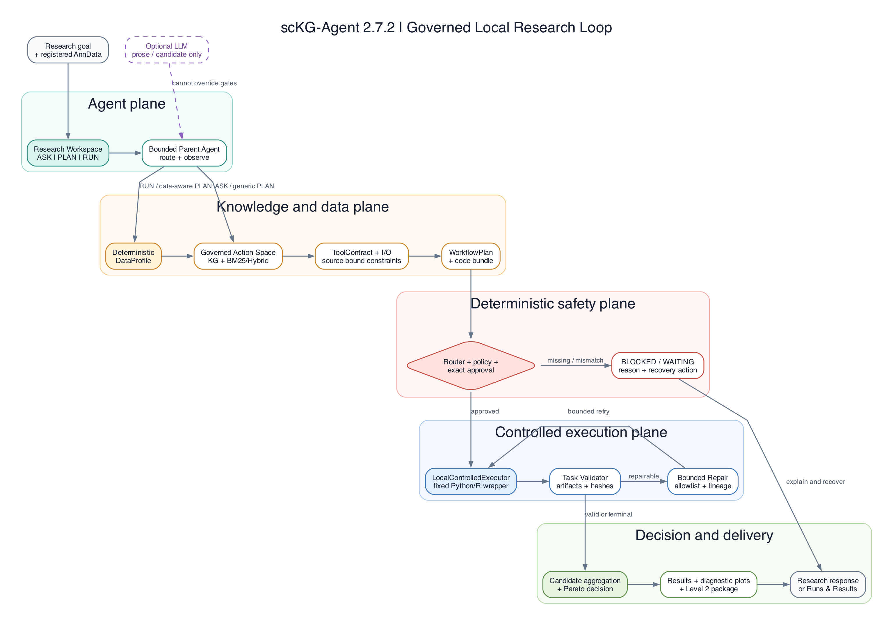
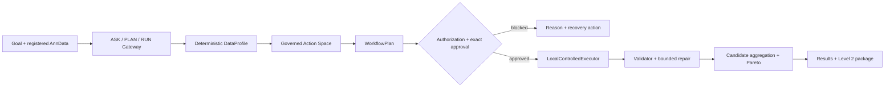

# scKG-Atlas Agent

**A local-first, evidence-governed Agent that turns a single-cell analysis goal and an AnnData file into an approved, validated, and reproducible workflow.**

scKG-Agent is not a general biomedical chatbot and not a catalog that installs every tool it knows. Its current executable scope is deliberately narrow:

- **Doublet Detection:** Scrublet 0.2.3 and scDblFinder 1.24.0;
- **Batch Integration:** Harmony 2.0.0 and Scanorama 1.7.4;
- **Scientific pilots:** GSE108313 and scIB pancreas;
- **Default policy:** `ExecutionPolicy=disabled`.

## Current Release Posture

Repository baseline: `phase5a-checkpoint` at `4fb5545` (2026-08-30). The current release decision is **`NOT READY FOR RC`**.

| Status | Current evidence |
| --- | --- |
| **Implemented** | Canonical Trace v0 across Research, Stepwise/Jupyter and Controlled Execution boundaries; a constrained Scanpy Core adaptive Notebook vertical slice; formal Scoped Authorization v0 on top of Policy and ApprovalService; and a Trace-driven EDD/architecture-ablation bridge. |
| **Verified** | Full regression `680 passed, 8 warnings`; raw PBMC3k Notebook `18/18` cells, zero errors and five figures; processed PBMC3k Notebook `2/2` cells, zero errors and reuse/skip with no unjustified preprocessing; fresh Research -> Stepwise -> Jupyter canonical parent/child topology and privacy checks; Level 2 package integrity `15/15` hashes. |
| **Blocked** | The production/full, KG-hybrid and KG+governance-contract architecture profiles fail the current citation-coverage release gate (`0.842105`, `0.894737`, and `0.842105`, requirement `>=0.9`). |
| **Not run** | A fresh real-data Controlled Execution canonical Trace, isolated ToolContract causal effect, broad biological/scientific qualification, RAGAS, external stability repetitions, and ordinary trusted-user execution. |

“Adaptive Notebook” here means reviewed Scanpy Core steps and bounded parameters resolved from user intent, DataProfile, RepresentationLedger, Method Graph and ToolContract. It does not mean arbitrary LLM-generated code. Scoped Authorization v0 is the repository's Principal/Operation/Resource/Scope binding; it is not OAuth, RBAC or enterprise IAM. `ExecutionPolicy=disabled` remains unchanged.

## One Product Loop



The figure above remains the governed product mainline. It is an architecture view, not a claim that the current HEAD has passed its RC release gates. Older orchestration and target-architecture figures are retained only as historical design records.



The application has one task entry: `ResearchChatService.run_request`.

- `ASK` answers methods, principles, applicability, limitations, and references without compiling a workflow.
- `PLAN` compiles a governed dry-run DAG and, where maintained, returns a smoke-tested code bundle without executing it.
- `RUN` profiles registered data and creates an execution handoff. It cannot bypass data authorization, ToolContract, environment, policy, or plan-specific approval.

LangGraph is the preferred high-level scheduler. When it is unavailable, a deterministic scheduler invokes the same node functions; dependency availability does not switch the product to the legacy workflow. The long-running execution state machine remains in `ExecutionOrchestrator` and is not duplicated in the Agent graph.

## Why This Is More Than RAG

KG/RAG is the knowledge plane, not the product outcome. It helps discover source-bound methods and constraints. The execution path additionally enforces:

- deterministic matrix and batch profiling;
- versioned ToolContracts and parameter schemas;
- registered artifacts, ownership, expiring grants, and approval fingerprints;
- fixed Python/R wrappers through `LocalControlledExecutor`;
- artifact, hash, runtime, memory, and task-specific validation;
- allowlisted repair actions with explicit lineage and budgets;
- Pareto decisions and reproducibility manifests.

Catalog entries, source chunks, memory, legacy embeddings, and migration hypotheses cannot authorize execution or silently become trusted scientific evidence.

## Golden Demonstrations

### Doublet Detection

```text
raw-count AnnData
-> count-source profile
-> Scrublet / scDblFinder plans
-> controlled runs
-> score/label validation
-> cross-tool Pareto
-> diagnostic artifacts and Level 2 package
```

### Batch Integration

```text
AnnData + batch + X_pca
-> batch/profile gate
-> Harmony / Scanorama plans
-> controlled runs
-> mixing and biology-conservation validation
-> cross-tool Pareto
-> embedding artifacts and Level 2 package
```

The safety demonstration changes an approval/hash/task boundary and must finish `BLOCKED` with `ExecutionRequest=0`.

## Local Quick Start

```bash
python -m cli.sckg doctor
python -m cli.sckg launch
```

Or start Streamlit directly:

```bash
streamlit run app.py
```

The three primary pages are:

1. `Research Workspace` for ASK / PLAN / RUN;
2. `Runs & Results` for approval, execution, validation, repair, decision, and package review;
3. `Graph Explorer` for inspecting catalog and governed action relationships.

Evidence, evaluation, memory, runtime packs, and historical baselines live under `Advanced/Admin`.

## Reproduce The Mainline Gate

```bash
python scripts/run_portfolio_acceptance.py
```

The acceptance command runs the full test suite, mainline, retrieval, Agent Quality, Memory, Interview Demo, package-integrity, Git-integrity, and release-privacy gates. It writes a traceable worktree digest without pretending the current uncommitted worktree is a Git tag.

The following is the current closure evidence at HEAD `4fb5545`; it supersedes the older local RC-ready wording:

| Gate | Result |
| --- | ---: |
| full pytest | 680 passed, 8 warnings |
| raw / processed PBMC3k browser UAT | passed / passed |
| canonical Research -> Stepwise -> Jupyter topology | passed |
| trajectory completeness / ordering / forbidden-stage checks | 1.0 / 1.0 / 1.0 |
| unauthorized execution | 0 |
| BM25-only architecture gate | passed |
| production/full, KG-hybrid, KG+contract gates | blocked by citation coverage |
| overall RC decision | NOT READY FOR RC |

The generated bundle is local and Git-ignored; exact metrics, scope, and limitations are recorded in [`docs/status/PROJECT_STATUS_2.0.md`](docs/status/PROJECT_STATUS_2.0.md). External-model stability, RAGAS, and independent user trials remain `not_run`.

## Architecture Map

```text
agent/research_chat_service.py       sole application entry
agent/research_agent_graph.py        ASK/PLAN/RUN high-level graph
agent/bounded_parent_agent.py        bounded Parent Agent and tool calls
core/research_agent_models.py        public request/state/response/handoff
core/trace_context.py                canonical Trace v0 schema and collector
engine/hybrid_retrieval.py           KG + BM25 + optional local dense retrieval
engine/execution_planner.py          dry-run WorkflowPlan compiler
engine/capability_workspace_service.py
                                     Representation-aware Scanpy workspace/plan boundary
execution/execution_orchestrator.py  deterministic profile/plan/run state machine
execution/local_user_service.py      exact approved local execution
execution/local_controlled_executor.py
execution/approval_service.py        scoped approval and authorization binding
execution/validators/                task-specific output validation
execution/repair_policy.py           bounded deterministic repair
engine/pareto_decision.py            configuration/tool decision
execution/reproducibility_packager.py
eval/evaluation_pipeline.py          canonical-Trace trajectory evaluation
eval/architecture_ablation.py        fixed paired architecture comparison
```

The old `agent/workflow.py` is retained only as a historical Track-A baseline. The main UI does not import or dispatch to it.

## Boundaries

Implemented today:

- 2 qualified task families and 4 qualified tools;
- local KG/BM25 and optional local bge-m3 retrieval;
- data registration, grants, formal scoped authorization, exact approvals, ownership, cancellation, canonical Trace v0, validation, repair, Pareto, and Level 2 packages;
- reviewed Scanpy Core adaptive parameter/method resolution with RepresentationLedger reuse/skip behavior;
- Trace-driven ExpectedTrajectory evaluation and fixed architecture ablation;
- Streamlit local workbench and CLI diagnostics;
- dataset-scoped scientific pilots and deterministic engineering evaluations.

Not current product capability:

- arbitrary LLM-generated code execution;
- recursive multi-Agent execution;
- MCP, FastAPI, Docker/OCI sandbox, WSL2, cloud deployment, or remote multi-user service;
- execution of all 1,847 catalog tools;
- universal claims that one tool is scientifically best;
- completed RAGAS, broad scientific qualification, independent real-user trial evidence, or ordinary trusted-user execution.

`LocalControlledExecutor` is application-level process control, not an OS sandbox. Input matrices and full paths remain local by default, but stronger isolation claims require a future isolated runner.

## Documentation

- Active specification: [`docs/DEV_SPEC_2.0.md`](docs/DEV_SPEC_2.0.md)
- Current status: [`docs/status/PROJECT_STATUS_2.0.md`](docs/status/PROJECT_STATUS_2.0.md)
- Evaluation protocol: [`docs/eval/RESEARCH_EVAL_PROTOCOL.md`](docs/eval/RESEARCH_EVAL_PROTOCOL.md)
- Security model: [`docs/security/EXECUTION_SECURITY_MODEL.md`](docs/security/EXECUTION_SECURITY_MODEL.md)
- Resume fact handoff: [`docs/SC_KG_AGENT_RESUME_HANDOFF.md`](docs/SC_KG_AGENT_RESUME_HANDOFF.md)
