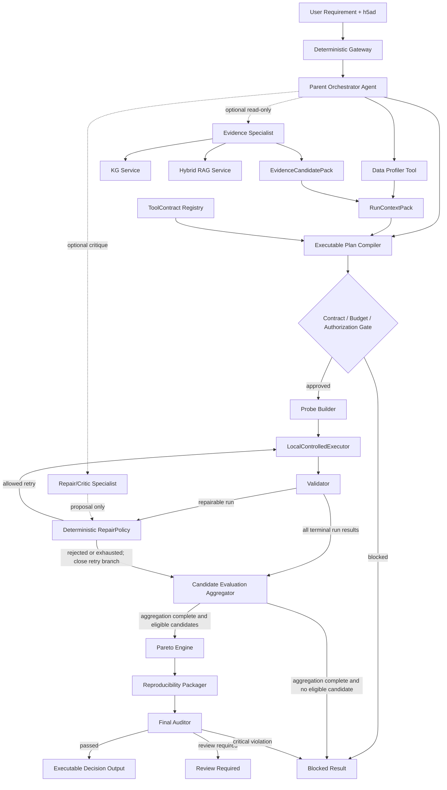
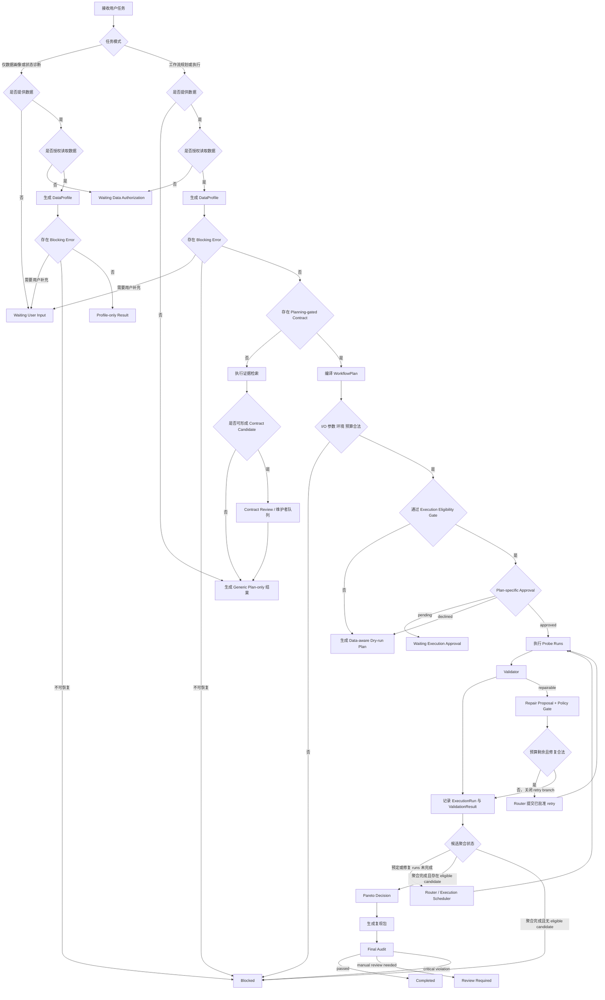
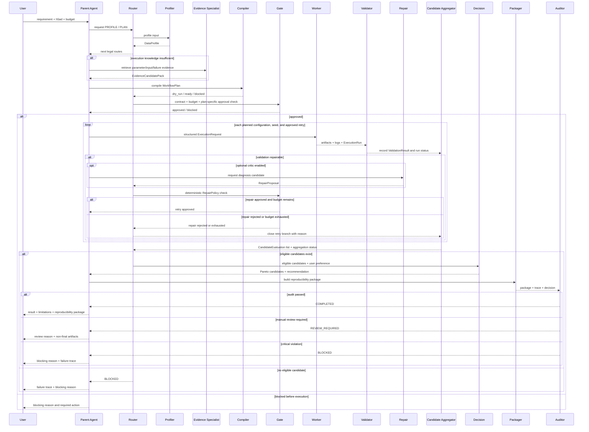
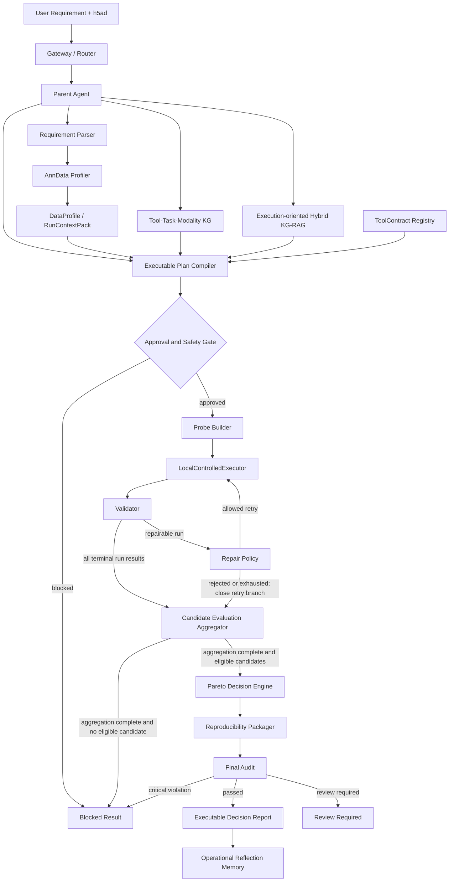
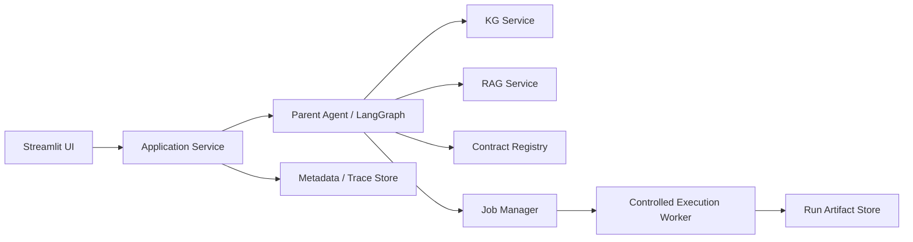

# scKG-Agent 2.0 中文开发规约

版本：2.10.2-dev
状态：Active，Phase 5 completed；Phase 6 trial_ready；全局 ExecutionPolicy 默认 disabled
生效日期：2026-08-23
维护语言：中文  
适用仓库：`SCKG-Agent`  
历史规约：`docs/DEV_SPEC_scKG_CN.md`，冻结为 1.x 设计与演进记录  

> 本规约是 scKG-Agent 2.0 的唯一主开发基准。需求、代码、测试、评测、界面和文档发生冲突时，以本规约中当前 Phase 的边界和验收标准为准。完成每个 Phase 后必须反向更新本文档。

### 2026-08-23 Scanpy Core 科学与架构一致性修订

- `scale` 改为 HVG 后、PCA 前的 optional representation transition；现代 Scanpy 流程可跳过它，但已有 scaled state 必须被正确识别，且 scaled matrix 不得进入 marker/DE 或 annotation evidence。
- Doublet Detection 作为 Filtering 后、Normalization 前的 optional composed Action，复用 Scrublet/scDblFinder 既有 ActionBundle、contract、executor 和 validator；默认只写 score/call，是否排除必须显式确认。
- Representation 从单线枚举改为带 lineage 的并存 ledger；UMAP 与 Leiden 从同一个 neighbor graph 分叉，Marker 固定读取未缩放的 log-normalized 全基因表达，Annotation A/B 保持 method-family abstraction。
- Spatial/Squidpy 明确 deferred；本轮只增加 workflow-level gold case 设计，不进入 S0-S6 实现范围。

### 2026-08-23 Extensibility / Capability Pack Contract 修订

- Scanpy Core 是第一个 `CapabilityPack`，不是 Agent Core 内的 Scanpy 特殊分支；新增方法原则上只增加受版本控制的 pack 资产和 adapter/validator plugin。
- Agent Core、Planner、ExecutionOrchestrator 与 ResearchChatService 不得依赖 Scanpy、Seurat、CellTypist、SingleR 或 Squidpy 名称；兼容性只能由 typed Representation、provenance、schema、cell/gene hash 与 state requirement 决定。
- Notebook compilation 必须由 generic Step/Adapter/Renderer 逐步取代 `compile_scrublet()` 式工具特化；Validator 采用通用 primitives 与 capability-specific scientific validator 组合。
- 本修订不改变 S0-S6 顺序和执行范围；只增加 pack schema、registry、静态 gate 与 mock-pack 扩展性验收。

### 2026-08-24 Scanpy Core Workflow / Method Graph v0 实现状态

- Scanpy Core S0-S6 已完成实现与 synthetic engineering smoke；当前状态为 `implemented / engineering_smoke_passed / scientific_validation_not_evaluated / user_execution_disabled`。这不等于 broad scientific validation，也不改变全局 `ExecutionPolicy=disabled`。
- 该工作流必须复用 Research Workspace、WorkflowPlan、StepContract、Notebook compiler、ToolContract、LocalControlledExecutor、Validator、trace、Evaluation Pipeline 与 ReproducibilityPackager，不得创建第二套执行或 Notebook 框架。
- canonical JSONL/manifest 继续作为唯一事实源；Method Graph v0 是 canonical snapshot 的受治理扩展，Neo4j 降为单向、可删除、可重建的 optional projection，不参与运行时正确性或执行准入。

### 2026-08-14 Stepwise Tutorial Notebook v3

- Research Chat 的 synthetic handoff 使用 deferred widget selection，禁止在同一 Streamlit render 中修改已创建的 artifact selector。
- Notebook 模板 digest 纳入 backend cache identity；代码热更新后旧 compiler 不得继续生成旧模板。已有 Notebook digest 过期时，页面必须展开参数区并提供明确更新动作。
- Scrublet Notebook 固定采用教程式小单元：输入画像与 QC、参数 provenance、初始化、评分、输出校验、score/rank/call diagnostics、manifold 和 interpretation boundary。
- Notebook 使用已登记 Runtime Pack，不包含安装命令，不自动运行；修改后的 cell 继续不能取得受控执行权威。

---

## 0. 2.0 决策摘要

scKG-Agent 2.0 从“证据治理型推荐与报告原型”转向：

```text
面向单细胞分析的
证据约束、可执行、可验证、可修复、可复现的科研 Agent
```

推荐英文定位：

```text
scKG-Agent 2.0:
An Evidence-Grounded Agent
for Single-Cell Workflow Planning, Execution, Validation, and Repair
```

核心研究问题：

```text
如何将用户的单细胞分析需求和真实数据状态，
转化为经过轻量执行验证、能够解释参数来源、
能够有限修复错误并交付复现包的分析工作流？
```

2.0 的决定不是废弃已有 KG、RAG、证据治理和推荐模块，而是改变它们在系统中的位置：

```text
1.x：证据与图谱 -> 推荐 -> 报告

2.0：需求与数据 -> 图谱/RAG/契约 -> 可执行计划
     -> Probe 实测 -> 验证/修复 -> 多目标决策 -> 复现包
```

### 0.1 已敲定的架构决策

| 决策 | 2.0 结论 |
| --- | --- |
| 项目名称 | 继续使用 `scKG-Agent`，不立即重命名仓库 |
| `scKG-Exec` | 作为执行子系统或内部代号，不作为当前仓库名称 |
| Agent 类型 | 有边界的中心化 Agent（Bounded Centralized Agent），Parent 可委派预定义 Specialist，但 Specialist 不再生成下级 Agent |
| 当前是否多 Agent | 不是运行中的多 Agent；subagent contract 已有但默认关闭 |
| 核心输出 | 可执行计划、运行结果、验证结果、修复记录、复现包，而不只是报告 |
| 首个任务 | Doublet Detection |
| 首个输入 | 本地 `.h5ad` / AnnData，scRNA-seq |
| 首个真实工具 | Scrublet |
| 第二独立工具 | scDblFinder 1.24.0 已按独立 R 环境完成 qualification 与 dataset-scoped pilot |
| Batch Integration | 第二个动态任务；Phase 5 双工具工程资格、scientific pilot 与 ActionBundle 已完成 |
| 执行模式 | `LocalControlledExecutor`，应用层受控 worker，`shell=False`，wrapper allowlist，有限预算 |
| 环境 | 轻量控制平面与按任务族 Runtime Pack 分离；环境安装审批与数据执行审批分离 |
| RAG 范围 | 全量 catalog metadata 建目录 chunk；只为高频/核心及执行白名单工具补 README、论文全文和 benchmark chunk，不要求 1800+ 工具全部下载 PDF |
| Dense embedding | 不是 Phase 1 阻塞项；稀疏检索和结构化契约先服务执行 |
| 决策方式 | Pareto frontier + 透明偏好，不输出无统计定义的伪精确置信度 |
| Memory | 只保存偏好、资源约束和运行教训，不成为科学证据或参数权威 |
| MCP | 等本地执行 contract 稳定后再抽取，不是当前主线 |
| GNN / RL | 暂停，不进入 2.0 MVP |
| 多 Agent 口径  | 当前不是运行中的多 Agent；MVP 只有 Parent Agent，未来最多增加只读 Evidence Specialist 与受限 Repair/Critic Specialist |
| 任务路由 | Parent Agent 负责语义规划；deterministic Router 负责权限、状态和预算路由；任何 Specialist 都无最终执行权 |
| 动态 Agent 范围| 允许动态选择 route、工具、probe、参数搜索和 repair；不允许动态生成任意 Agent 类型或任意工具权限  |
| RAG 地位 | Execution-oriented Hybrid KG-RAG 是核心知识能力，但不能直接越过 ToolContract 生成执行参数|
| Action Space | Decision Graph 是唯一权威动作图；`ActionBundle` 将 Task、Action、ToolContract、I/O、Environment、Failure、Validation、KnowHow、Source 与 scoped Evaluation 组合为规划上下文，但永不授权执行 |
| Scanpy Core Workflow | S0-S6 与 Post-S6 synthetic engineering journey 已实现并通过 smoke；Scanpy 官方 PBMC3k 已完成 dataset-scoped real-data engineering pilot：raw 文件执行全流程、processed 文件验证 resume/skip；无独立 gold-label scientific validation，普通用户执行保持关闭 |
| Method Graph | 在同一 canonical snapshot 内增加 Capability、Method、Representation 与有来源的 workflow relation；不创建第三份独立事实源 |
| Graph 存储 | canonical nodes/edges JSONL + manifest 是唯一事实源；typed in-memory graph 是默认查询层，SQLite FTS5/NumPy dense 是派生索引，Neo4j 只做 optional projection |
| 服务化原则 | MVP 采用 modular monolith + separate execution worker；核心 Python API 稳定后再包装 MCP/FastAPI |
| Skill 原则 | Skill 是版本化、可测试的能力单元，不等于 Agent；所有执行型 Skill 必须绑定 schema、权限、contract 和测试 |

### 0.2 对新转型手册的裁决

直接采纳：

- 从报告型 Agent 转向执行、验证、修复型 Agent；
- AnnData Data Profiler；
- ToolContract；
- workflow DAG 与参数搜索空间；
- Probe Builder；
- LocalControlledExecutor；
- Validation 与有限 Repair Loop；
- Pareto 多目标决策；
- 可复现运行包；
- Planning/Knowledge 与 Execution/Repair 双轨 baseline；
- 首个闭环优先 Doublet Detection；
- 禁止任意 shell、无限重试、自动安装、自动写 formal evidence。

调整后采纳：

- 项目不整体改名为 `scKG-Exec`，避免已有论文、文档、图谱和代码口径断裂；
- Phase 1 不同时支持 6 至 8 个真实执行工具，只为少量工具建立 contract；
- RAG 的参数、输入要求、失败模式增强必须与 ToolContract 同期开始，不能放到所有执行之后；
- 首个闭环先完成 Scrublet 的真实运行和参数比较，再增加第二个独立实现；
- Batch Integration 等 Doublet Detection 闭环稳定后再进入；
- 当前 `ToolExecutor` 是 Agent 函数调用包装器，不等同于生信受控执行器。

暂缓：

- 自动 spawn 多层 subagent；
- 全工具覆盖；
- 复杂 Docker/Kubernetes/remote worker；
- 自动 evidence promotion；
- GNN、RL、learning-to-rank；
- 用户行为 Agent；
- 自动生成最终生物学结论。

### 0.3 Biomni 对齐与差异化裁决

Science 2026 发表的 Biomni 将生物医学 Agent 拆为统一 action environment 与 generalist agent，证明“资源检索、code-centric planning、执行观察和动态修订”是可落地路线。scKG-Agent 不复制其全权限动态代码执行，也不追求短期覆盖整个生物医学领域，而采用以下定位：

参考入口：PubMed `PMID: 42424436`、DOI `10.1126/science.adz4351`、公开项目论文 `https://biomni.stanford.edu/paper.pdf`、官方仓库 `https://github.com/snap-stanford/Biomni`。

```text
Biomni：通用生物医学 action space 的广度
scKG-Agent：单细胞 action space 的证据、数据状态、安全执行和可复现深度
```

固定借鉴：

- 将图谱从工具目录升级为 Agent 可组合的 action space；
- 离线 action discovery 负责发现候选，在线 Parent Agent 只消费经过治理的 ActionBundle；
- 查询时只召回相关 action/tool/software/data/know-how 子集；
- 用 held-out task、消融和真实执行轨迹评价 Agent，而不是只评价最终自然语言报告。

固定不照搬：

- 不允许 LLM 生成任意 Python/R/Bash 后直接获得宿主机权限；
- 不让 action-discovery 输出自动成为 trusted capability、formal evidence 或 ToolContract；
- 不用多 Agent 数量代替工具资格、数据兼容性、Validator 和复现包；
- 不因相对 benchmark 提升而声称达到普遍专家水平。

在线拓扑仍是中心化 Parent Agent；Action Discovery 属于离线能力建设流程，不构成运行时多 Agent 协商。

#### 0.3.1 Biomni 能力对照边界

截至 2026-07-16，scKG-Agent 已实现与 Biomni 同方向的 action retrieval、结构化 planning、Python/R 固定 wrapper 执行、观察/验证、有界 repair、trace 与复现包；并额外要求 ToolContract、数据画像、逐请求 approval 和 ownership gate。

但当前绝不表述为“已经实现 Biomni 全部能力”：scKG-Agent 只有 4 个 execution-qualified 工具和 2 个 qualified Action；尚无 Biomni 规模的通用 action environment、开放式 Python/R/Bash 代码组合、跨 25 个生物医学领域的工具/数据库覆盖、湿实验协议与仪器控制、以及大规模 held-out benchmark。两者当前关系是“借鉴架构原则并在单细胞受控执行上做深”，不是功能等价。

---

## 1. 为什么必须转型

当前系统已经能完成约束解析、KG 候选召回、证据检索、工作流模板生成、MCDM、报告审计和可观测展示，但主要回答的仍是：

```text
“应该考虑哪些工具，以及为什么。”
```

通用 LLM、Deep Research 和普通 RAG 也可以生成类似内容。仅增加 PDF、图谱节点、Agent 角色名称或更漂亮的报告，不会形成稳定的科研价值。

2.0 要回答的是：

```text
“基于我的真实数据状态，这个方法能否运行？”
“参数是否合法，来源是什么？”
“在小规模 probe 上实际表现如何？”
“失败在哪里，系统做了什么有限修复？”
“最终交付能否由另一个人复现？”
```

这些能力不能由一个 Prompt 稳定替代，因为它们依赖：

- 真实文件检查；
- 结构化工具契约；
- 输入输出兼容性校验；
- 受控执行与明确的隔离等级；
- 真实 stdout、stderr、版本和资源记录；
- 任务指标计算；
- 有限状态修复；
- artifact hash 和复现清单。

这也是 2.0 与普通“推荐助手”的核心差异。

---

## 1A. 研究假设

2.0 不只验证“系统能否做出来”，还要检验以下可证伪假设。详细数据集、baseline、统计方法和防泄漏协议维护在 `docs/eval/RESEARCH_EVAL_PROTOCOL.md`。

### H1：DataProfiler 与 ToolContract 能减少无效工作流

与 LLM-only 或普通 RAG 相比，matrix-level DataProfiler 和 ToolContract 应提高：

- critical input error recall；
- parameter legality；
- input/output compatibility；
- invalid execution blocking rate。

### H2：Execution-oriented KG-RAG 能提高执行知识检索质量

与普通文档 RAG 相比，KG-RAG 应提高：

- parameter source recall；
- input requirement recall；
- failure mode recall；
- metric definition recall；
- source span hit rate。

### H3：执行反馈闭环能提高任务完成率和复现率

与 one-shot code generation 相比，contract-constrained execution 和有限 repair 应提高：

- executable rate；
- artifact completion；
- rerun success；
- failure detection；

并降低 unsupported repair 和 unsafe action。

### H4：轻量 Probe 可辅助配置选择，但外推能力有限

需要分别检验：

- probe 上的参数排序是否稳定；
- 不同子样本和随机种子下排序是否一致；
- probe 排名能否预测更大数据上的表现；
- synthetic probe 与正交标签数据的结果是否一致。

Synthetic probe 结果不支持真实检测准确率声明。

### H5：受控 Agent 更安全，但可能牺牲灵活性

比较自由 one-shot Agent、固定 deterministic workflow 和受控 Parent Agent 的：

- task completion；
- invalid action；
- tool-call count；
- runtime；
- repair success；
- unsupported scientific claim。

---
## 1B. 科研贡献与工程贡献边界

scKG-Agent 2.0 不声称提出新的基础大模型、通用 RAG 算法或通用多 Agent 理论。项目贡献分为科研方法贡献与工程系统贡献。

### 1B.1 科研方法贡献候选

1. **Data-aware workflow planning**

   工作流规划不仅依据用户自然语言，还显式读取 AnnData 的矩阵状态、metadata、任务前置条件和资源约束。

2. **Contract-constrained executable capability representation**

   使用版本化 ToolContract 描述工具输入、输出、参数、前置条件、失败状态、验证指标和执行环境，使工具知识可以被编译和执行，而不只是被自然语言描述。

3. **Execution-oriented Hybrid KG-RAG**

   KG-RAG 不只检索工具介绍和文献摘要，还检索执行所需的输入要求、参数来源、失败模式、metric 定义、版本信息和 workflow transition。

4. **Probe-based empirical validation**

   在受限预算和受控 probe 上实际运行候选配置，以本次执行结果补充文献先验，但不将 synthetic probe 结果外推为真实科学性能。

5. **Contract-constrained repair**

   错误修复不允许 Agent 自由修改代码或参数，只能在 ToolContract 和 RepairPolicy 声明的合法空间内进行。

6. **Artifact-grounded evaluation**

   Agent 质量主要依据真实 artifact、运行日志、验证指标、错误恢复和复现结果进行评价，而不是仅依赖 LLM judge。

### 1B.2 工程系统贡献

* matrix-level AnnData profiler；
* ToolContract registry；
* LocalControlledExecutor；
* execution trace；
* reproducibility package；
* adaptive retrieval router；
* read-only MCP-ready service APIs；
* evaluation harness 与 robustness suite。

这些工程模块可以形成软件成果、软著、演示系统和求职项目，但不能单独被表述为新的科学理论。

### 1B.3 不得作为核心创新单独声称的内容

以下能力属于采用、集成或工程实现：

* LangGraph；
* 普通 RAG；
* BM25 + dense retrieval + RRF；
* Neo4j；
* MCP；
* Streamlit；
* 多 Agent 角色命名；
* MCDM；
* Docker；
* Dashboard；
* LLM structured output。

项目的创新性必须通过消融实验和真实执行结果证明，而不能通过技术组件数量证明。


## 2. 当前实现边界与状态维护

主规约只保存稳定的能力边界，不保存会频繁变化的测试数、包版本、source coverage 和当前 blocker。

动态状态统一维护在：

```text
docs/status/PROJECT_STATUS_2.0.md
```

科研评测协议维护在：

```text
docs/eval/RESEARCH_EVAL_PROTOCOL.md
```

执行威胁模型维护在：

```text
docs/security/EXECUTION_SECURITY_MODEL.md
```

### 2.1 稳定能力分类

现有 KG、RAG、evidence gate、plan-only workflow、trace、dashboard 和 operational memory 作为 1.x 可复用基础。Phase 1 已实现 canonical execution models、deterministic AnnDataProfiler、planning-only Scrublet ToolContract 和 import-qualified EnvironmentRegistry。受控本地执行、Validator、Repair Loop 和 Reproducibility Packager 在对应 Phase 验收前仍属于目标能力。

文档或 UI 必须使用以下状态：

```text
implemented
partially_implemented
design_only
not_implemented
deprecated
```

禁止用“已规划”“已有 schema 草案”代替 `implemented`。

### 2.2 不得混淆的现有对象

`core.agent_runtime.ToolExecutor` 当前负责：

```text
注册 Python 函数
校验参数模型
记录 tool call trace
阻断重复调用和超预算调用
```

它不负责：

```text
执行生信命令
隔离文件系统
限制运行时间和内存
记录产物 hash
管理 Conda/R/Python 环境
```

因此 2.0 新增的生信执行器必须命名为 `LocalControlledExecutor`，不能复用 `ToolExecutor`，也不能在没有 OS/container isolation 时称为 sandbox。

### 2.3 状态更新规则

每次 Phase 完成后：

1. 更新 `docs/status/PROJECT_STATUS_2.0.md` 的日期、实现状态、环境和测试；
2. 只有 schema、边界、Phase 或 gate 改变时才更新本规约；
3. 实验数据集、baseline 或统计方法改变时更新评测协议；
4. 路径、进程、网络或资源隔离改变时更新安全模型。

---

## 3. 产品边界

### 3.1 2.0 是什么

scKG-Agent 2.0 是一个受控科研 Agent。它负责：

1. 理解用户任务和资源约束；
2. 检查真实单细胞数据对象；
3. 从 KG、RAG 和 ToolContract 召回候选工具、参数和限制；
4. 编译可执行 workflow DAG；
5. 在受控 probe 数据上运行候选配置；
6. 验证产物、任务指标、稳定性和资源消耗；
7. 对允许修复的失败执行有限重试；
8. 用透明多目标决策比较结果；
9. 输出代码、配置、环境、trace、指标和证据链接。

### 3.2 2.0 不是什么

第一版不承诺：

- 自动处理 FASTQ/BAM；
- 自动发现所有单细胞工具；
- 支持任意 Python/R 工具；
- 支持全单细胞多组学原始数据；
- 自动产生可发表生物学结论；
- 自动判断所有 benchmark 是否可信；
- 全自动安装依赖；
- 自动修改用户原始数据；
- 自动写 formal TSV 或 trusted Neo4j；
- 自动无限修复；
- 去中心化多 Agent；
- 训练领域 LLM；
- 用 embedding 相似度代替真实执行。

### 3.3 不需要把所有工具 PDF 都入库

2.0 明确取消以下错误前提：

```text
“只有把 1800+ 工具的所有论文 PDF 下载、切 chunk、embedding，
Agent 才能开始执行。”
```

正确顺序是：

```text
选择执行白名单工具
-> 补齐官方文档、方法论文、参数说明和失败模式
-> 建立 ToolContract
-> 完成真实执行与评测
-> 根据任务扩展工具覆盖
```

PDF 只是 source 类型之一。官方 HTML、API 文档、README、tutorial、protocol 和可定位的方法段落都可以成为 retrieval source。只有需要支持具体 claim 时，才要求相应 source span。

---

## 4. Agent 与 Workflow 的关系

Workflow 是被规划和执行的对象，Agent 是控制这个闭环的决策主体。

```text
Workflow：固定或动态生成的步骤、依赖、输入输出和参数
Agent：观察状态、选择工具、执行、读取结果、决定继续/修复/停止
```

只输出一份 DAG 不是完整 Agent。2.0 至少必须形成：

```text
Observe data
-> Plan
-> Act on probe
-> Observe result
-> Validate
-> Repair or stop
-> Decide
-> Package
```

### 4.1 架构类型

当前与目标口径：

```text
当前：中心化 Parent Agent + 硬编码 LangGraph 工作流原型
目标：有限状态、预算受控的 Bounded Centralized Agent
```

Parent Agent 对以下内容负最终责任：

- 任务路由；
- 是否需要数据画像；
- 是否提出执行请求以及是否进入执行候选路径；
- workflow plan；
- repair budget；
- evidence boundary；
- 最终决策和报告；
- 复现包完整性。

Subagent 不是 2.0 MVP 的必要条件。执行 worker 也不是 subagent，它只是无自主权的受控工具。

执行是否最终获准，由用户授权、ToolContract execution gate、Deterministic Router 和 Safety Gate 共同决定。Parent Agent 无权单独批准执行。

### 4.2 Agentic Decision Boundary

系统不把所有逻辑交给 LLM。确定性模块负责：

- 文件、路径和 hash 校验；
- matrix-level 数据状态检测；
- ToolContract schema 和执行 gate；
- 参数类型与范围；
- 用户执行授权；
- artifact validation；
- repair permission；
- budget、安全边界和停止条件；
- Pareto 计算。

Parent Agent 负责：

- 根据用户目标形成候选任务计划；
- 在合法 ToolContract 中选择候选；
- 根据 DataProfile 决定补充检索、请求信息或阻断；
- 根据运行结果选择继续测试、停止或进入允许的 repair route；
- 根据用户资源偏好选择 Pareto candidate；
- 组织结论、限制和复现说明。

只有形成以下运行时闭环时，场景才称为 Agent 路由：

```text
Observe -> Plan -> Act -> Observe -> Adapt -> Stop
```

若某场景始终执行同一固定 DAG，应表述为 `deterministic workflow`。2.0 评测必须加入：

```text
fixed deterministic workflow
vs
Parent Agent dynamic routing
```

Agent 的价值由动态路径选择、正确阻断、有限修复和停止决策证明，不由 Agent 角色数量证明。

### 4.3 当前与目标 Agent 拓扑

当前系统只有一个真正拥有运行时决策权的 Agent：

```text
Parent Orchestrator Agent
```

DataProfiler、KG Retriever、RAG Retriever、Plan Compiler、Executor、Validator、RepairPolicy 和 Pareto Engine 均属于工具、服务、编译器或确定性决策模块，不应因为被 Parent Agent 调用就称为独立 Agent。

MVP 架构：

```text
Parent Agent
  + deterministic tools/services
  + controlled execution worker
```

目标扩展架构最多包含三个 Agent：

| Agent                    | 状态      | 核心职责                                              | 明确禁止                                    |
| ------------------------ | ------- | ------------------------------------------------- | --------------------------------------- |
| Parent Orchestrator      | MVP 主控  | 目标理解、规划、路由、停止、授权申请、最终决策                           | 任意 shell、绕过 contract、修改 formal evidence |
| Evidence Specialist      | 后续可选，只读 | query decomposition、KG/RAG 检索、source span 与参数来源核对 | 启动执行、修改 contract、决定最终推荐                 |
| Repair/Critic Specialist | 后续可选，受限 | 错误归类候选、修复建议、矛盾检查                                  | 自由改代码、直接重试、扩大预算、修改 repair policy        |

执行 worker 不是 Agent。它不具有目标、规划、记忆和自主路由能力。

### 4.4 权限与责任矩阵

| 决策/动作              |        Parent Agent | Specialist Agent |    Deterministic Module |         User |
| ------------------ | ------------------: | ---------------: | ----------------------: | -----------: |
| 理解用户目标             |                  主责 |              可辅助 |               schema 校验 |         提供需求 |
| 任务路由               |                  主责 |               无权 |          Router 强制 gate |            无 |
| KG/RAG 检索          |                  发起 |          可执行只读检索 |            Retriever 执行 |            无 |
| Workflow DAG 编译    |                  发起 |               无权 |        Plan Compiler 主责 |            无 |
| 参数合法性              |              无权修改规则 |           无权修改规则 |         ToolContract 主责 | 只能在合法范围内显式 override |
| 执行授权               |                  申请 |               无权 |                 Gate 校验 |         最终确认 |
| 真实执行               |              无直接执行权 |               无权 | LocalControlledExecutor |        授权后触发 |
| 结果有效性              |                  读取 |              可批评 |            Validator 主责 |          可查看 |
| Repair 建议          | 决定是否进入 repair route |            可提出候选 |     RepairPolicy 决定是否合法 |        必要时确认 |
| 最终推荐               |                  主责 |             无最终权 |      Pareto Engine 提供候选 |         提供偏好 |
| Formal evidence 修改 |              无权自动修改 |               无权 |      人工 review workflow |        维护者确认 |

### 4.5 Route 类型

系统至少定义以下 route：

```text
PROFILE_ONLY
PLAN_ONLY
EVIDENCE_RECOVERY
CONTRACT_REVIEW
EXECUTION_QUALIFICATION
WAITING_USER_INPUT
WAITING_DATA_AUTHORIZATION
WAITING_EXECUTION_APPROVAL
PROBE_EXECUTION
VALIDATION
REPAIR
DECISION
PACKAGE
AUDIT
REVIEW_REQUIRED
COMPLETED
BLOCKED
```

每个 route 必须声明：

* 输入 schema；
* 输出 schema；
* 允许调用的工具；
* 最大调用次数；
* 是否读取用户数据；
* 是否允许外部模型；
* 是否需要用户授权；
* 失败后的合法下一 route。

### 4.6 Deterministic Router

Parent Agent 可以提出下一步意图，但最终 route 必须由 deterministic Router 根据状态和 gate 决定。

Router 至少读取：

```yaml
request:
  task
  input_path
  data_access_authorized
  execution_authorized
data_profile:
  blocking_errors
  selected_count_source
contract:
  planning_gate_passed
  execution_gate_passed
plan:
  plan_status
execution:
  run_status
validation:
  eligible_for_candidate_aggregation: bool
  repairable: bool
candidate_evaluation:
  aggregation_complete: bool
  eligible_candidate_count: int
  all_candidates_failed: bool
budget:
  runs_remaining
  repairs_remaining
user:
  approval_state
actor:
  role: user | maintainer
qualification:
  mode: bool
  fixture_id: str | null
  fixture_allowlisted: bool
```

核心规则：

```text
用户任务仅请求数据画像、对象解释或数据状态诊断，
且不请求 workflow planning 或 execution
  -> PROFILE_ONLY

未提供数据，但请求生成通用分析方案
  -> PLAN_ONLY

提供数据但 data_access_authorized = false
  -> WAITING_DATA_AUTHORIZATION

存在需要用户处理的 blocking error
  -> WAITING_USER_INPUT

存在不可恢复的 blocking error
  -> BLOCKED

缺少 planning-gated contract
  -> EVIDENCE_RECOVERY、CONTRACT_REVIEW 或 PLAN_ONLY

contract 未通过 execution gate，
且 actor.role = maintainer，
且 qualification.mode = true，
且 fixture_allowlisted = true
  -> EXECUTION_QUALIFICATION

contract 未通过 execution gate，
且不满足 qualification 条件
  -> PLAN_ONLY 或 CONTRACT_REVIEW

数据已画像但 execution_authorized = false
  -> PLAN_ONLY

plan ready，
且 execution_authorized = true，
但 approval_state != approved
  -> WAITING_EXECUTION_APPROVAL

plan approved
  -> PROBE_EXECUTION

单次 run 进入 terminal 状态
  -> VALIDATION

每个 ValidationResult 都必须写入对应 candidate 的运行记录。
eligible_for_candidate_aggregation 只决定该 run 是否参与聚合指标，
不影响 failed_run_id、失败类型和资源记录的保存。

validation.repairable = true 且预算足够
  -> REPAIR

validation.repairable = false，
或 repair 被拒绝、取消、耗尽预算
  -> 不生成新 run，继续等待 candidate 聚合

同一 candidate 的预定 run 或已批准 repair run 尚未全部进入 terminal 状态
  -> PROBE_EXECUTION

PROBE_EXECUTION route 同时负责提交未运行任务和轮询已提交任务，
具体 job 状态由 execution scheduler 管理。

candidate 聚合完成且 eligible_candidate_count > 0
  -> DECISION

candidate 聚合完成且 all_candidates_failed = true
  -> BLOCKED

decision 完成
  -> PACKAGE

package 完成
  -> AUDIT

AUDIT 通过
  -> COMPLETED

AUDIT 未通过，但属于非关键缺失或可人工复核问题
  -> REVIEW_REQUIRED

AUDIT 发现 evidence boundary violation、
unauthorized execution、安全问题、
关键 artifact 缺失或结论无法回溯
  -> BLOCKED
```

LLM 不能直接修改 Router 的状态字段，也不能把 `BLOCKED` 改为 `READY`。

### 4.7 动态 Agent 边界

2.0 是有界动态 Agent，而不是任意动态 Agent。

允许动态决定：

* 是否需要证据检索；
* 是否需要用户补充信息；
* 选择哪些通过 gate 的候选工具；
* 选择 probe 规模；
* 选择 ToolContract 允许的参数配置；
* 是否进入 repair；
* 何时停止；
* 选择哪个 Pareto candidate。

固定不变：

* Agent 类型；
* 工具权限；
* ToolContract；
* RepairPolicy；
* 最大深度；
* 最大工具调用次数；
* 最大 repair 次数；
* 执行白名单；
* evidence boundary；
* 用户授权规则。

未来若启用 Specialist Agent：

```text
max_specialist_depth = 1
max_specialists_per_run = 2
specialist_execution_permission = false
specialist_write_permission = false
```

MVP 不动态创建新的 Agent 类型。

### 4.8 Agent 模式图



### 4.9 任务规划流程图



### 4.10 核心时序图



## 5. 总体架构



### 5.1 Bounded Parent Agent Loop

Phase 6 提供 plan-first Parent Agent runtime：自然语言需求依次调用 deterministic gateway、governed GraphRAG、ToolContract/Environment、AnnDataProfiler、ExecutionPlanCompiler 与 DeterministicRouter。每次调用记录 capability、input/output summary、elapsed time、status 和 warning。

固定 route 至少包括：

```text
PLAN_ONLY
WAITING_DATA_AUTHORIZATION
WAITING_EXECUTION_APPROVAL
EVIDENCE_RECOVERY
BLOCKED
```

Parent Agent 不接收任意文件路径和命令，不得覆盖 Router。plan-only UI 试跑必须保持 `execution_request_count=0`；真实执行仍只能进入 Phase 6 restricted local execution backend，并重新经过 exact approval、policy、ownership 和 execution gate。

### 5.2 四个平面

控制平面：

- Parent Agent；
- LangGraph 状态机；
- routing、budget、approval；
- trace 和 audit。

知识平面：

- Neo4j KG；
- formal evidence；
- source chunks；
- ToolContract registry；
- metric/failure/parameter knowledge。

执行平面：

- Data Profiler worker；
- Probe Builder；
- LocalControlledExecutor；
- tool wrappers；
- Validator；
- Repair Policy；
- run artifacts。

评测与治理平面：

- planning eval；
- execution eval；
- repair eval；
- scientific validity eval；
- governance eval；
- observability dashboard。

---

## 6. MVP 边界

### 6.1 输入

Phase 1 至 Phase 4 只支持：

```text
文件：.h5ad
对象：AnnData
模态：scRNA-seq
数据形态：本地文件
任务：Doublet Detection
```

不支持：

```text
FASTQ, BAM, loom, RDS, spatial image,
scATAC raw fragments, CITE-seq raw inputs,
远程对象存储和任意 URL 输入
```

### 6.2 首个执行工具

第一个真实 wrapper：

```text
Scrublet
```

首个闭环允许比较：

- 不同合法参数配置；
- 不同随机种子；
- 默认参数与 source-bound 参数范围；
- Scrublet 与透明 heuristic baseline。

注意：heuristic baseline 不是第二个科学工具，不能在论文或展示中写成“两种工具比较”。

第二个独立工具只在 Phase 3A-E 完成后选择：

```text
优先评估 scDblFinder
备选 DoubletFinder
```

选择标准：

- 能否从 AnnData counts 做稳定转换；
- 本地 Mac 环境能否复现；
- wrapper 和环境复杂度；
- source 与参数信息是否足够；
- 是否能生成与 Scrublet 可比较的输出。

### 6.3 默认预算

首版默认值采用保守本地配置：

```text
max_cells_for_probe = 10_000
max_genes_for_probe = all input genes, with method-specific HVG cap when needed

parameter_configs_per_tool <= 4
random_seeds_per_config <= 3

max_initial_runs_per_request = 12
reserved_repair_runs_per_request = 4
reserved_validation_reruns = 2
max_total_runs_per_request = 18

repair_attempts_per_failed_run <= 2
max_concurrent_runs = 1
default_timeout_seconds = 900

必须满足：

initial_runs
+ repair_runs
+ validation_reruns
<= max_total_runs_per_request

Planner 不得把全部预算分配给初始参数搜索。
Repair 预算未使用时可以释放给后续验证，但必须记录 budget reallocation。
加入第二工具后，预算必须在工具之间显式分配，不能简单乘以工具数量。
```

预算必须可配置，并写入 trace。资源不足时缩小 probe 或阻断，不自动运行全量数据。

---

## 7. 核心数据模型

执行模型建议新增到 `core/execution_models.py`，避免继续扩大 `core/models.py`。

### 7.1 RequirementSpec

```yaml
request_id: str
query: str
task: doublet_detection
modality: scRNA-seq
species: str | unknown
platform: str | unknown
input_path: str | null
input_object_type: AnnData | unknown
batch_key: str | null
label_key: str | null
resource_budget:
  max_cells: int
  max_runtime_seconds: int
  max_memory_mb: int | null
  memory_enforcement: monitor_only | hard_limit
  gpu_allowed: bool
output_goal: str
strictness: conservative | balanced | exploratory
data_access_authorized: bool
execution_authorized: bool
user:
  approval_state: pending | approved | declined | revoked
  approved_plan_id: str | null
  approved_plan_hash: str | null
  approved_budget_snapshot: object | null
  approved_at: datetime | null
  approval_revoked_at: datetime | null
```

规则：

- LLM 可以辅助解析自然语言；
- 路径、文件类型、预算和授权必须由确定性代码校验；
- 未授权时只能生成 dry-run plan；
- 用户数据内容不发送给外部 LLM，默认只发送去标识化 profile summary。

授权分层：

```text
data_access_authorized 控制系统是否可以读取和画像用户文件。
execution_authorized 表示用户是否允许本次请求进入真实执行候选流程，
不等于用户已经批准任意具体计划。

user.approval_state 表示用户对某个具体 WorkflowPlan 的批准状态：

pending | approved | declined | revoked

批准必须绑定：

approved_plan_id
approved_plan_hash
approved_budget_snapshot
approved_at

当工具、输入矩阵、参数搜索范围、资源预算或输出路径发生实质变化时，
原批准自动失效并重新进入 WAITING_EXECUTION_APPROVAL。

RepairPolicy 范围内、且不改变已批准风险边界的修复，
可以复用原批准；超出原预算或改变工具/输入的修复必须重新授权。

```

用户可以选择：

1. 不提供数据，只获得 generic plan；
2. 提供数据并授权画像，但不授权执行，只获得 data-aware dry-run plan；
3. 同时授权画像与执行，经过 gate 后启动 probe run。

### 7.2 DataStateEvidence

每个数据状态判断都必须保存依据：

```yaml
state_name: integer_count_likelihood
value: 0.98
method: sampled_nonzero_integer_fraction
sample_size: 10000
thresholds:
  raw_like: 0.95
warnings: []
```

启发式数值不能单独决定执行输入。`value` 表示观测结果或启发式信号，不是统计校准后的概率。

### 7.3 MatrixProfile

AnnData 的 `X`、`raw.X` 和 `layers/*` 必须分别画像：

```yaml
matrix_id: X | raw.X | layers/counts
shape: [int, int]
dtype: str
is_sparse: bool
min_value: float | null
max_value: float | null
negative_fraction: float | null
nonzero_integer_fraction: float | null
inferred_state: raw_counts | normalized | log_normalized | scaled | unknown
inference_confidence: high | medium | low
state_evidence: [DataStateEvidence]
eligible_tasks: [str]
blocking_reasons: [str]
```

`inference_confidence` 是规则强弱标签，不得解释为统计置信度。矩阵采样、阈值和推断规则必须写进 `state_evidence`。

### 7.4 DataProfile

```yaml
profile_id: str
file_path_redacted: str
file_hash: str
file_size_bytes: int
object_type: AnnData
n_cells: int
n_genes: int
raw_exists: bool
layers: [str]
obsm_keys: [str]
obsp_keys: [str]
obs_keys: [str]
var_keys: [str]
batch_key: str | null
batch_count: int | null
label_key: str | null
has_pca: bool
has_neighbors: bool
has_clustering: bool
matrix_profiles: [MatrixProfile]
selected_count_source: str | null
count_source_selection:
  method: explicit_user | tool_contract | explicit_layer_name | deterministic_rule | unresolved
  evidence: [str]
warnings: [str]
blocking_errors: [str]
profile_version: str
```

count source 选择优先级：

```text
用户明确指定且通过 MatrixProfile/ToolContract 校验
> ToolContract 明确指定
> 明确命名且通过校验的 counts layer
> 可验证的整数 count matrix
> 数值启发式候选
> unresolved
```

数值启发式只能产生候选，不能让系统自动越过 `unresolved`。例如：

```text
X = log-normalized
layers/counts = raw counts
raw.X = older normalized matrix
```

此时 DataProfile 必须保留三个 MatrixProfile，并将 `layers/counts` 作为有依据的执行候选，而不是给整个 AnnData 一个状态标签。

### 7.5 ToolContract

```yaml
contract_id: str
contract_version: str
tool_name: str
tool_version: str
task: str
language: python | r
environment_id: str
wrapper_id: str
input_object: AnnData
required_fields: [str]
optional_fields: [str]
preconditions: [ContractRule]
not_supported: [str]
output_artifacts: [ArtifactSpec]
parameter_schema: object
default_parameters: object
paper_parameters: [ParameterProvenance]
searchable_parameters: object
failure_checks: [str]
validation_metrics: [str]
resource_requirements: object
source_refs: [str]
schema_status: draft | valid | invalid
source_review_status: missing | partial | reviewed
execution_critical_fields_reviewed: bool
wrapper_status: missing | implemented | smoke_passed
environment_status: missing | available | smoke_passed
execution_status: untested | integration_passed
scientific_validation_status: not_evaluated | synthetic_only | scientific_pilot | externally_evaluated
enabled_for_execution: bool
```

Planning gate 要求：

```text
schema_status = valid
source_review_status in {partial, reviewed}
wrapper_id is declared
parameter_schema is valid
```

通过 planning gate 的 contract 可以进入 dry-run plan，但不能执行。

Execution gate 要求：

```text
schema_status = valid
source_review_status = reviewed
execution_critical_fields_reviewed = true
wrapper_status = smoke_passed
environment_status = smoke_passed
execution_status = integration_passed
enabled_for_execution = true
```

执行关键字段包括：

- input matrix requirements；
- default parameters；
- searchable parameter ranges；
- output artifacts；
- failure checks；
- validation metrics；
- tool version；
- resource requirements。

满足执行 gate 不代表科学性能已经被外部数据验证。`scientific_validation_status` 必须单独展示，不能被其他状态隐式推高。

Contract 第一次 integration test 通过受限 qualification route 完成：

```text
schema_status = valid
wrapper_status = implemented
environment_status = available
qualification_fixture = maintainer-approved
qualification_mode = true
```

Qualification route 只允许测试 fixture 和维护者运行，不接受用户数据，也不进入最终推荐。测试通过后才能更新 `smoke_passed`、`integration_passed` 和 `enabled_for_execution`。

ToolContract 文件使用版本化 JSON，推荐路径：

```text
contracts/tools/scrublet/0.2.3.json
contracts/tools/scdblfinder/<version>.json
contracts/tools/harmony/<version>.json
contracts/tools/scanorama/<version>.json
```

首版使用 JSON，避免额外引入 YAML parser。

### 7.6 ParameterProvenance

```yaml
parameter_name: str
value_or_range: any
origin_type: contract_default | source_bound_prior | user_override | empirical_search | repair_action
source_type: official_default | official_tutorial | primary_paper | benchmark | internal_run | user | policy_rule
source_id: str | null
source_span: str | null
tool_version: str | null
run_id: str | null
policy_rule_id: str | null
applicable_scope: str
limitations: [str]
```

执行使用的每个参数都必须区分“为什么出现这个值”和“证据或规则来自哪里”：

```text
origin_type = 参数进入 plan/run 的原因；
source_type/source_id/source_span = 支撑该参数合法性或推荐范围的来源；
run_id = empirical_search 或 repair_action 产生参数时对应的运行记录；
policy_rule_id = repair 或安全策略修改参数时对应的规则。
```

`user_override` 只能在 ToolContract 合法范围内生效。`empirical_search` 和 `repair_action` 的参数不能伪装为文献参数，必须回链到运行记录或 policy rule。

### 7.7 WorkflowPlan

```yaml
plan_id: str
requirement_id: str
profile_id: str
steps: [WorkflowNode]
edges: [WorkflowEdge]
candidate_tools: [str]
selected_probe_tools: [str]
parameter_search_space: object
execution_budget: object
expected_outputs: [ArtifactSpec]
blocking_conditions: [str]
approval_required: bool
plan_status: dry_run | ready | blocked | approved
```

每个 WorkflowNode 必须包含：

- 输入 artifact；
- 输出 artifact；
- ToolContract；
- 参数与来源；
- 资源预算；
- 前置条件；
- 失败策略；
- 是否可跳过。

### 7.8 ProbeSpec

```yaml
probe_id: str
profile_id: str
sampling_strategy: stratified_by_batch | random
max_cells: int
random_seed: int
selected_obs_indices_hash: str
synthetic_doublet_ratio: float | null
synthetic_generation_method: str | null
synthetic_generation_version: str | null
pairing_strategy: within_cluster | between_cluster | mixed | null
split_role: engineering | development | evaluation
ground_truth_available: bool
ground_truth_type: synthetic | cell_hashing | genotype_demultiplexing | experimental | none
probe_artifact_path: str
probe_hash: str
```

### 7.9 ExecutionRequest 与 ExecutionRun

Parent Agent 不能直接输出任意 shell command。它只能生成：

```yaml
request_id: str
run_id: str
wrapper_id: scrublet_v0_2_3
environment_id: scRNAseq
input_artifact_id: probe_001
parameters: object
timeout_seconds: int
artifact_policy_id: default_run_artifacts
```

ExecutionRequest 不接受用户或 LLM 提供的绝对输出目录。

LocalControlledExecutor 根据 run_id 和 artifact_policy_id
确定规范化工作目录：

.sckg_exec/runs/<run_id>/

所有路径必须由 Executor 解析、规范化并检查父目录。
用户导出结果通过独立 ExportRequest 完成，不能修改原始 run directory。
ExecutionRun：

```yaml
run_id: str
trace_id: str
plan_id: str
step_id: str
wrapper_id: str
tool_name: str
tool_version: str
environment_id: str
command_argv_redacted: [str]
parameters: object
parameter_provenance: object
input_hash: str
start_time: datetime
end_time: datetime
runtime_seconds: float
peak_memory_mb: float | null
memory_enforcement: monitor_only | hard_limit
exit_code: int | null
stdout_path: str
stderr_path: str
artifact_paths: [str]
artifact_hashes: object
status: queued | running | succeeded | failed | timeout | blocked
error_type: str | null
```

### 7.10 ValidationResult

```yaml
validation_id: str
run_id: str
artifact_checks: object
task_metrics: object
sanity_checks: object
stability_metrics: object
resource_metrics: object
warnings: [str]
failures: [str]
eligible_for_candidate_aggregation: bool
repairable: bool
validation_version: str
```

### 7.10A CandidateEvaluation

CandidateEvaluation 将同一工具、同一参数配置在多个随机种子或重复运行下的结果聚合为一个决策候选。

```yaml
candidate_id: str
tool_name: str
tool_version: str
configuration_hash: str
parameters: object
parameter_provenance: object
run_ids: [str]
successful_run_ids: [str]
failed_run_ids: [str]
aggregated_metrics: object
metric_uncertainty: object
stability_metrics: object
runtime_summary: object
memory_summary: object
evidence_profile: object
eligible_for_decision: bool
limitations: [str]
```

聚合规则：

- 同一 `tool_name + tool_version + configuration_hash` 形成一个 candidate；
- 所有 terminal run 都进入 candidate 记录，包括成功、失败、超时和修复后的 run；
- 只有满足 `eligible_for_candidate_aggregation=true` 的 run 参与数值指标聚合；
- 失败 run 仍必须进入 `failed_run_ids`、稳定性、失败率和资源统计；
- 只有聚合完成后的 CandidateEvaluation 可以进入 Decision Engine。

### 7.11 RepairProposal

RepairProposal 是候选诊断和候选修复，不代表系统已经允许重试。

```yaml
proposal_id: str
failed_run_id: str
proposed_error_type: str
diagnosis: str
proposed_repair_type: parameter_change | probe_resize | environment_retry | no_repair
proposed_parameter_changes: object
proposed_environment_changes: object
supporting_evidence: [str]
proposed_by: deterministic_classifier | repair_critic
status: proposed | rejected | approved
```

Repair/Critic Specialist 只能生成 RepairProposal。是否转化为 RepairAction，必须由 deterministic RepairPolicy、预算、用户授权和 ToolContract 共同决定。

### 7.12 RepairAction

```yaml
repair_id: str
failed_run_id: str
error_type: str
diagnosis: str
repair_type: parameter_change | probe_resize | environment_retry | no_repair
parameter_changes: object
environment_changes: object
retry_index: int
policy_rule_id: str
result_run_id: str | null
status: approved | applying | applied | failed | exhausted | cancelled
proposal_id: str
approval_scope:
  plan_id: str
  plan_hash: str
  budget_snapshot: object
```

### 7.13 DecisionResult

```yaml
decision_id: str
candidate_ids: [str]
eligible_candidate_ids: [str]
pareto_candidate_ids: [str]
recommended_candidate_id: str | null
alternative_candidate_ids: [str]
representative_run_ids: object
preference_profile: object
decision_flip_conditions: [str]
limitations: [str]
```

聚合关系：
ExecutionRun
-> ValidationResult
-> 按 tool + parameter configuration 聚合
-> CandidateEvaluation
-> Pareto Decision

### 7.14 RunContextPack

`EvidenceContextPack` 保留给 1.x 推荐链。2.0 新增：

```yaml
requirement_context: object
data_context: object
tool_context: object
evidence_context: object
plan_context: object
execution_context: object
validation_context: object
decision_context: object
blocked_context: object
authority_matrix: object
```

必须明确区分：

```text
文献说了什么
ToolContract 要求什么
数据画像观察到什么
本次运行实际得到什么
系统推断了什么
```

### 7.15 ReproducibilityManifest

```yaml
package_version: str
request_id: str
trace_id: str
input_hash: str
probe_hash: str
plan_path: str
contract_versions: object
environment_lock_paths: [str]
commands: [object]
parameters: object
source_refs: [str]
run_ids: [str]
validation_paths: [str]
decision_path: str
artifact_hashes: object
rerun_instructions: [str]
known_limitations: [str]
```

### 7.16 Reproducibility Levels

Level 1，Configuration reproducibility：

- 同一代码、参数和输入 hash；
- 环境和平台信息齐全；
- 命令可以重新执行。

Level 2，Metric reproducibility：

- 关键 metric 在预设 tolerance 内；
- 输出 schema 和必需 artifact 完整；
- 随机种子、线程数和非确定性来源有记录。

Level 3，Artifact reproducibility：

- 核心 artifact hash 完全一致；
- 只对 contract 明确声明 deterministic 的 wrapper 强制要求。

随机算法默认验收 Level 2，不要求跨平台 artifact hash 完全一致。

### 7.17 Supporting Schemas

以下对象必须在进入 Phase 2 前完成 Pydantic schema：

```text
ContractRule
ArtifactSpec
WorkflowNode
WorkflowEdge
ExecutionBudget
EvidenceCandidatePack
RetrievalRoute
AuditResult
ExportRequest
ApprovalState
CandidateEvaluation
```

未定义对象不得使用自由 dict 代替，除非明确标记为 Phase 1 临时实现。

---

## 8. Data Profiler

推荐位置：

```text
engine/data_profiler.py
```

第一版实现 `AnnDataProfiler`，使用执行 worker 读取 `.h5ad`。

### 8.1 必须检查

- 文件存在、可读、后缀合法；
- 文件 hash 和大小；
- AnnData 能否读取；
- 分别枚举 `X`、`raw.X` 和每个 `layers/*`；
- 为每个候选矩阵生成 MatrixProfile；
- 分别记录 shape、dtype、sparse/dense；
- 分别记录近似整数比例、数值范围、分位数和负值比例；
- 分别记录 log1p-like、scaled-like 信号；
- `obs`、`var`、`obsm`、`obsp` keys；
- batch key 是否存在；
- batch 数量；
- PCA、neighbors、clustering、label 是否已有；
- 数据规模是否超过预算；
- NaN/Inf 和空矩阵；
- 重复 obs/var name。

### 8.2 Warning 与 Blocking Error

例子：

| 情况 | Doublet Detection | Batch Integration |
| --- | --- | --- |
| 缺 batch key | warning，可按 sample-independent 模式处理 | blocking error |
| 单 batch | warning | blocking error |
| 已有 PCA | informational | 可复用或重算，取决于 contract |
| `X` 可能 scaled，但 counts layer 合法 | 选择 counts layer，并保留选择依据 | 根据 contract 决定 |
| 所有候选矩阵状态 unresolved | blocking | blocking |
| 数据过大 | 生成 probe 建议 | 生成 probe 建议 |
| unknown count state | blocking，要求用户指定 counts layer | blocking |

### 8.3 画像不得依赖 LLM

基础状态检查必须由确定性代码完成。LLM 只能：

- 将 warning 翻译为用户可读说明；
- 根据 profile 提出澄清问题；
- 不能改变 `blocking_errors`；
- 不能猜测不存在的 layer 或 metadata key。

---

## 9. ToolContract Registry

### 9.1 Contract 是执行前置条件

没有通过完整 execution gate 的 ToolContract 只能：

```text
进入 retrieval candidate
出现在 plan-only 建议
```

不能：

```text
进入 LocalControlledExecutor
自动生成运行参数
进入 empirical comparison
```

执行 gate 与科学验证状态分离。`scientific_validation_status=synthetic_only` 的工具可以参与工程运行，但最终界面必须明确显示其科学验证仍不足。

### 9.2 首批 contract

Phase 1 必做：

1. Scrublet 0.2.3；
2. synthetic doublet generator，内部受控组件；
3. doublet validation metric set，内部受控组件。

Phase 2/3 预留：

1. scDblFinder 或 DoubletFinder；
2. Harmony；
3. Scanorama。

合同数量不等于已支持工具数量。只有 wrapper、environment smoke 和 end-to-end test 都通过，才能设置 `enabled_for_execution=true`。

### 9.3 Contract 校验

新增 registry loader 后必须验证：

- JSON schema/Pydantic 合法；
- wrapper_id 存在；
- environment_id 在环境注册表；
- 参数类型和范围合法；
- source_refs 可解析；
- output artifact 有 validator；
- contract version 与工具实际版本一致。
- 多状态字段不能被压成一个笼统的 `validated`。

---

## 10. Execution-oriented Hybrid KG-RAG

KG-RAG 仍然是 2.0 的核心，但职责从“支持报告推荐”变为“支持执行决策”。

### 10.1 检索目标

必须能检索：

- 工具任务与模态；
- 输入对象和 required field；
- 输出 artifact；
- 官方默认参数；
- 参数建议范围；
- benchmark 参数；
- 版本信息；
- 资源需求；
- 已知失败模式；
- metric 定义；
- workflow transition；
- 兼容与不兼容条件。

### 10.2 SourceDocument 与 EvidenceChunkV2

原文语料以 `SourceDocumentRecord` 去重，不再为每个工具重复保存同一篇论文。`EvidenceChunkV2` 按 page、section 和 paragraph 切分，目标长度 350–700 tokens，overlap 80 tokens，不得将整页长文本直接写成一条 chunk。

字段至少包括：

```yaml
claim_type: str
source_id: str
chunk_id: str
tool_names: [str]
canonical_task: str | null
source_span: str
page: int | null
section: str | null
source_type: str
content_hash: str
tool_version: str | null
parameter_name: str | null
parameter_value: any | null
parameter_range: any | null
input_requirement: str | null
output_artifact: str | null
failure_mode: str | null
metric_name: str | null
workflow_transition: str | null
applicable_scope: str | null
```

`claim_type` 至少支持：

```text
tool_capability
input_requirement
output_contract
parameter_default
parameter_recommendation
benchmark_result
failure_mode
workflow_transition
metric_definition
resource_requirement
```

### 10.3 RAG 与 Contract 的关系

```text
RAG = 发现候选知识和 source span
ToolContract = 经过维护者确认的执行约束
Execution = 在当前数据上的实测
```

RAG snippet 不能直接变成可执行参数。参数要进入执行必须：

1. 进入 ToolContract；或
2. 被限制在 ToolContract 已声明的 searchable range；或
3. 作为用户显式 override 并通过 schema 校验。

### 10.4 Dense retrieval 的位置

Dense 是可删除的本地 model pack，不是 control plane 硬依赖。未安装 `BAAI/bge-m3` 或向量索引缺失时，系统必须自动回退到 `KG + SQLite FTS5 BM25`，不报错、不调用云 embedding API。

优先顺序：

```text
结构化 contract lookup
-> KG hard filter
-> sparse source retrieval
-> governance rerank
-> 小规模 dense retrieval
```

向量使用归一化 NumPy mmap 保存；必须记录模型、provider、维度、vector count、source digest 和重建版本。本地 dense 索引不得改变 evidence authority。

### 10.5 RAG 评测

针对执行白名单建立 gold queries：

- tool recall；
- input requirement recall；
- parameter source recall；
- failure mode recall；
- metric definition recall；
- source span hit rate；
- context precision；
- context recall。

RAGAS 只能作为辅助评测，不得绕过 contract 和 evidence gate。

### 10.6 Adaptive Hybrid RAG Router

2.0 不要求所有请求都固定执行：

```text
KG + sparse + dense + rerank + LLM
```

Retriever Router 必须根据 query type 选择最低成本、最低风险且足够完成任务的检索路线。

2026-08-04 的检索纠偏进一步规定：显式命名工具的查询必须先执行 content-level tool attribution，不能仅因一篇共享 benchmark 在 source registry 中关联该工具，就把没有提及该工具的 chunk 当作该工具证据。输入、输出、参数、失败模式和 benchmark 等 claim type 必须使用兼容的 source span；广义工具发现允许按工具去重与限额，避免单个工具的多个 chunk 挤占 Top-k。与当前 Action Space 明确不兼容的 genome assembly、BAM somatic variant、protein structure 等 hard negative 必须在 KG hard filter 阶段停止，不能因为 query 中出现一个已知工具名就召回其文档。

同日 96-case 重测结果为：`KG + BM25` 的 Recall@10/Precision@10/MRR/span=`0.996212/0.931088/0.991477/1.0`，warm p95=`75.905 ms`；`KG + Hybrid + ToolContract` 为 `0.996212/0.929951/0.991477/1.0`，warm p95=`93.596 ms`，两者 false-support 与 governance leakage 均为 0。Dense 没有提高主要质量指标，因此 route policy 必须诚实选择 `KG + BM25` 作为当前默认；Dense 继续用于 ambiguous、migration、低 source coverage 等自适应升级场景，不得为了展示 embedding 而强制启用。

### 10.7 Evidence-governed Knowledge Graph v2

Phase 6 的知识底座以 `CanonicalKnowledgeSnapshot` 为本地唯一事实源，Catalog Graph 和 Decision Graph 是绑定同一 `canonical_snapshot_id/source_digest` 的两个投影；Neo4j 只是可选 shadow projection：

```text
formal TSV + formal audit
+ official scRNA-tools full catalog snapshot + catalog chunks
+ source registry + source chunks
+ ToolContract + EnvironmentRecord
+ scientific pilot package
+ normalized Task/Modality/Language/RuntimePlatform/AlgorithmFamily ontology
+ provenance-bound legacy relation hypotheses
-> canonical source/ontology builder
-> CanonicalKnowledgeSnapshot
-> deterministic Catalog/Decision projection
-> data/knowledge_graph_v2/nodes.jsonl
-> data/knowledge_graph_v2/edges.jsonl
-> quality_report.json + manifest.json
-> Neo4j KGv2Node/KG_V2_REL shadow namespace
```

治理层级固定为：

```text
trusted_core
execution_verified
retrieval_only
frozen
quarantined
```

硬规则：

- `retrieval_only` 只负责候选发现，不能支持主推荐；
- `frozen` 与 `quarantined` 的 `recommendation_eligible` 必须为 false；
- execution qualification 只能产生 `execution_verified`，不能替代 formal publication/benchmark 晋升；
- scientific pilot 关系必须保存 dataset scope 与 limitations；
- catalog seed 可以形成 Tool 实体；语义关系必须明确区分 source-bound relation 与 legacy-derived hypothesis；
- 官方 catalog 必须保存全量字段快照、同步 drift audit、Category、publication/preprint 元数据和一工具一目录 chunk；这些记录固定为 `retrieval_only`，不得冒充 full-text evidence；
- legacy LLM profile/embedding 不进入 canonical capability edge；若作为候选召回信号，必须留在 candidate layer，不得进入 Decision projection；
- KG v2 JSONL 是可审计主快照，Neo4j 只做隔离的 shadow projection；旧 Neo4j Tool/Algorithm 图不得自动覆盖 KG v2 gate；
- `dangling_edge_count`、canonical task junk、projection drift、unsupported capability edge、`frozen_recommendation_leakage_count` 和 snapshot hash 必须进入固定评测。
- catalog connectivity、source-bound coverage、contract coverage 和 formal evidence coverage 必须分别报告；禁止用“连通率 100%”暗示科学语义完整。
- canonical Task 只允许规约登记的 15 个 task family；hash、文件片段和未解析标签不得进入 canonical Task。

Agent 的 hard-constraint retrieval 在 KG v2 存在时优先读取 governed local snapshot，并为每个候选标记：

```text
execution_verified
catalog_metadata
graph_hypothesis
```

`execution_verified` 表示固定 ToolContract/Environment 组合具备受控执行资格；`catalog_metadata` 表示有官网来源绑定的 category/scope 路径；`graph_hypothesis` 表示旧 profile 的未核验关系。后两者只负责候选发现，不能表达推荐结论。固定 retrieval gold 必须与 formal evidence 分离，不能成为 promotion 来源。

| Query 类型    | 首选路线                            | 备选路线                    |
| ----------- | ------------------------------- | ----------------------- |
| 参数是否合法      | ToolContract exact lookup       | 无                       |
| 参数默认值       | ToolContract + official source  | sparse source retrieval |
| 参数为什么这样设置   | sparse + source span            | dense + rerank          |
| 哪些工具支持某任务   | KG hard filter                  | sparse tool catalog     |
| 输入输出是否兼容    | KG typed edge + ToolContract    | 不使用自由 LLM 判断            |
| 已知失败模式      | failure-mode index              | source RAG              |
| metric 如何定义 | metric registry                 | source RAG              |
| 某次运行为什么失败   | run-log retrieval               | Repair/Critic           |
| 类似历史运行      | episodic run retrieval          | 不作为科学证据                 |
| 最新工具版本      | official package/release source | 人工确认                    |

### 10.7.1 Action Space 与 ActionBundle

Decision Graph v3.1 在原 provenance-only 决策图内增加以下权威节点，不创建第三张彼此割裂的知识图谱：

```text
Task -> Action
ToolContract -> IMPLEMENTS_ACTION -> Action
Action -> CONSUMES_INPUT / MAY_PRODUCE_OUTPUT
Action -> REQUIRES_ASSUMPTION
Action -> GUARDED_AGAINST FailureMode
Action -> VALIDATED_BY ValidationRule
Action -> INFORMED_BY_KNOW_HOW KnowHow
Tool -> SourceChunk / Dataset-scoped Evaluation
```

`ActionBundleRetriever` 只从 decision-eligible contract path 编译：

```text
ActionBundle
  action/task/modality
  tool + versioned contract + environment
  input/output/preconditions/parameters
  failure modes + validation rules + reviewed know-how
  source material + dataset-scoped evaluations
  DataProfile compatibility
  planning blockers + execution gate blockers + limitations
```

硬边界：

- catalog-only、legacy hypothesis 和未经晋升的 chunk task 标签不能生成 ActionBundle；
- `DataProfile` 缺失时 bundle 只能标记 `generic`，不得假装数据兼容；
- raw-count 条件满足时可标记 `compatible`；scaled/unresolved count source 必须标记 `blocked`；
- ActionBundle 的 `execution_allowed` 恒为 false，`execution_request_count` 恒为 0；
- contract execution qualification 不等于一次具体请求获批，后者仍由 policy、data grant、exact approval、ownership、Router 和 safety gate 决定；
- SourceChunk 仍是 evidence-discovery context；ActionBundle 不执行 formal evidence promotion。

首个黄金切片固定为一个共享 `Doublet Detection` Action，由 Scrublet 0.2.3 与 scDblFinder 1.24.0 两个 contract 实现。下一任务只有在形成相同的 Action/Contract/Data/Validation 闭环后才能进入严格图。

### 10.7.2 Retrieval Route 输出

每次检索必须输出：

```yaml
retrieval_route:
  route_id: contract_lookup | kg_lookup | sparse | dense | hybrid | run_memory
  reason: str
  query_type: str
  providers: [str]
  filters: object
  top_k: int
  latency_ms: float
  result_ids: [str]
  source_bound_count: int
  warnings: [str]
```

Router 必须把 retrieval route 写入 trace，便于比较不同检索路线的贡献、延迟和成本。

### 10.8 RAG 服务接口边界

业务 workflow 不直接依赖具体向量库或 embedding provider。RAG 层应先形成稳定 Python service API：

```text
search_tools_for_task()
search_parameter_evidence()
search_input_requirements()
search_failure_modes()
search_metric_definitions()
get_source_span()
get_retrieval_coverage()
```

每个接口必须返回结构化对象，而不是只返回自然语言文本。

当这些 API 稳定并通过 integration test 后，才允许包装成 MCP 或 HTTP 服务。

### 10.9 RAG 消融实验

至少比较：

```text
BM25 only
Dense only
BM25 + Dense
KG + BM25
KG + Hybrid RAG
KG + Hybrid RAG + ToolContract
```

指标包括：

* Recall@K；
* MRR/NDCG；
* parameter source recall；
* input requirement recall；
* failure mode recall；
* source span hit rate；
* latency；
* token cost；
* downstream parameter legality；
* downstream plan blocking correctness。

高 RAG 分数不能绕过 ToolContract 和 execution gate。

### 10.10 Knowledge Intelligence Recovery 实现基线

Phase 6 知识质量收口固定以下边界：

- 1,847 条 catalog record 是发现层，不是 1,847 条已核验能力；工具名大小写归一后的 canonical Tool node 可少于 catalog record。
- 首批 source corpus 固定覆盖 16 个核心工具，四个 qualified tool 必须全部具有 `Tool -> Contract -> Task -> Environment -> DatasetPilot -> EvidenceSource` 路径。
- `PRECEDES` 与 `REQUIRES_OUTPUT_OF` 只能来自 canonical workflow 规约；未被来源或合同支持的关系留在 candidate layer。
- retrieval 主 gate 使用 source-bound ID metrics；RAGAS 仅是可选二级诊断，evaluator 不可用或未授权时必须记录 `not_run`。
- 对话默认使用统一 Research Chat；LangGraph、dense pack、Neo4j 或外部模型不可用时，deterministic Parent Agent 仍必须可完成本地检索、阻断说明与 dry-run planning。
- retrieval context、memory、reflection 和 skill candidate 均不得写 formal TSV、trusted graph 或直接改变执行决策。

### 10.11 Knowledge Intelligence v2.7 实现裁决

2026-07-23 的本地消融已建立 `retrieval-bge-m3` 独立 Model Pack，并仅对 source-bound、非 catalog-only chunk 构建归一化 dense index。模型、revision、snapshot digest、source digest、chunk 顺序和 rebuild command 必须全部写入 metadata；任一项变化都使旧索引失效。模型包缺失、损坏或失配时必须无异常回退 `KG + BM25`，禁止切换到云 embedding。

六路线 96-case 评测表明：独立 BM25、Dense 和 BM25+Dense 都因 hard-negative false-support 超标而失败；`KG + BM25`、`KG + Hybrid` 与 `KG + Hybrid + ToolContract` 通过治理 gate。后者相对 `KG + BM25` 同时提高 Recall@10、Precision@10、MRR 和 source-span hit，且 false-support=0、parameter legality=1、governance leakage=0、warm p95<500 ms，因此当前默认路线可切换为 `KG + Hybrid + ToolContract`。该默认值必须由版本化 route policy 决定，不能硬编码；未来重建后若 gate 退化，应自动恢复 `KG + BM25`。

Research Chat 发布 gate 扩展为 80 个 scenario、3 种自然语言改写、共 240 次 deterministic run，并单独执行 30-case Memory gate。错误级联只记录一个 root stage，再关联下游 symptom，不能把同一上游错误重复计算为多个独立根因。外部模型 16×3 稳定性评测和 RAGAS 仍需单独的脱敏外发/evaluator 授权；无授权时必须为 `not_run`。当前实测 Agent p50=96.130 ms、p95=827.632 ms，相对 `rc-2.6.4` 存在 p50 延迟回归，因此不得自动冻结 `rc-2.7.0`。

Cell Type Annotation 当前只完成 evidence admission：CellTypist 与 SingleR 具有 source-bound planning-only ToolContract 和 ActionBundle，Parent Agent 路由为 `CONTRACT_REVIEW`。二者均保持 wrapper/environment/scientific pilot 未实现、`execution_contract_qualified=false`、`ExecutionRequest=0`。错误 DOI `10.1093/bib/bbad418` 继续隔离，禁止作为 annotation benchmark 来源。

### 10.12 Knowledge Intelligence v2.7.1 性能与 Annotation Gate

2026-07-25 的性能收口增加了 `intent -> KG filter -> BM25 -> dense encode -> fusion -> Parent planning -> answer compose` 分阶段 timing。Research Chat 进程内复用 Parent、Decision Graph 与 contract registry；dense worker 在后台预热，首个请求在模型未就绪时立即回退 `KG + BM25`。query embedding LRU 必须绑定 query、model revision 与 source digest，任一版本变化都使缓存失效。检索路线由确定性策略选择并记录原因，LLM 无权决定是否绕过 KG 或 ToolContract。

本轮 96-case 重测中，`KG + BM25` 的 Recall@10/Precision@10/MRR/span 分别为 `0.931818/0.898620/0.980114/0.988636`，p95=`36.258 ms`；`KG + Hybrid + ToolContract` 为 `0.971591/0.912256/0.991477/1.0`，p95=`37.377 ms`，false-support 与 governance leakage 均为 0。240-run Agent Quality 的 task、routing、intent、tool、workflow、blocker、source、compliance、trace 与 stability 均为 1.0，p50=`47.382 ms`、p95=`159.751 ms`；30-case Memory 全部通过且 scientific-authority violation=0。strict-offline 冷启动在无 Runtime Pack/dense/Neo4j/外部模型时仍可完成本地图谱、BM25、DataProfile 与 dry-run plan，`ExecutionRequest=0`。

Cell Type Annotation 已实现但尚未取得执行资格：

- 新增确定性的 annotation data profile、development/evaluation synthetic probe、CellTypist Python wrapper、SingleR Python/R wrapper、共享 AnnotationValidator、聚合/Pareto 支持、Zheng68K manifest/split/evaluator 与 500 次 bootstrap 评测能力。
- 新增受签名保护的 `annotation-python` 与 `annotation-r` Runtime Pack；SingleR 2.14.0 使用锁定 R/Bioconductor 依赖和官方 source digest。reference 必须作为独立版本化 pack 存在，执行期间禁止下载。
- 24-case annotation admission 的 governed route 达到 Recall/Precision/MRR/span=1、false-support=0；错误 `bbad418` 来源继续 quarantine。
- 当前验收时可用空间约 4 GiB，不满足 `projected install size + 6 GiB reserve`；CellTypist model、SingleR reference、Zheng68K h5ad/manifest/label mapping/split 也尚未登记。因此 2×3 qualification、真实 scientific pilot、双工具复现包和第三个 qualified Decision Action 均保持 blocked，实际工具运行数和 ExecutionRequest 均为 0。

在上述 blocker 解除并完成真实 qualification/pilot 前，CellTypist 与 SingleR 必须保持：

```text
wrapper_status=implemented
environment_status=missing
execution_status=untested
scientific_validation_status=not_evaluated
enabled_for_execution=false
```

连续评测相对 `rc-2.6.4` 仍记录 Agent/retrieval p50 的 3 项趋势回归，但本轮 Agent p50、workflow p95 和 retrieval p95 均满足 v2.7.1 硬阈值，且 Agent p95 由 `880.125 ms` 降至 `159.751 ms`。外部模型重复方差、RAGAS 和真实用户试用仍为 `not_run`，所以 release signal 保持 `WATCH`，不得自动冻结 `rc-2.7.1`。

### 10.13 v2.7.2 唯一产品主链与模块分级

产品主线固定为：

```text
用户目标 + 已登记 AnnData
-> ASK / PLAN / RUN Gateway
-> DataProfile
-> governed Action Space
-> WorkflowPlan
-> data grant + plan-specific approval
-> controlled execution
-> validation + bounded repair
-> CandidateEvaluation + Pareto
-> reproducibility package
```

`ResearchChatService.run_request` 是唯一应用任务入口，公共接口统一为 `AgentMode`、`ResearchAgentRequest`、`ResearchAgentState`、`ResearchAgentResponse` 与 `ExecutionHandoff`。`ASK` 不编译 plan，`PLAN` 不创建 ExecutionRequest，`RUN` 只将 profile/plan/status 引用交接给现有授权执行后端。Parent Agent 无权覆盖 Router、Contract、Approval、Validator 或 evidence authority。

高层节点为 `gateway -> requirement_parse -> action_retrieval -> [plan_compile -> deterministic_route] -> answer_or_handoff`。安装 LangGraph 时由 `StateGraph` 调度；未安装时确定性调度器调用完全相同的节点函数。依赖状态不得再将同一请求切换到旧 `agent/workflow.py`。矩阵和大型 artifact 不进入 Agent State，执行长任务继续由 `ExecutionOrchestrator` 状态机管理。

模块分级固定为：

```text
Product core
  Research Workspace / Runs & Results / Graph Explorer
  Bounded Parent Agent / Action Space / deterministic safety plane

Advanced/Admin
  Evidence & RAG / Evaluation / Memory / Runtime Packs / failure audit

Frozen baseline or lab
  agent/workflow.py / recommendation 1.x / Planning Lab annotation
  experimental migration / Subagent / MCP / container / WSL2 / GNN
```

正式执行范围只包含 Doublet Detection 与 Batch Integration 四个 qualified tool。CellTypist/SingleR 仍为 Planning Lab；算法迁移只能输出 `exploratory_hypothesis`，不能进入黄金 Demo 或执行空间。

### 10.14 Method Graph v0 与本地图存储边界

#### 10.14.1 当前事实与设计动机

截至 2026-08-23，canonical knowledge snapshot 包含 15 个 canonical task family、1,847 条 catalog record、37 个 SourceDocument 和 783 个 source-bound EvidenceChunk；KG v2 为 7,537 个节点、17,667 条边，Decision Graph v3 为 1,058 个节点、1,318 条边。四个 qualified tool 的 governed path coverage 为 100%，但 catalog/source/contract/formal-evidence coverage 必须继续分账，不能用图连通性替代方法语义完整性。

现有 Scanpy 相关 source-bound chunk 共 34 条，主要覆盖 clustering 和 batch integration；QC、filtering、normalization、HVG、PCA、neighbors、UMAP、Leiden、marker 与 annotation 的逐步输入/输出、失败和验证证据尚未形成闭环。因此 Method Graph v0 只建设 Scanpy Core Workflow 小切片，不扩充全部 catalog，也不从目录标签推断未经来源支持的能力边。

#### 10.14.2 三层语义

Method Graph 必须区分：

```text
Task family
  用户科研目标，例如 quality_control、batch_integration、clustering、
  differential_expression、cell_type_annotation。

Capability
  系统可提供的稳定能力，例如 compute_qc_metrics、select_hvg、
  construct_neighbor_graph、derive_marker_evidence。

Method
  对输入 Representation 执行确定性状态变换的具体方法，
  例如 scanpy.pp.normalize_total、scanpy.pp.highly_variable_genes、
  scanpy.tl.leiden、Harmony 或 Scanorama。
```

不得为了工作流顺序把每个函数都晋升为新的 canonical Task。现有 15 个 task family 保持兼容；细粒度步骤由 Capability、Method、Representation 和 StepContract 表达。

#### 10.14.3 Method Graph v0 schema

首版节点类型固定为：

```text
Task
Capability
Method
Tool
Representation
InputArtifact
OutputArtifact
ToolContract
StepContract
FailureMode
ValidationRule
EvidenceSource
EvidenceChunk
HumanReviewGate
```

每个节点至少保存：

```text
node_id
node_type
canonical_name
version
scope
properties
governance_layer
review_status
decision_eligible
provenance_refs
source_span_ids
content_digest
```

首版关系固定为：

```text
CONSUMES
PRODUCES
REQUIRES
PRECEDES
COMPATIBLE_WITH
ALTERNATIVE_TO
COMPLEMENTS
HAS_LIMITATION
SUPPORTED_BY
IMPLEMENTS
BOUND_BY
VALIDATED_BY
REQUIRES_REVIEW
```

关系本身必须保存 provenance、适用 scope、source span、review status 和 governance layer。`PRECEDES` 只表达有合同、数据状态或来源依据的先后约束；页面布局和节点坐标不表达科学顺序。`COMPATIBLE_WITH` 必须说明兼容的 Representation、版本和条件，不能只保存一个无范围布尔值。

#### 10.14.4 Representation State Machine

AnnData 的状态不是一个会被后一步覆盖的单值枚举。raw counts、log-normalized expression、scaled working matrix、embedding、neighbor graph 和 labels 可以同时存在于不同 slot。Method Graph v0 必须使用 `RepresentationLedger` 语义：

```text
RepresentationStateRecord
  representation_id
  representation_kind
  storage_slot
  parent_representation_ids
  cell_index_hash
  gene_index_hash
  value_state
  method_id / step_contract_id
  parameter_hash
  validation_status
  created_at
  stale_reason
```

首版 `representation_kind` 至少包含：

```text
raw_counts
qc_metrics
filtered_raw_counts
doublet_scores_and_calls
library_size_normalized_expression
log1p_normalized_expression
hvg_mask
scaled_hvg_expression
pca_embedding
integrated_embedding
neighbor_graph
umap_embedding
cluster_labels
marker_result
annotation_candidates
human_confirmed_cell_labels
```

合法 transition graph 为：

```text
registered_anndata
-> profile / representation ledger

raw_counts
-> QC metrics
-> filtered_raw_counts
-> optional Doublet Detection
-> optional user-confirmed doublet exclusion
-> library-size normalized expression
-> log1p-normalized expression

filtered_raw_counts OR log1p-normalized expression
-> flavor-compatible HVG mask

log1p-normalized expression + HVG mask
-> [optional scale] -> scaled HVG expression

[log1p-normalized expression + HVG mask] OR scaled HVG expression
-> PCA embedding
-> [none | Harmony | Scanorama] selected representation
-> neighbor graph

neighbor graph -> UMAP embedding
neighbor graph -> Leiden cluster labels

log1p-normalized full-gene expression + cluster labels
-> marker result

marker result + cluster labels + curated marker evidence
-> marker/evidence annotation candidates

method-compatible expression + versioned reference
-> reference-based annotation candidates

annotation candidates -> HumanReviewGate -> confirmed cell labels
```

上图中 UMAP 与 Leiden 是 neighbor graph 的两个消费者；UMAP 不是 Leiden、Marker 或 Annotation 的科学前置条件。界面可以先显示 UMAP 再显示 Leiden label，但 Method Graph 不得写 `UMAP PRECEDES Leiden` 的硬依赖。

`sc.pp.scale` 不是所有现代 Scanpy pipeline 的必需步骤。官方当前 preprocessing tutorial 可直接在 HVG-aware log-normalized expression 上执行 PCA；legacy/特定分析流程则会在 PCA 前进行零中心、单位方差缩放。因此 Scale 必须作为 HVG 后、PCA 前的 optional StepContract：它只产生供 PCA 使用的 `scaled_hvg_expression`，不得覆盖保存的 counts 或全基因 log-normalized expression。`zero_center=True` 可能增加稀疏矩阵内存占用，必须进入 resource estimate；`max_value`、layer、gene mask 和参数来源必须写入 provenance。官方 API 语义以 [scanpy.pp.scale](https://scanpy.readthedocs.io/en/stable/generated/scanpy.pp.scale.html) 为 source-bound 基线。

HVG 的输入由 flavor 决定：dispersion-based `seurat/cell_ranger` 路线读取 log-normalized expression；`seurat_v3/seurat_v3_paper` 路线读取 count layer。任何 flavor/input-state 不匹配都必须 blocking，不能让 Scanpy warning 代替 contract gate。官方语义以 [scanpy.pp.highly_variable_genes](https://scanpy.readthedocs.io/en/stable/generated/scanpy.pp.highly_variable_genes.html) 为基线。

每个状态必须映射到明确的 AnnData slot，例如 `layers["counts"]`、受控 normalization/log layer、`var["highly_variable"]`、受控 scaled layer、`obsm["X_pca"]`、`obsm["X_harmony"]`/`obsm["X_scanorama"]`、`obsp["connectivities"]`、`obsm["X_umap"]`、`obs["leiden"]` 和 `uns["rank_genes_groups"]`。原始登记 artifact 默认只读；每一步产生新的受控 artifact 或显式派生副本，不允许静默覆盖唯一 raw-count source。

失效传播按 lineage 和 index hash 计算：改变 cell/gene filter、doublet exclusion、normalization、HVG、scale、PCA 或 integration 参数时，只将其 descendants 标记 stale；兄弟 representation 不得被无差别删除。缺少 raw counts 可以阻断 count-only QC、Doublet Detection 和 count-based HVG，但不能自动阻断已经具备合法 log/PCA/neighbor state 的下游只读路径。

#### 10.14.5 本地事实源与派生投影

运行时存储顺序固定为：

```text
canonical nodes.jsonl / edges.jsonl / manifest.json
-> typed Python in-memory graph service
-> ActionBundle / WorkflowPlan compiler

EvidenceChunk JSONL
-> SQLite FTS5 BM25
-> optional normalized NumPy dense index
-> EvidenceContextPack

canonical snapshot
-> optional Neo4j projection for Graph Explorer/debug only
```

typed graph 默认沿用可审计 adjacency index；NetworkX 只可作为进程内算法视图，不是事实存储，也不能成为公共接口依赖。业务模块通过稳定的 `MethodGraphQueryService` 查询，不直接绑定 NetworkX 或 Cypher。

Neo4j projection 必须满足：

- 单向从 canonical snapshot 构建，禁止回写 canonical JSONL；
- projection manifest 保存 canonical snapshot ID、source digest、node/edge count、schema version 和 import status；
- 可删除、可重建，连接失败只影响高级可视化，不影响 Research Chat、RAG、planning、execution 或 Evaluation；
- 不进入核心启动条件、默认 release dependency 或执行审批 fingerprint；
- legacy Neo4j Algorithm embedding 只能保留为冻结的 candidate-recall 实验，不得进入 Method Graph、ActionBundle 或正式推荐。

SQLite FTS5 和 NumPy dense index 都是可重建派生索引，不是图事实源。RAG 负责找到 supporting source span；Method Graph 负责验证数据状态转换；ToolContract/StepContract 负责参数与执行边界，三者不得相互越权。

#### 10.14.6 Extensibility / Capability Pack Contract

Agent Core 只理解稳定协议，不理解具体科研软件名称：

```text
CapabilityPackRegistry
-> Capability / Method discovery
-> typed Representation transition
-> ToolContract + StepContract binding
-> ExecutionAdapter protocol
-> generic validation primitives + scientific validator
-> Notebook Renderer binding
-> Evidence binding + Gold Case binding
```

Scanpy Core 必须以第一个 `CapabilityPack` 接入。禁止在 Planner、ResearchChatService、ExecutionOrchestrator、ApprovalService 或 Router 中新增 `if tool == "Scanpy"`、`if task == "Seurat"` 一类分支。上述核心模块只能读取 pack 解析后的 method、representation transition、gate result 和稳定 ID。

Capability Pack 最小 schema 固定为：

```text
CapabilityPackManifest
  schema_version / pack_id / pack_version / status
  task_families / capabilities
  representation_contracts[]
    representation_kind / schema_version / axes / value_state
    required_provenance / require_cell_hash / require_gene_hash
  methods[]
    method_id / capability_id / implementation_kind
    consumes[] / produces[] / requires[] / invalid_predecessors[]
    tool_contract_ref / step_contract_ref / environment_id
    execution_adapter / notebook_renderer
    validation_pipeline
      generic_primitives[] / scientific_validator_id
    evidence_ids[] / gold_case_ids[]
  evidence_bindings[]
    evidence_id / source_id / source_ref / source_span
    claim_type / authority / review_status
  gold_case_bindings[]
    case_id / dataset_ref / split / applicable_metrics
  dependencies[] / limitations[] / content_digest
```

`ExecutionAdapter` 统一暴露版本化的 structured request/result protocol、固定 entrypoint、runtime kind 和 environment binding。Python module、Rscript 与未来 container worker 只是 adapter implementation；控制平面不得拼 shell，也不得因语言不同复制 Orchestrator。Pack 只能引用 allowlisted adapter，adapter 不拥有审批权。

兼容性判断固定为：

```text
consumer RepresentationRequirement
vs producer RepresentationContract
-> kind/schema/value_state
-> provenance requirements
-> cell_index_hash/gene_index_hash compatibility
-> required metadata and validation status
```

工具名、函数名、语言或 UI 标签不得作为 compatibility key。`Method Graph` 只表达 Capability、Method 与 Representation 的科学语义；具体 Tool 通过 `IMPLEMENTS Method`，ToolContract/StepContract 通过 `BOUND_BY` 挂载，Environment/Adapter/Validator 通过稳定引用连接。

Notebook compilation 的目标接口为：

```text
GenericNotebookCompiler.compile(step_sequence, renderer_registry, context)
```

Renderer 只负责把 pack 注册的 StepContract 转成维护者审核的 markdown/code/figure cell；不得再增加 `compile_scanpy()`、`compile_celltypist()` 或 `compile_seurat()`。现有 `compile_scrublet()` 在 S3 前保持兼容入口，但其模板必须迁移为 registry-driven renderer 后才能作为扩展性验收依据。

Validator pipeline 固定为两层：

```text
generic primitives
  exit/status / required artifact / hash / schema / finite
  cell order / gene order / shape / runtime / memory / provenance

capability-specific scientific validator
  QC range / representation variance / graph integrity
  biology conservation / marker semantics / annotation conflict 等
```

两层继续输出同一个 `ValidationResult` schema。scientific validator 不得复制 process、hash、artifact ownership 或 resource 检查。

未来加入 CellTypist、SingleR 或 Seurat，理论上只允许新增：

```text
capability_packs/<pack>/<version>/manifest.json
capability_packs/<pack>/<version>/steps/*.json
capability_packs/<pack>/<version>/gold_cases.json
contracts/tools/<tool>/<version>.json
execution/environments/<environment>.json 或 Runtime Pack manifest/lock
execution/adapters/<adapter>.py 或既有 adapter 配置
execution/renderers/<renderer>.py
execution/validators/<capability_scientific_validator>.py
execution/wrappers/<fixed_wrapper>.*
source/evidence bindings and focused tests
```

核心文件原则上不得修改：

```text
engine/execution_planner.py
execution/execution_orchestrator.py
agent/research_chat_service.py
core/deterministic_router.py
execution/local_controlled_executor.py
```

只有稳定公共协议本身升级时，才允许对 pack registry、generic compiler、adapter registry、validator primitive registry 或 evaluation adapter 做向后兼容修改；不得为单一工具添加名称分支。

扩展性架构验收新增零容忍 case：注册一个不含真实科研工具代码的 mock capability pack，在不修改 Planner、ResearchChatService 或 ExecutionOrchestrator 主逻辑的前提下，必须可被 discovery、transition planning、notebook binding、validation pipeline 和 evaluation gold discovery 使用。该 case 只证明协议扩展性，不证明真实工具科学资格或执行成功。

---

## 11. Executable Plan Compiler

建议新增：

```text
engine/execution_planner.py
```

旧 `engine/workflow_recommender.py` 保留为 plan-only 兼容层，不直接改造成执行器。

### 11.1 编译输入

```text
RequirementSpec
+ DataProfile
+ ToolContract candidates
+ KG/RAG execution context
+ ExecutionBudget
```

### 11.2 编译输出

输出 `WorkflowPlan` DAG。每个 step 必须通过：

- 输入 artifact 存在；
- 上游输出与下游输入兼容；
- ToolContract precondition；
- 参数类型和范围；
- 环境存在；
- 预算不超限；
- output validator 存在。

### 11.3 Plan 状态

```text
dry_run：可以展示，不能执行
ready：contract 和数据条件已满足，等待授权
approved：用户授权执行
blocked：存在不可绕过条件
```

LLM 不能把 `blocked` 改成 `ready`。

---

## 12. Probe Builder

建议新增：

```text
execution/probe_builder.py
```

### 12.1 通用抽样

- 按 batch 分层抽样；
- 没有 batch 时使用固定种子随机抽样；
- 保存选中 obs index 的 hash；
- 保持原始数据只读；
- 输出新的 probe `.h5ad`；
- 保存 probe manifest。

### 12.2 Doublet Probe

第一版支持：

```text
真实 singlet-like 子集
-> 随机配对细胞
-> 合成 doublet counts
-> 按比例混入
-> 保存 ground truth labels
```

至少记录：

- doublet_ratio；
- pairing strategy；
- batch-aware pairing 与否；
- random_seed；
- original/synthetic index mapping；
- probe hash。

Synthetic doublet 评测不等于真实 doublet ground truth。最终报告必须标明这一限制。

### 12.3 评估隔离与防循环验证

Scrublet 自身使用模拟 doublets。若 Probe Builder 使用相近的“两个细胞 counts 相加”机制，再用这些标签证明 Scrublet 科学性能，会形成生成假设与被测方法之间的循环验证。

因此 synthetic probe 主要用于：

- 验证 wrapper、contract 和 environment 是否可运行；
- 检查参数合法性和输出 artifact；
- 比较 seed stability；
- 做受控参数敏感性测试；
- 测试 trace、validator 和复现包。

强制规则：

1. Probe Builder 必须独立于 Scrublet wrapper 实现；
2. synthetic generation method 和版本必须记录；
3. 至少支持 within-cluster/homotypic 和 between-cluster/heterotypic pairing；
4. synthetic 数据不能单独支持真实检测性能声明；
5. 工程闭环和科学验证必须分别验收；
6. 科学验证至少需要一个带正交标签的公开数据集，例如 cell hashing、genotype demultiplexing 或其他实验标签；
7. 若没有正交标签，结论只能写“在受控 synthetic probe 上的表现”。

### 12.4 参数搜索与评价隔离

每次参数实验至少区分：

```text
development probe：选择配置和 threshold
evaluation probe：冻结配置后报告最终指标
```

两者必须：

- 使用不同 synthetic pairing；
- 使用不同随机种子；
- 具有独立 ground-truth labels；
- 不在 evaluation probe 上继续调参；
- 记录 threshold 来源。

threshold provenance 必须是以下之一：

```text
tool_default
expected_doublet_rate
development_probe_tuned
user_override
```

最终指标不得来自参与参数选择的数据。数据不足时使用 nested resampling，并明确标记为 internal validation，不得称为独立测试。

---

## 13. LocalControlledExecutor

建议目录：

```text
execution/
  local_controlled_executor.py
  environment_registry.py
  wrappers/
    scrublet.py
  validators/
    doublet.py
```

### 13.1 执行规则

必须：

- 只接受结构化 ExecutionRequest；
- 只运行 registry 中的 wrapper_id；
- 使用 argv list 和 `shell=False`；
- 固定运行目录；
- 输出只能写入 run directory；
- 设置 timeout；
- 记录 stdout、stderr、exit code；
- 记录环境与工具版本；
- 记录输入输出 hash；
- 记录 runtime；
- 用 psutil 记录 peak memory；Phase 3 只做 monitoring，不声称 hard limit；
- timeout 时终止完整 process tree，并检查残留进程；
- cleanup policy 必须保留失败日志和必要临时文件；
- 单条失败不破坏其他 run；
- 失败必须有明确状态。

禁止：

- 拼接用户 shell 文本；
- 任意系统命令；
- 维护者审核的 wrapper 声明或主动发起网络访问；
- 自动 `pip install` / `conda install`；
- 写用户原始文件；
- 路径穿越；
- 自动清理用户数据；
- 无限重试；
- 自动写 Neo4j/formal TSV。

### 13.2 执行安全边界

Phase 3 的 `LocalControlledExecutor` 提供应用层控制，不提供操作系统级安全隔离。

Phase 3 仅提供 policy-level network prohibition，不声明系统级网络隔离。只有迁移到容器、独立 worker 或明确配置 network policy 后，才能在文档和论文中声称 enforceable network isolation。

可以防御：

- 用户直接注入任意 shell command；
- 未注册 wrapper 调用；
- 显式路径穿越；
- 超时后父子进程继续运行；
- 输出路径的显式越界请求。

不能完全防御：

- 第三方库内部的任意文件访问；
- 恶意 Python/R package；
- worker 进程绕过应用层目录约束；
- macOS 上的 OS 级资源争抢；
- 未隔离的第三方网络访问；
- kernel 或系统调用级攻击。

因此 Phase 3 只允许运行项目维护者审核过的 wrapper 和固定依赖。真正的多用户服务必须迁移到容器或独立 worker。完整规则见 `docs/security/EXECUTION_SECURITY_MODEL.md`。

### 13.3 运行目录

默认：

```text
.sckg_exec/
  runs/<run_id>/
    request.json
    plan.json
    contract_snapshot.json
    input_manifest.json
    work/
    artifacts/
    stdout.log
    stderr.log
    execution_run.json
    validation.json
    repair_history.jsonl
    reproducibility_manifest.json
```

`.sckg_exec/` 必须加入 `.gitignore`。运行包可以由用户显式导出，默认不进入 Git。

### 13.4 环境调用

控制平面通过 Runtime Pack resolver 与环境注册表调用固定 worker。不得在 wrapper 或业务代码中写死 Conda 安装根目录，例如：

```text
RuntimePackResolver("doublet-python")
-> <verified-prefix>/bin/python -m execution.wrappers.scrublet ...
```

但 command argv 由 registry 构造，不接受 LLM 或用户直接提供命令字符串。

worker 环境固定设置可写缓存目录：

```text
NUMBA_CACHE_DIR=<run cache>
MPLCONFIGDIR=<run cache>
XDG_CACHE_HOME=<run cache>
```

#### 13.4.1 环境规模策略

不得因为 Catalog Graph 收录 1847 个工具，就在本机安装 1847 套依赖。Catalog/SourceChunk/ToolContract 可以处于 planning-only；只有通过任务优先级、维护者 qualification 和安全 gate 的固定工具/环境组合才进入 execution allowlist。

固定策略：

- 控制平面与 worker 环境分离；兼容工具按任务族共享版本锁定环境，而不是一工具一常驻环境；
- 新环境由维护者以 digest 固定 manifest 按需 qualification；UI 只能在显式环境审批后执行该固定安装计划，Agent 不能自动批准或拼接安装命令；
- 高频 CPU 工具保留本地环境，低频、GPU 或冲突严重工具后续路由到容器/远程 worker/HPC；
- 保存 lockfile、contract 和 environment snapshot，允许删除不活跃环境后按锁文件重建；
- Conda package cache 可以复用，但环境存在主要消耗磁盘，只有实际进程运行时才消耗相应 RAM；
- Phase 7 前不得把应用层隔离描述为 OS sandbox。

#### 13.4.2 Runtime Pack 与双重审批

Mac Beta 的本地产品采用：

```text
轻量控制平面
+ 本地压缩 KG / sparse RAG
+ 按任务族 Runtime Pack
+ 环境安装审批
+ plan-specific 数据执行审批
```

`RuntimePackManifest` 必须绑定平台、架构、任务族、工具/环境/wrapper、lockfile SHA256、来源、license、下载/安装估算、安装域名、运行网络策略和 qualification 状态，并通过 release 内置 Ed25519 公钥验证 detached maintainer signature。私钥不得进入 Git 或产品包。Runtime Pack 安装到 `SCKG_HOME`（默认 `~/.sckg`），不进入 Git、核心发布包或用户数据 workspace。

缺少环境时固定路由为：

```text
PLANNED
-> WAITING_ENVIRONMENT_APPROVAL
-> INSTALLING
-> VERIFYING
-> ENVIRONMENT_READY
-> WAITING_EXECUTION_APPROVAL
```

环境 approval 绑定 `user + pack + manifest_digest + plan + expiration`，一次性消费，支持撤销。环境就绪不授予数据访问或执行权限；原有 artifact/plan/contract/environment/parameter fingerprint approval 继续生效。Parent Agent 无权覆盖环境 Router。

首批逻辑包：`doublet-python`、`doublet-r`、`batch-cpu`。现有 `scRNAseq`、`scDblFinder-R`、`sckg-batch-cpu` 作为 legacy compatibility source 由同一 resolver 读取；新增 annotation 工具前必须先通过该机制。

2026-07-19 当前机器 clean-prefix 验收：固定 Micromamba 2.8.1、control-plane conda/pip lock、STRICT_OFFLINE 冷启动和三个 Runtime Pack 的真实安装/卸载/重建均通过；`batch-cpu` 首次失败暴露并修复了 `--no-deps` 下缺失 Scanorama 依赖的问题，失败 lineage 保留。该验收只允许标记 `RELEASE_CANDIDATE`，第二台干净 Apple Silicon Mac 复验前不得标记 `clean_machine_accepted`，也不得据此提前启动 Annotation、WSL2 或 MCP。

### 13.5 资源边界

Phase 3：

```text
timeout = enforceable，必须终止 process tree
memory = monitoring only
network = wrapper policy only，不是系统隔离
filesystem = application-level path policy
```

Container/Linux worker 阶段才允许声明：

```text
hard memory enforcement
container filesystem isolation
network policy
CPU quota
```

---

## 14. Validator

### 14.1 通用验证

- exit code；
- 必需 artifact 是否存在；
- artifact 能否读取；
- shape、obs 数量是否符合预期；
- NaN/Inf；
- 输出字段是否满足 contract；
- hash 是否生成；
- runtime 是否在预算内；
- peak memory 是否超过软预算；只有 hard-limit worker 才能声称内存被强制限制。

### 14.2 Engineering 指标

Synthetic engineering probe 必须报告：

- wrapper/run success；
- artifact completeness；
- output schema validity；
- seed stability；
- configuration sensitivity；
- runtime；
- peak memory monitoring；
- reproducibility level。

可以计算 AUROC/AUPRC/F1 来检查 metric pipeline，但必须标记：

```text
synthetic_engineering_metric
```

不得据此声明真实科学性能。

### 14.3 Scientific Pilot 指标

有独立正交 ground truth 时：

- AUROC；
- AUPRC；
- precision；
- recall；
- F1；
- top-k recall；
- 不同拆分和随机种子稳定性；
- development/evaluation split；
- uncertainty interval；
- 与 synthetic 结果的差异。

没有 ground truth 时：

- 只输出 score distribution、call rate、batch/sample consistency 和 sanity checks；
- 不得声称真实准确率；
- 不得把 synthetic probe 表现直接外推为全数据表现。

### 14.4 统计区间

只有真实重复运行或 bootstrap 支持时才输出区间，例如：

```text
AUPRC median across 3 seeds
bootstrap 95% CI
```

禁止输出无定义的：

```text
推荐可信度 91%
证据分数 0.83
```

---

## 15. Repair Loop

Repair 是有限策略，不是自由 LLM debug。

### 15.1 首版错误类型

```text
missing_dependency
invalid_parameter
missing_input_field
wrong_data_state
memory_limit
timeout
tool_runtime_error
output_missing
```

### 15.2 允许与禁止

| 错误 | 允许动作 | 禁止动作 |
| --- | --- | --- |
| invalid_parameter | 收缩到 contract 合法范围，最多一次 | 自造新参数 |
| missing_input_field | 阻断并请求用户指定 | 自动猜 batch_key/layer |
| wrong_data_state | 切换到明确 counts layer，需 profile 支持 | 对 scaled X 强行运行 |
| memory_limit | 缩小 probe | 自动扩大资源或跑全量 |
| timeout | 缩小 probe 或降低合法迭代参数 | 无限延长时间 |
| missing_dependency | 标记环境失败 | 自动联网安装 |
| output_missing | 检查 wrapper/路径后有限重试 | 忽略产物继续决策 |

### 15.3 Repair 预算

- 每个 run 最多 2 次；
- 同一 fingerprint 不重复执行；
- 每次 repair 必须绑定 policy rule；
- repair 后重新完整 validation；
- 用尽预算后返回 blocked result；
- LLM 只能提供 diagnosis candidate，确定性 policy 决定是否允许。

---

## 16. Decision Engine

旧 MCDM 保留，但不再以 publication、benchmark、GitHub 元数据为主要输入。

### 16.1 决策输入

Decision Engine 以 `CandidateEvaluation` 为直接输入，不直接比较单次 `ExecutionRun`。

- aggregated task performance；
- stability；
- execution success；
- runtime；
- peak memory；
- tool/data compatibility；
- literature evidence profile；
- parameter provenance coverage；
- user resource preference；
- known caveats。

### 16.2 默认输出

先输出 Pareto frontier，再根据用户偏好选择推荐项：

```text
性能优先
稳定性优先
资源优先
快速本地运行
```

命名边界：

```text
Phase 3A-E / 3A-S：configuration-level Pareto analysis
Phase 3B 及以后：tool-level Pareto comparison
```

只有一个工具时，不得把参数配置比较包装成多工具决策。

### 16.3 透明性

必须显示：

- 哪些 candidate 被淘汰；
- 必要时展示其对应的 failed/successful run；
- 淘汰原因；
- 哪些指标来自本次执行；
- 哪些信息来自文献；
- 权重或偏好配置；
- 决策翻转条件；
- 缺失指标。

若所有 CandidateEvaluation 均不满足 decision eligibility，
recommended_candidate_id 必须为 null。

---

## 17. Evidence Governance 在 2.0 的位置

原有 evidence gate 继续有效。

### 17.1 六类 authority

| 类型 | 权限 |
| --- | --- |
| formal reviewed evidence | 支持受限文献声明 |
| retrieval source chunk | 发现与解释，不自动 promotion |
| ToolContract | 约束允许执行的输入、参数和输出 |
| DataProfile observation | 描述当前数据事实 |
| Execution/Validation result | 描述本次 run 的实测事实 |
| Memory/Subagent output | 仅 operational/candidate context |

### 17.2 不得跨层

- 文献 benchmark 不能伪装成本次运行结果；
- synthetic probe 结果不能伪装成真实数据 ground truth；
- 本次小样本结果不能自动晋升 formal benchmark；
- Memory 不能修改参数范围；
- RAG snippet 不能直接执行；
- ToolContract 不能替代工具论文中的科学结论；
- LLM 解释不能改变 artifact 或 metric。

### 17.3 Evidence profile

文献证据使用结构化 profile，而不是单一总分：

```yaml
source_type: primary_method_paper
primary_source_available: true
source_span_available: true
tool_version_match: true
task_alignment: matched
modality_alignment: matched
parameter_source_coverage: partial
code_available: true
independent_benchmark_available: false
limitations:
  - synthetic probe only
```

可以映射为 A/B/C/insufficient，但必须同时展示缺陷。

---

## 18. Memory、Subagent 与 MCP

### 18.1 Memory

保留现有 operational memory，可记录：

- 常用物种、平台和输出格式；
- 默认资源预算；
- 最近数据字段选择；
- 已确认的用户偏好；
- 常见失败原因；
- 上次执行环境状态；
- 待补 source/contract gap。

不能记录为科学权威：

- “某工具一定最好”；
- 未验证参数；
- AI 自己生成的 benchmark 结论；
- 自动 evidence promotion 决策。

### 18.2 Reflection

每次执行后可反思：

1. 哪个 stage 失败；
2. 是否存在可复用的 operational lesson；
3. ToolContract 是否缺字段；
4. 是否需要新增测试或 source；
5. 是否生成 review-only skill candidate。

Reflection 不自动修改 contract、wrapper 或 repair policy。

### 18.3 Subagent

当前 2.0 MVP 不是多 Agent 系统。只有 Parent Agent 具有全局目标、运行时状态、路由权和最终输出权。

未来启用 Subagent 时，只允许从预定义 Specialist 模板中实例化：

```text
Evidence Specialist
Repair/Critic Specialist
Report Critic Specialist
```

不得在运行时创建新的 Agent 类型、权限或系统提示词。

Subagent 默认：

```text
read_only = true
execution_permission = false
write_contract_permission = false
write_evidence_permission = false
max_depth = 1
max_instances_per_run = 2
```

Subagent 不得：

- 启动 LocalControlledExecutor run；
- 修改参数范围；
- 修改最终决策；
- 修改 formal evidence；
- 写 trusted KG。

### 18.4 MCP

本地 contract 稳定后，可抽取只读 MCP：

```text
profile_anndata
query_tool_contract
search_execution_evidence
compile_workflow_plan
get_execution_status
read_validation_result
```

`run_workflow` 之类写操作必须晚于权限、审批、LocalControlledExecutor 和隔离路线稳定化。当前不因为“方便调用”而提前拆微服务。

### 18.5 Memory 分层

Memory 必须保持四个逻辑权限层。它们可以使用同一个 `SCKG_HOME/state/workbench.sqlite3` 作为物理存储，但必须使用独立表、authority 标记和服务 API，不得将用户偏好与科学知识混成一种记忆。

#### Thread State

作用：维护当前任务的短期状态。

包括：

* RequirementSpec；
* DataProfile；
* WorkflowPlan；
* current route；
* active run IDs；
* repair budget；
* user approval state；
* pending clarification。

生命周期：当前 thread。

#### User Preference Memory

作用：保存跨任务的非科学偏好。

允许保存：

* 语言；
* 输出格式；
* CPU/GPU 偏好；
* 默认预算；
* 常用物种和平台；
* 是否允许调用云端模型。

禁止保存：

* 工具优劣结论；
* benchmark 结论；
* 未审核参数；
* 科学事实。

#### Episodic Run Memory

作用：保存历史运行经验。

允许保存：

* wrapper 在特定环境中的失败；
* 某类输入常见 blocking error；
* repair 是否成功；
* runtime/memory 概况；
* contract 或 source 缺口。

Episodic memory 只能影响：

* warning；
* route priority；
* evidence retrieval；
* review queue。

不能直接修改参数或最终推荐。

#### Scientific Knowledge Store

包括：

* formal evidence；
* source chunks；
* ToolContract；
* metric registry；
* KG。

它独立于用户记忆和运行记忆，更新必须经过各自治理流程。

### 18.6 ReflectionEvent Schema

每次 run 结束后可生成：

```yaml
reflection_id: str
trace_id: str
run_id: str | null
stage: str
outcome: succeeded | failed | blocked | repaired
observed_issue: str | null
operational_lesson: str | null
evidence_gap: str | null
contract_gap: str | null
test_gap: str | null
candidate_action:
  type: warning_rule | test_case | source_review | contract_review | skill_candidate
  description: str
write_target:
  episodic_memory: bool
  review_queue: bool
  user_preference: bool
requires_user_confirmation: bool
auto_apply: false
created_at: datetime
```

Reflection 推断出的用户偏好默认只能进入 review candidate。只有用户明确表达或确认后，才能写入 User Preference Memory。单次运行、单次点击或单次参数选择不得自动升级为长期偏好。

所有 reflection 默认：

```text
auto_apply = false
```

Reflection 不允许自动修改：

* ToolContract；
* RepairPolicy；
* wrapper；
* formal evidence；
* trusted KG；
* production prompt。

### 18.7 MCP 服务划分

未来 MCP 建议拆成三个逻辑服务，但 MVP 阶段可以由同一进程实现。

#### Evidence MCP，read-only

```text
search_source_chunks
search_parameter_evidence
search_failure_modes
get_metric_definition
get_source_span
get_evidence_coverage
```

#### Graph/Contract MCP，read-only

```text
query_tools_for_task
get_tool_contract
find_workflow_paths
check_io_compatibility
get_tool_neighbors
```

#### Execution MCP，future write-capable

```text
create_probe
submit_execution
get_execution_status
cancel_execution
read_validation_result
export_reproducibility_package
```

Execution MCP 不得在以下条件完成前开放：

* authentication；
* explicit user approval；
* wrapper allowlist；
* job ownership；
* path policy；
* timeout/cancellation；
* audit log；
* resource quota；
* isolated worker。

禁止暴露：

```text
run_shell(command)
execute_python(code)
install_package(name)
write_formal_evidence(...)
```

### 18.8 MCP 与核心业务关系

MCP 是接口层，不是业务层。

必须遵守：

```text
核心 Python API
-> unit/integration tests
-> MCP adapter
```

禁止：

```text
在 MCP handler 中复制业务逻辑
在 Streamlit 中复制业务逻辑
MCP 返回绕过 gate 的原始数据库内容
```

MCP、CLI、Streamlit 和未来 FastAPI 必须调用相同 application service。

---

## 19. 可审计执行

每个成功或失败 run 至少保存：

- 用户需求；
- 输入 hash；
- DataProfile 与判断依据；
- workflow DAG；
- ToolContract snapshot；
- 工具和版本；
- 环境清单；
- command argv；
- 全部参数；
- 参数来源；
- source IDs 和 source spans；
- stdout、stderr；
- 中间和最终 artifact；
- artifact hash；
- runtime、peak memory；
- validation metric 和计算版本；
- 失败、重试和 repair action；
- Pareto 与最终决策依据；
- limitations；
- rerun instructions。

系统必须能回答：

```text
为什么允许这个工具运行？
为什么用这些参数？
工具是否真的执行成功？
最终指标来自哪次 run？
失败后修改了什么？
换偏好后决策是否变化？
哪些结论来自文献，哪些来自本次实测？
别人能否复现？
```

回答不了时，不得标记为 auditable execution。

### 19.1 最终复现包

用户导出的固定结构：

```text
reproducibility_package/
  README_RUN.md
  workflow_plan.json
  config.json
  run_workflow.py
  environment.yml
  requirements-lock.txt
  platform.json
  contracts/
  sources/
  metrics/
  logs/
  artifacts/
  reproducibility_manifest.json
```

`README_RUN.md` 必须回答：

- 如何安装；
- 如何运行；
- 输入文件放在哪里；
- 哪些参数允许修改；
- 预计资源和运行时间；
- 如何检查输出；
- 哪些结果只来自 probe；
- 如何生成全量数据脚本；
- 当前达到哪个 reproducibility level。

`run_workflow.py` 只能调用已注册 wrapper，不能将历史 command string 原样拼接后执行。

---

## 20. UI 目标

统一应用继续使用 `app.py`，但必须等后端 contract 稳定后再增加执行控件。

### 20.1 统一应用外壳

`app.py` 使用同一套本地产品外壳。导航必须先于对话历史，并按职责分组：

```text
Primary
  Research Workspace / Runs & Results / Graph Explorer
Advanced/Admin
  Knowledge Review / Defense Demo / Evidence & RAG / Evaluation
  Runtime Packs / Memory / Architecture / Legacy Agent Baseline
```

最近对话只作为 Research Workspace 的辅助入口，不能挤压核心工作流。`Runs & Results` 只能调用现有授权与执行服务，不能实现第二套执行逻辑；`Graph Explorer` 只用于检查知识与 Action Space，不作为首页。所有页面使用统一的紧凑页头、状态标签、表格、指标和 8px 以内圆角；不得用大面积渐变、营销式 hero 或原始 JSON 墙替代工作界面。

### 20.2 用户侧

`Home / Chat` 目标交互：

```text
输入需求 + 选择/上传 h5ad
-> Data Profile card
-> blocking warnings
-> executable plan DAG
-> 参数和预算预览
-> 用户授权执行
-> live run status
-> metrics/Pareto
-> repair history
-> reproducibility package
```

Graph Explorer 是独立一级页面，不得嵌套在 Knowledge Review、Action Space 或 Tool Dossier 标签页内。它必须提供真正的层级下钻，而不是只高亮静态关系：

```text
Catalog -> Category -> Tool -> Metadata / Publication / Preprint
Decision Tool -> Capability Group -> Governed Node -> Scope / Provenance / Properties
```

Catalog 路径必须提供搜索、面包屑、Back、Overview 和大类别分页。Decision/Search 网络路径使用统一的 bounded interactive canvas，并作为 Graph Explorer 默认入口：完整 Decision Graph 进入可展开池，首屏按 `Task -> Action -> Tool -> ToolContract -> I/O/Environment/Evaluation` 语义泳道展示平衡的连通骨架；参数、失败模式、验证规则、原文和其他相邻节点每次最多展开 12 个并围绕父节点分环布局。画布必须支持滚轮缩放、按钮缩放、画布平移、节点拖拽、双击展开、逐关系跳转、收起、类型/治理层过滤、搜索、适配画布和详情检查器。全量目录保持可达，但节点坐标不表达流程顺序，catalog metadata 仍不能绕过 Decision Graph 与 execution gate。

`Knowledge Review` 只承载面向 Parent Agent 问答与规划审查的 `Action Space / Tool Dossier / Governance`，不得重复嵌入图谱画布。界面必须同时显示覆盖层级：1,847 条 catalog record、1,839 个 canonical Tool node、15 个 canonical task family、16 个 source-rich tool 与 2 个 qualified task。每个数字必须明确是 discovery、source、contract 还是 execution coverage。

新增任务不得从原始 catalog 标签直接生成能力。必须映射到 canonical task ontology，并按以下优先级逐项完成 `catalog mapping -> source coverage -> contract -> qualification -> scientific pilot`：

```text
P0 qualified
  doublet detection / batch integration
P1 frequent core
  quality control and filtering / ambient RNA removal
  normalization and feature selection / clustering
  cell type annotation / marker and differential expression
P2 biological inference
  trajectory and pseudotime / RNA velocity and fate
  cell-cell communication / gene regulatory network
P3 multi-omics
  multimodal integration / spatial mapping and deconvolution
  perturbation analysis
```

该列表是 15 个首批 canonical task family 的建设 backlog，不表示当前均已执行资格化。新增 task 必须至少先进入 planning-only 图层，不能仅凭 catalog category 生成 qualified Action。

节点坐标和拖拽位置只用于阅读，不表达流程先后或证据强弱。只有 `WorkflowPlan` DAG、Orchestrator 状态机和带方向的显式 relation 才表达顺序；工具相关性必须来自 source-bound typed edge、contract compatibility、dataset-scoped evaluation 或明确标为 retrieval-only 的 hypothesis，不能从视觉距离推断。

KEGG/GO 不作为装饰节点直接并入 Action Graph。后续如建设生物解释层，应以带版本和来源的 `Gene / GOTerm / Pathway / AnalysisArtifact` 子图承接 enrichment 与结果解释，并与 ToolContract 执行准入分层；来源许可、版本和 evidence code 未记录前不得进入 trusted decision edge。

### 20.3 管理员侧

目标导航：

```text
Home / Chat
Run Trace
Evidence & RAG
Neo4j / KG
Execution Runs
Reflection Memory
Evaluation
Settings
```

现有独立 dashboard 保留作为管理端和调试端。不要在 backend 未完成时用静态 JSON 假装真实执行。

### 20.4 人工确认点

首版至少需要：

- 确认输入文件；
- 确认 counts layer 或阻断项；
- 确认执行预算；
- 点击授权真实执行；
- 对可能覆盖/导出的操作二次确认。

人工确认不要求用户审核所有生物学论文，但系统必须把证据缺口和运行限制说清楚。


## 20A. 后端联动、打包与部署

### 20A.1 MVP 部署形态

2.0 MVP 使用：

```text
Modular Monolith
+ Separate Controlled Execution Worker
+ On-demand Runtime Packs
```

控制平面和执行平面进程分离，但不立即拆成大量微服务。



### 20A.2 分层结构

推荐代码分层：

```text
ui/
api/
application/
agent/
core/
contracts/
retrieval/
graph/
execution/
evaluation/
storage/
observability/
```

职责：

* `ui/`：展示与用户交互；
* `api/`：可选 FastAPI/MCP adapter；
* `application/`：用例编排；
* `agent/`：Parent Agent 与 routing；
* `core/`：schema、policy、不变量；
* `execution/`：worker、wrapper、validator；
* `storage/`：artifact、trace、job metadata；
* `evaluation/`：offline harness 和 regression。

业务逻辑不得直接写在 Streamlit callback 或 MCP handler 中。

### 20A.3 MVP 存储

首版本地存储可以使用：

```text
SQLite：run metadata、approval、job state
JSONL：trace、reflection、evaluation artifact
filesystem：run artifacts 和 reproducibility package
Neo4j/offline graph：KG
local BM25/vector index：RAG
```

后续组内服务化再考虑：

```text
PostgreSQL
Qdrant/Chroma
object storage
job queue
Docker worker
```

### 20A.4 部署阶段

#### Stage 1：本地开发

```text
Streamlit
LangGraph
SQLite
local/Neo4j graph
local retrieval index
Conda controlled worker
```

#### Stage 2：Windows/Linux worker 适配（未开始）

```text
Windows launcher/UI + WSL2 Linux worker
linux-64 lock / OCI worker
same contract, approval and trace plane
```

#### Stage 3：服务化

```text
Web frontend
API gateway
Agent service
Evidence MCP
Graph MCP
isolated execution workers
object storage
central observability
authentication and quotas
```

Phase 1 至 Phase 4 不实施 Stage 3。

首发顺序固定为 Apple Silicon Mac Beta -> Windows WSL2 -> Linux/HPC。MCP 是 Phase 7 的可选 adapter，不是产品本体；MCP 的 tool-call permission 不能替代 scKG 环境审批或 plan-specific execution approval。

### 20A.5 打包与发布

项目至少维护：

```text
pyproject.toml or requirements-control.txt
environment-worker.yml
.env.example
Dockerfile.control future
Dockerfile.worker future
scripts/run_control_plane.*
scripts/run_worker.*
scripts/run_smoke.*
```

控制平面依赖和执行 worker 依赖必须分开锁定。

发布验收至少包括：

* fresh clone smoke；
* missing config fail-fast；
* worker version report；
* secret 不进入 trace；
* reproducibility package 可导出；
* upgrade/migration notes；
* rollback instructions。

---

## 21. 评估体系

### 21.1 双轨 Baseline

Planning 与 Execution 必须分开比较。不能用不具备执行模块的 RAG baseline 计算执行成功率。

Track A，Planning / Knowledge：

| Baseline | Knowledge | Matrix Profile | Contract |
| --- | --- | --- | --- |
| LLM-only | model knowledge | summary only | no |
| ordinary RAG | document chunks | summary only | no |
| KG-RAG | KG + governed chunks | matrix profile | no |
| KG-RAG + ToolContract | KG + governed chunks | matrix profile | yes |

比较 tool/workflow recall、parameter legality、source coverage、I/O compatibility 和 unsupported claim。

Track B，Execution / Repair：

| Baseline | Execution path | Repair |
| --- | --- | --- |
| Expert static script | fixed reviewed script | no |
| One-shot LLM-generated code | generated once | no |
| Contract-constrained execution | allowlisted wrapper | no |
| Contract-constrained execution + repair | allowlisted wrapper | bounded policy |

比较 executable rate、artifact completion、failure detection、repair success、runtime、reproducibility 和 unsafe action。

`One-shot LLM-generated code` 不得由本地 `LocalControlledExecutor` 直接运行。没有容器/独立隔离 worker 时，只做静态代码与计划评估，或将 LLM 输出约束为同一 wrapper registry 的参数选择 baseline；任意生成代码的真实执行必须等待隔离 worker。

Agentic ablation：

```text
fixed deterministic workflow
vs
Parent Agent dynamic routing
```

详细 protocol 统一维护在 `docs/eval/RESEARCH_EVAL_PROTOCOL.md`。

### 21.2 Planning 评估

- requirement parse accuracy；
- tool recall；
- workflow step recall；
- input/output compatibility rate；
- parameter legality rate；
- parameter source coverage；
- blocked-invalid-plan rate。

### 21.3 Data Profiler 评估

- object read success；
- matrix-level raw/log/scaled/unknown classification；
- batch key detection；
- blocking error recall；
- false blocking rate；
- large-file profile runtime；
- deterministic repeatability。

### 21.4 Execution 评估

- executable plan rate；
- successful run rate；
- artifact completion rate；
- timeout rate；
- runtime；
- peak memory monitoring；
- reproducibility rerun success。

### 21.5 Repair 评估

- error classification accuracy；
- repair success rate；
- invalid repair rate；
- average attempts；
- exhausted-budget correctness；
- repeated-call violation count。

### 21.6 Scientific validity

- AUROC/AUPRC/F1 等任务指标；
- seed stability；
- parameter sensitivity；
- synthetic-to-real limitation reporting；
- development/evaluation leakage count；
- false migration/unsupported conclusion rate。

### 21.7 Governance

- evidence boundary violation = 0；
- parameter without provenance rate；
- execution-gate contract violation count = 0；
- unauthorized execution count = 0；
- path escape count = 0；
- trace completeness；
- unverifiable decision rate；
- frozen evidence leakage = 0。

### 21.8 鲁棒性场景

内部场景至少包含：

- 损坏 h5ad；
- 空矩阵；
- 缺 counts layer；
- scaled X；
- 缺 batch key；
- 单 batch；
- 重复 obs/var names；
- 错误参数；
- 环境缺包；
- wrapper 返回非零；
- output missing；
- timeout；
- memory budget；
- path traversal；
- prompt 要求绕过执行 gate。

### 21.9 阶段成功指标

以下数值只用于有明确定义的工程验收，不作为科学“可信度分数”。

| 阶段 | 指标 | MVP 门槛 | 定义 |
| --- | --- | ---: | --- |
| Phase 1 | critical blocking recall | 1.00 | gold 中会导致错误执行的状态全部被阻断 |
| Phase 1 | DataProfile deterministic rate | 1.00 | 同一输入重复运行的结构化 profile 一致，时间字段除外 |
| Phase 1 | planning-gated contract load rate | 1.00 | 白名单 contract 全部通过 schema、参数、source 和 planning gate 校验，但 `enabled_for_execution` 保持 false |
| Phase 2 | parameter legality rate | 1.00 | plan 中参数全部落在 contract 范围内 |
| Phase 2 | I/O compatibility violation | 0 | gold plan 中没有不兼容 step edge |
| Phase 2 | unprovenanced non-default parameter | 0 | 非默认参数都有来源类型 |
| Phase 3A-E | execution-gated contract load rate | 1.00 | Scrublet contract 在 qualification fixture、wrapper smoke、environment smoke 和 integration test 通过后进入 execution gate |
| Phase 3A-E | reference fixture run success | >= 0.90 | 固定环境下支持的 Scrublet run 成功比例 |
| Phase 3A-E | required artifact completion | 1.00 | 成功 run 的必需 artifact 全部存在且可读 |
| Phase 3A-E | metric reproducibility | 1.00 | reference demo 的关键指标在预设 tolerance 内 |
| Phase 3A-E | unauthorized/path-escape execution | 0 | 安全测试中无越权执行或目录逃逸 |
| Phase 3A-S | evaluation leakage count | 0 | 最终评价数据未参与参数或 threshold 选择 |
| Phase 4 | invalid repair rate | 0 | gold repair cases 中无 policy 禁止动作被执行 |
| Phase 4 | repair budget violation | 0 | 没有超过 contract 中定义的 retry budget |
| 全阶段 | evidence boundary violation | 0 | retrieval/memory/legacy embedding 不越权 |
| 全阶段 | trace completeness | 1.00 | 必需 stage 和 artifact reference 全部存在 |

`reference fixture run success` 的分母必须是环境、输入和 contract 都声明支持的 run。不能把被正确阻断的 unsupported case 计为执行失败，也不能从分母中删掉真实 runtime failure。


### 21.10 Agent Routing 与 Trajectory 评估

Agent 评估不能只看最终任务是否完成，还要评估路径是否合理。

指标：

```text
route selection accuracy
trajectory exact match
trajectory partial match
unnecessary retrieval rate
unnecessary tool-call rate
invalid transition rate
premature stop rate
failure-to-stop rate
human clarification correctness
specialist spawn precision
```

Gold trajectory 不要求每一步完全唯一，但必须标记：

* required states；
* allowed alternative states；
* forbidden states；
* expected stop condition；
* expected human-confirmation point。

### 21.11 Agent 效率与成本

每次运行记录：

```text
LLM input/output tokens
LLM cost
retrieval calls
KG calls
tool calls
specialist calls
execution runs
repair attempts
retrieval latency
planning latency
execution wall time
total wall time
peak memory observation
artifact storage size
```

核心派生指标：

```text
cost per successful task
tool calls per successful task
repair cost per recovered run
latency increase vs deterministic workflow
accuracy gain per additional tool call
```

需要判断动态 Agent 带来的质量提升是否值得额外成本。

### 21.12 Memory 与个性化评估

只有启用长期偏好后才评估：

* preference retrieval accuracy；
* inappropriate personalization rate；
* scientific decision contamination rate；
* user correction count；
* response format satisfaction；
* memory deletion correctness。

个性化只能改善交互和默认预算，不能以降低科学正确性为代价。

### 21.13 在线试用评估

组内试用至少收集：

```text
task completion
user intervention count
blocking reason
execution success
repair result
reproducibility package opened
user-rated usefulness
user-reported incorrect claim
```

用户评分不能替代离线科学评测。

所有在线运行必须匿名化保存必要 telemetry，并提供不记录用户原始数据内容的默认选项。

---

## 22. 实施阶段

实施阶段采用“主链 + 可选研究分支”，不是所有 Phase 强制线性串行。

主工程链：

Phase 0
-> Phase 1
-> Phase 2
-> Phase 3A-E
-> Phase 4
-> Phase 6

可选科学与扩展分支：

Phase 3A-E
-> Phase 3A-S

Phase 3A-E
-> Phase 3B

Phase 4
-> Phase 5

Phase 6
-> Phase 7

主链中的 Phase 未通过验收，不进入下一主链 Phase。
可选分支未完成，不阻断 Engineering MVP、Repair Loop 和 UI 集成。
Phase 7 属于服务化扩展，不阻断 Engineering MVP、答辩演示版本和本地可复现版本的验收。

Phase 3B 默认只能输出 engineering-level multi-tool comparison。只有两个工具均完成同等级正交标签验证后，才能输出 scientific tool comparison。

### Phase 0：规约冻结与执行环境资格审查

目标：建立真实基线，不改业务主逻辑。

产物：

- 本规约；
- `docs/review/PROJECT_REVIEW_scKG_EXEC.md`；
- `docs/design/MIGRATION_MAP_scKG_TO_EXEC.md`；
- `docs/review/PLAN_REVIEW_scKG_EXEC.md`；
- `docs/status/PROJECT_STATUS_2.0.md`；
- `docs/eval/RESEARCH_EVAL_PROTOCOL.md`；
- `docs/security/EXECUTION_SECURITY_MODEL.md`；
- execution environment smoke report；
- 当前测试基线。

必须确认：

- 哪些模块复用；
- 哪些模块只是 plan-only；
- 哪些旧 artifact 不再代表 2.0 成功；
- `scRNAseq` 环境在可写 cache 配置下可用；
- 仓库没有可直接用于真实闭环的 `.h5ad`。

验收：

- `python -m pytest` 通过；
- 环境 import smoke 可复现；
- 不新增业务执行代码；
- 2.0 规约成为中文主入口。

### Phase 1：Execution Models + AnnData Profiler + Scrublet Contract

目标：系统能理解数据状态，并明确 Scrublet 的 planning/execution eligibility 及缺失条件。

实现状态（2026-07-11）：`completed`。Scrublet 仅通过 planning gate；execution gate 明确失败。未实现或运行 Scrublet wrapper。

新增建议：

```text
core/execution_models.py
engine/data_profiler.py
contracts/tools/scrublet/0.2.3.json
execution/environment_registry.py
tests/test_execution_models.py
tests/test_data_profiler.py
tests/test_tool_contracts.py
```

测试 fixture：

- synthetic raw counts AnnData；
- log1p AnnData；
- scaled-like AnnData；
- counts in layer；
- missing/invalid file；
- corrupted h5ad；
- duplicate names；
- oversized metadata-only case。

验收：

- 不调用 LLM 完成 profile；
- `X/raw.X/layers/*` 分别生成 MatrixProfile；
- count source 选择有优先级和依据；
- unresolved 不被强行继续；
- Scrublet precondition 自动检查；
- ToolContract 多状态字段独立校验；
- contract version 与 runtime version 一致；
- Phase 1 默认 `enabled_for_execution=false`，不得提前标记可执行；
- profile 不修改输入文件；
- 新旧测试全部通过。

### Phase 2：Executable Plan Compiler + Execution RAG v1

目标：从 plan-only recommendation 生成可编译 dry-run plan。

实现状态（2026-07-11）：`completed`。已实现独立 `ExecutionPlanCompiler` 与 `DeterministicRouter`；只生成 `dry_run/blocked` WorkflowPlan，不创建 ExecutionRequest，不运行工具。

新增建议：

```text
engine/execution_planner.py
engine/execution_knowledge.py
contracts/metrics/doublet_detection.json
eval/gold_execution_plans_v2.jsonl
tests/test_execution_planner.py
```

验收：

- DAG 每一步有 input/output；
- 所有候选 step 绑定通过 planning gate 的 contract；
- 未通过 execution gate 时 plan 保持 dry_run，不得变为 ready/approved；
- 参数合法且有 provenance；
- missing counts/invalid state 被阻断；
- plan 默认是 dry_run；
- RAG snippet 不能直接变参数；
- workflow evidence boundary violation = 0。

### Phase 3A-E：Scrublet 工程闭环

目标：证明系统能真实执行、记录、校验、阻断和重跑，不证明 Scrublet 在真实数据上的科学准确率。

实现状态（2026-07-13）：`completed`。

新增建议：

```text
execution/probe_builder.py
execution/local_controlled_executor.py
execution/wrappers/scrublet.py
execution/validators/doublet.py
engine/reproducibility_packager.py
eval/run_execution_eval.py
```

流程：

```text
AnnData
-> profile
-> synthetic doublet probe
-> qualification mode integration test
-> execution gate update
-> Scrublet parameter configs
-> run
-> validate
-> aggregate runs into CandidateEvaluation
-> configuration-level Pareto decision
-> reproducibility package
```

验收：

- 至少一个 synthetic `.h5ad` fixture 可重复运行；
- Scrublet 真实执行；
- 至少 3 个随机种子；
- 至少 2 个合法参数配置；
- synthetic AUROC/AUPRC 等只能标记为 engineering metric；
- stdout/stderr/version/hash/runtime 被保存；
- 运行包达到 Level 2 metric reproducibility；
- 任意 shell 和路径逃逸测试被阻断；
- timeout 终止完整 process tree；
- memory 只声明 monitoring；
- configuration-level Pareto 不包装成工具比较；
- development/evaluation probe 分离；
- 不声称已经比较两个独立工具。

### Phase 3A-S：Scrublet 科学验证试验

进入条件：Phase 3A-E 全部通过。

实现状态（2026-07-13）：`completed_as_scientific_pilot`，仅覆盖 GSE108313 Cell Hashing PBMC。

目标：在独立正交标签上检验参数选择和 probe 外推，而不是复用 Scrublet 相似的 synthetic 生成机制自证性能。

验收：

- 至少一个带正交 doublet 标签的公开数据集；
- 标签来源、license、预处理和排除标准可追踪；
- development/evaluation 数据严格隔离；
- 参数选择和 threshold 不使用最终评价集；
- 报告 AUROC、AUPRC、F1 和不确定性；
- 比较默认参数、source-bound 参数和 bounded search；
- 比较 synthetic 与正交标签结果；
- 结果不足时允许结论为“无法稳定推荐”；
- 单个公开数据集的受限试验只能更新为 `scientific_pilot`；只有满足预先定义的多数据集外部验证标准后，才允许更新为 `externally_evaluated`。

### Phase 3B：第二独立 Doublet 工具

目标：完成多工具 empirical comparison。

实现状态（2026-07-13）：`completed`。第二工具为 scDblFinder 1.24.0；Scrublet 与 scDblFinder 已完成同输入工程比较和同一 GSE108313 evaluation split 的 scientific pilot。

进入条件：Phase 3A-E 全部通过。若目标包含科学工具比较，还必须完成 Phase 3A-S 或为第二工具建立同等级正交验证。

任务：

- 比较 scDblFinder 与 DoubletFinder 的环境和转换成本；
- 只选择一个加入；
- 建立独立 environment、contract、wrapper、validator；
- 将输出统一为标准 doublet score/call artifact；
- 同一 probe、同一 seed policy 下比较。

验收：

- 两个独立实现真实运行；
- 失败不影响另一候选；
- 输出 Pareto comparison；
- R/Python 转换信息可复现；
- 不以 wrapper 名称冒充独立算法。

### Phase 4：有限 Repair Loop + Decision Engine

目标：Agent 能根据执行观察有限修复，而不是失败后只写报告。

实现状态（2026-07-13）：`completed`。

固定状态机：

```text
CREATED -> PROFILED -> PLANNED -> WAITING_APPROVAL
-> RUNNING -> VALIDATING
-> REPAIR_PENDING（仅可修复失败）-> RUNNING -> VALIDATING
-> AGGREGATING -> DECIDING -> PACKAGING
-> COMPLETED | BLOCKED | FAILED
```

Repair 只允许 `reduce_probe_size`、`reduce_n_prin_comps`、`switch_approx_neighbors`、contract 范围内 expected-doublet-rate 调整和同请求一次重试。安全违规、hash mismatch、无 count source、invalid contract、scientific label error 与 execution gate failure 不允许 repair。

固定预算：initial runs <= 12、repair runs <= 4、validation reruns <= 2、total runs <= 18。所有 repair 必须生成 `RepairProposal` 和 `RepairAction`，保存 parent/new run lineage、前后值、policy provenance 与 approval 状态。

验收：

- 至少 4 类错误有确定性 policy；
- 不超过 12/4/2/18 分层预算；
- invalid repair rate = 0 on gold cases；
- 每次 repair 有前后参数和 rule_id；
- 所有候选失败时不生成推荐；
- 单个候选失败不阻断其他候选；
- package 保留原始失败 run、stderr、artifact hash 和完整 repair history；
- Pareto 和决策翻转条件可解释。

### Phase 5：Batch Integration 闭环

目标：验证框架能从分类型任务扩展到多目标 integration。

实现状态（2026-07-16）：`completed`。Harmony 2.0.0 与 Scanorama 1.7.4 已完成独立环境、受控执行、验证、工程评估、scientific pilot、决策与复现闭环；全局执行策略仍默认关闭。

已完成：

- `TaskName=batch_integration` 与 task-aware `TaskDataGate`；
- AnnData multi-batch profile：batch key/count、missing label、batch size/imbalance、PCA components/finite state；
- Batch Integration 不再错误继承 Doublet Detection 的 raw-count blocking gate；
- Harmony 2.0.0 与 Scanorama 1.7.4 source-reviewed contract；
- 两个候选各自的 10 节点 dry-run DAG，包含 batch design、representation、PCA plan、output validation、mixing、biology conservation、aggregation 与 package；
- label 缺失时显式降级 biology conservation，不伪造指标；
- 单 batch、missing batch label、invalid PCA 与 unresolved representation 在执行请求前阻断。
- 独立 `sckg-batch-cpu` CPU 环境，固定 `harmonypy==2.0.0` 与 `scanorama==1.7.4`；
- 两个固定 wrapper 均经 `LocalControlledExecutor`，Scanorama 恢复原始细胞顺序；
- 3 biological classes x 3 batches 的独立 development/evaluation probe，12 次 development + 2 次 frozen evaluation 全部通过；
- 统一 `IntegrationValidator`、batch mixing ASW、biology conservation ASW、seed stability、runtime、memory 与跨工具 Pareto；
- scIB pancreas 16,382-cell 公开数据登记，固定 3,000/3,000 split、500 次 bootstrap CI 与 Level 2 package；
- Decision Graph 将 Batch Integration 晋升为 qualified Action，Harmony/Scanorama 各生成一个受 gate 控制的 ActionBundle；ActionBundle 仍不能创建 ExecutionRequest。

当前限制：scientific pilot 只覆盖 scIB pancreas/source PCA；不表达任一工具普遍最优，也不自动开放本地用户执行。

候选优先：

```text
Harmony
Scanorama
scVI optional, not required for CPU MVP
```

验收：

- multi-batch profile gate；
- 至少两个 CPU 候选真实运行；
- 至少一个 batch mixing metric；
- 有 label 时至少一个 biology conservation metric；
- 无 label 时明确降级；
- runtime、memory、stability 被比较；
- CPU-only fallback 成立。

### Phase 6：统一评估与 UI 集成

目标：形成可答辩、可演示、可复盘的 2.0 版本。

实现状态（2026-07-17）：`trial_ready`。授权、plan-specific approval、ownership、受限本地执行、取消、Streamlit UI、双轨 baseline、答辩 Demo、匿名 Trial Runner、append-only task telemetry、验收 gate 与 KG v2 固定治理评测已实现；3 至 5 人真实组内试用仍未开始，因此不得标记 complete。

面试级能力证明收口增加以下固定边界：

- 统一 Parent Agent trace 串联 `Gateway -> KG-RAG/ActionBundle -> DataProfile -> WorkflowPlan -> Router -> Approval -> Executor -> Validator/Repair -> Decision -> Package`，其中 LLM 只产生需求解析和候选规划，Router、Contract、Approval 与 Validator 保留最终否决权；
- 固定 48 条 deterministic portfolio gold case，其中 16 条代表场景执行 A2 ordinary RAG、A3 KG-RAG、A4 KG-RAG + ToolContract 的同 case 对照；模型不可用时必须记录 `not_run`，不能补造分数；
- 一键 interview bundle 必须包含 Doublet Detection、Batch Integration、bounded repair 和正确阻断四类案例；正确阻断案例的 `ExecutionRequest` 数必须为 0；
- Biomni 仅做官方代码只读架构审计，采用 `Adopt / Adapt / Reject` 记录；不得安装其大型环境，也不得将 LLM 生成代码直接纳入 scKG execution allowlist；
- 面试收口不能自动把 Phase 6 标记为 complete，真实参与人数仍按 Trial Gate 单独验收。

Portfolio Benchmark v2 进一步固定以下评测语义：

- `PortfolioScenarioState` 是测试输入，保存 artifact/grant/approval/hash/wrapper/path/evidence 等运行事实；它必须与 `expected_route`、`required_blockers` 等 gold label 分离；
- A2/A3/A4 接收相同 query 与 scenario facts，不再用 expected task 作为检索输入；
- A4 保存 `raw_response`，再由只读 ActionBundle、ToolContract 与 deterministic policy 生成 `admitted_response`；所有字段变化必须进入 `governance_interventions`；
- parameter schema、source refs、I/O、route、blocker 和 execution veto 只能由当前 context 投影，裁决器不得读取 gold route、gold blocker 或 expected tools；
- summary 必须同时报告 raw execution request、execution veto、parameter adjudication、admitted unauthorized request、`new_model_calls`、`recovered_model_calls` 与 `replayed_model_calls`；同一 output root 的中断恢复属于 recovered new calls，显式零调用重放才属于 replay；
- A4 admitted hard gate 通过不等于 LLM 原始响应全对，面试和文档必须同时展示 raw/admitted 差异。

Trial Runner 固定约束：

- Level 1 只能读取预生成 Demo，`ExecutionRequest=0`；
- Level 2 只能跳转既有 Restricted Execution，不能修改 policy、allowlist 或 gate；
- `maintainer_rehearsal` 与真实 participant 分离，永远不计入人数和完成率；
- 页面只记录匿名 task result、耗时、help count、critical error 与脱敏 notes；
- telemetry 和 gate 不能自动修改项目状态，最终状态必须由维护者确认。

任务：

- Planning/Knowledge 与 Execution/Repair 双轨 baseline；
- execution trace 页面；
- live run status；
- workflow DAG；
- validation/Pareto；
- repair history；
- reproducibility package export；
- failure queue；
- group trial telemetry。

验收：

- 一条完整 demo；
- 至少一个失败并修复案例；
- 至少一个正确阻断案例；
- baseline 对比；
- trace completeness 达标；
- 3 至 5 位组内用户可在明确说明下试用。

### Phase 7：服务化与 MCP

进入条件：本地 contract、权限和评测稳定。

实现状态（2026-07-13）：`not_started`。

可以做：

- FastAPI control service；
- read-only MCP；
- local worker API；
- job queue；
- Docker execution worker；
- 组内局域网部署。

暂不默认开放远程任意执行。

---

## 23. 代码迁移策略

### 23.1 直接复用

| 现有模块 | 复用方式 |
| --- | --- |
| `core/constraints.py` | 作为 RequirementSpec parser 的 deterministic 基础 |
| `core/evidence_policy.py` | 继续守 formal/retrieval boundary |
| `core/trace_context.py` | 扩展 trace_type 与 execution stages |
| `core/reflection_memory.py` | 保存 execution lesson，权限不变 |
| `engine/evidence_rag_pipeline.py` | 增加 execution claim types |
| `engine/evidence_discovery_index.py` | 继续 source retrieval |
| `connectors/graph_client.py` | 工具、任务、模态和关系查询 |
| `engine/semantic_hallucination_auditor.py` | 扩展执行 claim audit |
| `observability/` | 接入真实 run artifacts |
| `eval/` 现有治理评测 | 作为回归测试，不能删除 |

### 23.2 保留但降级

| 现有模块 | 2.0 定位 |
| --- | --- |
| `engine/workflow_recommender.py` | plan-only fallback/template baseline |
| `engine/mcdm_calculator.py` | 旧推荐 baseline，后续适配 empirical inputs |
| `engine/isomorphism_analyzer.py` | exploratory recall only |
| `engine/migration_hypothesis_engine.py` | 非 MVP，保留研究分支 |
| `core/subagent_runtime.py` | contract only，默认 disabled |
| `data/scKG_embeddings_backup.jsonl` | legacy baseline only |

### 23.3 暂不删除

2.0 初期不删除旧 eval artifact、evidence pipeline 或旧 spec。原因：

- 需要回归；
- 需要对比 1.x 与 2.0；
- 部分模块仍服务 execution knowledge；
- 删除会掩盖真实迁移成本。

只有在新测试、迁移说明和替代入口齐全后，才允许标记 deprecated。


## 23A. Skill 与 Harness 规范

### 23A.1 Skill 定义

Skill 是具有明确输入、输出、权限、失败状态、版本和测试的可复用能力单元。

Skill 不等于 Agent。一个 Skill 不拥有长期目标，也不能自行扩张权限。

首批 Skill：

| Skill                          | 输入                                | 输出                        | 权限                 |
| ------------------------------ | --------------------------------- | ------------------------- | ------------------ |
| `profile-anndata`              | h5ad + task                       | DataProfile               | 只读文件               |
| `resolve-count-source`         | DataProfile + ToolContract        | selected matrix / blocked | 无执行                |
| `retrieve-execution-knowledge` | task/tool/query                   | EvidenceCandidatePack     | 只读 KG/RAG          |
| `resolve-tool-contract`        | tool + version                    | ToolContract              | 只读 registry        |
| `compile-executable-plan`      | requirement + profile + contracts | WorkflowPlan              | 无执行                |
| `build-doublet-probe`          | AnnData + ProbeSpec               | probe artifact            | 写 run directory    |
| `run-scrublet`                 | ExecutionRequest                  | ExecutionRun              | controlled worker  |
| `validate-doublet-run`         | run artifacts                     | ValidationResult          | 只读 artifact        |
| `propose-bounded-repair`       | failed run + policy               | RepairProposal            | 无直接执行              |
| `compare-pareto-candidates`     | CandidateEvaluation 列表            | DecisionResult            | 无执行               |
| `package-reproducibility`      | RunContextPack                    | package                   | 写 export directory |
| `audit-run-trace`              | trace + context                   | AuditResult               | 只读                 |

### 23A.2 Skill Contract

每个 Skill 至少声明：

```yaml
skill_id: str
version: str
input_schema: str
output_schema: str
allowed_reads: [str]
allowed_writes: [str]
external_network: bool
execution_permission: bool
timeout_seconds: int | null
failure_types: [str]
unit_tests: [str]
integration_tests: [str]
status: draft | tested | enabled | disabled
```

Skill 只有在测试通过且状态为 `enabled` 时才能被 Parent Agent 调用。

### 23A.3 Evaluation Harness

Evaluation Harness 负责批量运行：

```text
task
baseline
model
retrieval configuration
random seed
probe configuration
error perturbation
```

统一收集：

```text
planning result
route trace
execution result
artifact
validation
repair
cost
latency
governance violation
```

Harness 必须支持：

* resume；
* fixed seed；
* configuration snapshot；
* failure queue；
* per-case artifact；
* summary report；
* baseline comparison；
* regression threshold。

### 23A.4 Wrapper Runtime Harness

Wrapper Runtime Harness 不是第二个执行器。它是 `LocalControlledExecutor` 内部复用的 wrapper lifecycle 与测试框架。

生产运行唯一入口仍是 `LocalControlledExecutor`。Wrapper Runtime Harness 提供 `prepare`、`validate_request`、`execute`、`collect_artifacts`、`validate_artifacts`、`cleanup` 生命周期；`LocalControlledExecutor` 负责权限、进程、目录、预算和运行状态。

所有工具 wrapper 使用统一生命周期：

```text
prepare
validate_request
execute
collect_artifacts
validate_artifacts
cleanup
```

Wrapper Runtime Harness 负责公共能力：

* run directory；
* cache directory；
* environment report；
* timeout；
* process-tree termination；
* stdout/stderr；
* hash；
* runtime/memory observation；
* artifact manifest。

具体 wrapper 只实现工具相关逻辑。

### 23A.5 Figure/Report Harness

评测产物可以通过 figure/report harness 自动生成：

* benchmark table；
* failure matrix；
* route Sankey/flow；
* Pareto plot；
* latency/cost plot；
* robustness heatmap；
* 答辩图和论文图。

Figure harness 只读取结构化 evaluation artifact，不得修改实验结果。

### 23A.6 Skill Candidate 治理

Reflection 可以生成 `SkillCandidate`，但不能自动启用。

Skill Candidate 流程：

```text
reflection
-> candidate file
-> maintainer review
-> implementation
-> unit/integration test
-> permission review
-> enabled registry
```

禁止 Agent 在运行时自行生成 Python 代码并注册为永久 Skill。

---

## 24. 开发规范

每个开发循环固定为：

```text
读取 DEV_SPEC_2.0
-> 确认当前 Phase
-> 检查工作树和现有实现
-> 写明输入/输出/权限/风险
-> 小步实现
-> 单元测试
-> integration smoke
-> governance regression
-> 更新本文档状态
-> 记录下一阻塞项
```

### 24.1 开始前必须回答

1. 本改动属于哪个 Phase？
2. 修改哪些 contract？
3. 是否读取用户数据？
4. 是否执行外部进程？
5. 是否写 `.sckg_exec` 以外的路径？
6. 是否调用外部 API？
7. 是否可能修改 formal TSV/Neo4j？
8. 需要哪些 unit/integration/eval？
9. 回退方式是什么？

### 24.2 完成后必须记录

- 修改摘要；
- 新增/修改文件；
- schema 变化；
- 测试命令和结果；
- 实际环境；
- 未解决问题；
- spec 更新；
- 下一 Phase gate。

### 24.3 测试纪律

至少运行：

```bash
python -m pytest
```

执行代码还必须运行：

```text
environment smoke
synthetic fixture smoke
controlled-executor security tests
execution integration test
governance regression
```

测试失败不能通过删除断言或放宽 gate 来掩盖。若设计改变，先更新 spec 和 schema，再更新测试。

---

## 25. 2.0 成功标准

2.0 的成功不看页面数量、Agent 数量、PDF 数量或工具目录规模。工程闭环与科学验证分别验收。

Engineering MVP 必须同时满足：

1. 能读取一个真实或公开可复现的 AnnData；
2. 能分别画像 `X/raw.X/layers/*` 并选择或阻断 count source；
3. 能阻断不合法 counts/batch/input 状态；
4. 能生成绑定 execution-gated ToolContract 的 DAG；
5. 能通过 LocalControlledExecutor 真实运行 Scrublet；
6. 能记录版本、参数、来源、命令、runtime 和 peak-memory observation；
7. 能生成彼此隔离的 development/evaluation synthetic probe；
8. 能比较参数和随机种子稳定性；
9. 能正确修复至少一种允许的失败；
10. 能正确阻断至少一种不可修复失败；
11. 能输出达到 Level 2 的可复现运行包；
12. 能明确区分文献、数据观察和本次实测；
13. evidence boundary violation = 0；
14. unauthorized execution = 0；
15. 能完成 Track A/Track B 对应 baseline；
16. 不把 synthetic engineering metric 声称为真实检测准确率。

Scientific Pilot 必须满足：

1. 至少一个带正交标签的公开 doublet 数据集；
2. 参数选择与最终评价数据隔离；
3. 报告 AUROC/AUPRC/F1、不确定性与限制；
4. 比较 synthetic 与正交标签结果；
5. 允许得出“无法稳定推荐”的负结果。

后续扩展成功标准：

1. 加入第二个独立 doublet 工具；
2. 输出 tool-level Pareto frontier；
3. 完成 Batch Integration 双工具闭环；
4. 组内用户可复现 demo；
5. 从 trace 完整复盘执行与修复。

---

## 26. 风险与砍项顺序

### 26.1 主要风险

| 风险 | 应对 |
| --- | --- |
| 环境版本冲突 | 控制平面与 worker 分离，版本锁定 |
| R/Python 转换复杂 | Phase 3A-E 先 Python-only，第二工具单独 gate |
| 没有真实 h5ad | 先 synthetic fixture，再选择公开小数据 |
| synthetic doublet 不代表真实 ground truth | 限制 claim，增加真实/半真实评测 |
| synthetic 机制与 Scrublet 假设相似 | 工程/科学验收拆分，增加正交标签和独立 pairing |
| RAG source coverage 低 | 只补执行白名单 claim，不做全量 PDF 工程 |
| 用户数据隐私 | 本地执行，外部 LLM 只看 summary |
| Repair 失控 | 确定性 policy、预算、无自动安装 |
| UI 先于 backend | UI 只展示真实 artifacts，禁止假执行 |
| 指标过多 | 每个任务先选少量可解释指标 |
| Agent 只是包装 | 以执行、观察、修复和复现作为验收 |
| 本地内存无法硬限制 | Phase 3 只声明 monitoring，容器阶段才声明 enforcement |

### 26.2 时间减半时的砍项顺序

依次砍掉：

1. MCP；
2. subagent；
3. dense embedding；
4. Batch Integration；
5. 第二独立 doublet 工具；
6. 复杂 dashboard；
7. cloud deployment。

绝不砍掉：

- Data Profiler；
- ToolContract；
- 一个真实执行闭环；
- Validation；
- Trace；
- Reproducibility package；
- governance boundary。

### 26.3 最低回退版本

```text
AnnData Profiler
+ Scrublet ToolContract
+ dry-run DAG
+ 一个真实 Scrublet probe
+ 指标与 trace
+ 可复现包
```

即使没有第二工具和 Repair Loop，这个版本也比继续扩展报告模块更有研究和演示价值。

---

## 27. 当前下一步

当前 roadmap 状态：Phase 3B、Phase 4 与原 Phase 5 Batch Integration 已完成；Phase 6 保持 `PHASE6_TRIAL_READY`，Trial Runner 与维护者自测已通过，但真实组内试用人数仍为 0，因此尚未 complete；Phase 7 服务化/MCP 尚未开始。`Release Hardening` 不是新的正式 Phase。

四个已资格化的固定组合为 Scrublet 0.2.3 + `scRNAseq`、scDblFinder 1.24.0 + `scDblFinder-R`、Harmony 2.0.0 + `sckg-batch-cpu` 和 Scanorama 1.7.4 + `sckg-batch-cpu`。其 contract/environment execution flag 已开启，但真实执行仍受独立 policy 和逐请求授权约束：

```text
contract.enabled_for_execution=true
environment.enabled_for_execution=true
ExecutionPolicy=disabled  # global default

仅当维护者配置 allowlisted_local_users，且 local user allowlist、data grant、
unchanged plan、exact approval、parameter hash、contract/environment 和 use count
全部匹配时，才能创建 restricted local ExecutionRequest。
```

Phase 5 已按 gate 完成。当前 Mac 的隔离 clean-prefix 已证明 control plane 与三个 Pack 可从 lock 重建，但第二台干净 Apple Silicon Mac 复验和 3 至 5 位真实组内试用仍未完成，因此正式状态保持 Phase 6 `trial_ready` 和 Mac `release_candidate`。知识层继续保持 Catalog Graph 负责召回、Decision Graph/Action Space 负责动作准入；四个 qualified ActionBundle 都只能提供规划上下文，不能绕过 policy、授权和 approval 创建执行请求。Annotation、Container、WSL2 与 Phase 7 MCP 不得提前启动。

v2.7.2 收束后，主 UI 不再导入 `run_sckg_workflow_traced`，也不再依据 LangGraph import 成功与否切换业务链。ASK/PLAN/RUN 均进入同一个 `ResearchChatService` 与复用的 `AuditedParentAgent`；RUN 的正式审批和启动只发生在 `Runs & Results`。Harmony/Scanorama 已从既有 qualification 链接回本地用户入口并使用 `IntegrationValidator`，不得再误用 doublet validator。

本轮新增 `MainlineQualityGate`，固定检查普通问答不生成 plan、Top-k caveat 数量、smoke-tested workflow bundle、无数据 generic plan、RUN 缺数据/不支持任务的正确阻断、零 ExecutionRequest、零 governance leakage，以及 Doublet/Batch 两个 scientific package 的 manifest hash。该小型 gate 是产品主链验收，不替代 96-case retrieval、240-run Agent Quality、System Quality 或真实用户试用。

2026-07-28 Portfolio RC fresh 验收结果为：`363 passed`；Mainline Quality Gate `6/6`；96-case `KG + Hybrid + ToolContract` 的 Recall@10/Precision@10/MRR/span 为 `0.971591/0.912256/0.991477/1.0`，false-support 与 governance leakage 均为 0，p50/p95=`8.823/24.406 ms`；240-run Agent Quality 的核心 correctness/stability/compliance 指标均为 1.0，hallucination=0，p50/p95=`21.419/69.840 ms`。统一验收 bundle 写入 `.sckg_exec/portfolio/rc-2.7.2-<timestamp>`，四类案例状态和 package integrity 全部通过，trace completeness=1.0，correctly blocked 的 `ExecutionRequest=0`，release/portfolio privacy issue=0；具体 digest 以包内 `portfolio_acceptance.json` 为准。外部模型稳定性、RAGAS 与真实用户试用均为 `not_run`；这些仍是冻结工程评测，不替代真实组内试用或开放世界科学验证。

Portfolio Acceptance 是发布验收编排器，不是新的业务 Phase。它只调用既有 pytest、Mainline、Retrieval、Agent Quality、Memory 和 Interview Demo 入口，并记录 Git HEAD、dirty worktree、artifact manifest、环境快照和 worktree digest。最新状态为 `RC_READY_FOR_USER_REVIEW`；Phase 6 继续为 `PHASE6_TRIAL_READY`，ExecutionPolicy 继续为 `disabled`，真实参与人数继续为 0。RC 结果不得自动 commit、创建 tag、开放执行策略或宣称 Phase 6 complete。

Research Chat 必须先做回答意图分流，再决定是否编译 WorkflowPlan：普通方法推荐返回可操作的算法选择，`workflow` 明确请求才生成 dry-run DAG，`caveat comparison` 只返回简短对照，算法迁移必须标记为 `exploratory_hypothesis`。原文 span 作为就近引用和末尾参考资料，不得取代面向用户的结论、适用条件和下一步动作。该协议由固定多轮回归集约束，不能再用一个工作流模板覆盖所有问题。

Research Chat 的多轮追问只把“最新用户句子”送入 intent classifier，上一轮任务通过结构化 conversation context 继承；禁止把上一轮完整问题拼进追问文本，以免 `top-k/caveat` 等旧标记污染新的 workflow 意图。普通问答可在用户显式授权脱敏外发后调用 `deepseek-v4-pro` 做受控 prose synthesis；LLM 只能读取 governed context，不能覆盖 Router、ToolContract、Approval、Validator 或 evidence authority。默认仍为本地确定性回答，页面必须明确显示实际 runtime mode。

明确请求 workflow 时，用户主输出不再暴露 `plan_tool_candidate_only` 一类内部节点作为最终答案。对于已经维护者审核并通过 synthetic smoke 的任务，Research Chat 返回 `WorkflowCodeBundle`：包含版本化固定脚本、模拟数据入口、真实 `.h5ad` 入口、输入要求、参数、结果表、标注后对象、诊断图、限制和 recipe digest。当前固定 bundle 为 Scrublet doublet detection 与 Harmony batch integration。该脚本是可复制的复现配方，不是 LLM 任意生成代码；在 scKG 内部真实运行仍必须经过 DataRegistry、plan-specific approval、Executor 和 Validator。

DrBioRight 2.0 的借鉴范围限定为“普通问答/分析请求分流、代码-校验闭环、交互式分析图和可复现报告”。scKG 不复制其 cancer/RPPA 数据后端，也不因为其使用动态 code generation 就放宽当前安全模型。未知算法只能生成 `exploratory_hypothesis` 和受限 toy-demo 候选；在独立隔离 runner、测试和人工准入前不得进入 allowlist。

### 27.1 Research Chat 基础智能恢复与事故复盘（2026-07-30）

Research Chat 采用逐消息 `AUTO` 路由，不允许 UI 中的历史 ASK/PLAN/RUN 状态覆盖新消息。只有“这个分析、上一种方法、继续”等明确省略型追问可以继承结构化 task reference；显式新工具、新任务或非单细胞领域请求必须重置任务，并由 canonical task、ActionBundle 和 Contract gate 重新判定。RUN 缺少登记数据时首行必须显示“尚未执行”、`WAITING` 与 `ExecutionRequest=0`。

外部 LLM 承担有界语义规划与回答组织。通用 `GENERAL` ASK 只调用一次 DeepSeek，且不得检索随机单细胞工具；明确单细胞 ASK 固定采用两阶段闭环：`DeepSeek semantic/tool plan -> read-only KG/RAG/Contract tools -> DeepSeek grounded synthesis -> claim audit`。工具调用只允许 `search_catalog、search_evidence、get_tool_contract、compile_workflow`，不得暴露 shell、安装器、Executor 或 evidence 写入。PLAN 只允许一次语义解析并返回资格化任务的固定 smoke-tested bundle；Safety Precheck 在任何外部调用之前完成，正确阻断的 provider call 与 `ExecutionRequest` 均为 0。禁止任意循环或隐藏重试。PLAN/RUN 的执行准入仍由本地 Router、合同、数据授权和 plan-specific approval 判定。模型结果必须保存 provider、model、token、延迟、调用状态、tool observation 和 grounded-answer audit；无效引用、无 source context 或虚构执行成功时拒绝模型答案并回退 `DEGRADED LOCAL FALLBACK`。Router、ToolContract、Approval、Validator 和 evidence authority 始终拥有最终否决权。

2026-07-31 的真实 UI 故障进一步收紧了域路由：系统身份与运行状态问题由本地 `system_info` 路径回答；普通非单细胞 ASK 在用户显式授权后进入通用 DeepSeek 对话层，必须跳过 KG/RAG；只有 canonical task、结构化 follow-up、单细胞领域词或 scRNA-tools catalog 实体命中时，才进入专用 KG/RAG/ToolContract 链。通用 LLM 未启用或失败时不得以随机工具候选代答。越界 PLAN/RUN 直接返回 `UNSUPPORTED_ACTION`、candidate=0、reference=0、`ExecutionRequest=0`，不需要为了阻断而调用 LLM。保存加密 API key 与授权本会话外发是两个独立动作，UI 必须分别显示 saved、unlocked 和 enabled 状态。

真实外部验收固定为 5 个顺序高风险问题，通过后才允许 20 case × 3 的稳定性评测。5-turn 必须覆盖推荐、workflow follow-up、Top-3 caveat、蛋白质结构任务切换和 CellPhoneDB 自动安装请求；60-turn 必须重复同一句问题三次，并报告 intent/task/tool、显式切换、Top-k、grounded citation、unsupported claim、治理干预、延迟、token 和失败率。凭据、授权或前置 smoke 任一缺失时状态必须为 `blocked/not_run`，provider 调用数为 0。

DeepSeek v4 的 external semantic/prose 层必须显式设置 `thinking=disabled`。该层只执行意图解析和 governed context 改写，不需要长思维链；默认 thinking 会使思考内容和正文共享 `max_tokens`，可导致 empty response 或截断 JSON。Semantic parser 同时使用 JSON Output 和字段类型容错；对当前句显式跨域的任务，确定性 veto 必须阻止 LLM 继承旧 canonical task。用户“想执行”的意图和“系统不允许执行”的准入结果必须分开评测。

2026-07-31 真实 DeepSeek 验收结果：5-turn=5/5；20 case × 3 的 requested/attempted/completed 为 60/60/60，failed=0。task、intent、tool、blocker、workflow、grounded citation、Top-k 和 explicit task switch 均为 1.0，unsupported claim rate=0，unauthorized ExecutionRequest=0，candidate/evidence leakage=0，平均延迟 `3651.763 ms`。权威 artifact 为 `.sckg_exec/evaluations/live-llm-smoke-20260731-r6-final` 与 `.sckg_exec/evaluations/external-agent-stability-20260731-final`。

所有真实用户故障、评测退化和 correction 追加到 [`docs/status/ISSUE_RETROSPECTIVE_LOG.md`](status/ISSUE_RETROSPECTIVE_LOG.md)。文档不得删除历史结论，也不得用确定性测试冒充真实 LLM 验收。

### 27.2 开放世界自然问题与三态领域路由（2026-07-31）

Research Chat 发布评测必须同时包含内部回归和来源独立的自然问题集。`NaturalQueryCase` 保存来源、采集日期、原始表达、expected domain/intent/task、answerability、允许来源和 blocker；当前 v1 固定为 120 条，拆分为 `72 development / 24 evaluation / 24 hidden`。external issue/FAQ 标题只提供领域和任务路由 gold，不得自动当作科学答案 gold。hidden split 只能在候选路线冻结后运行一次，运行后不得继续据此调规则。

领域路由固定为 `GENERAL / SINGLE_CELL / UNCERTAIN`。通用 ASK 只使用经授权的通用 LLM，不检索随机单细胞工具；明确单细胞问题进入规范化、KG/RAG 和 grounded synthesis；`UNCERTAIN` 在 LLM 可用时请求结构化 domain/intent/task/confidence，低置信度时澄清。只有“这个分析、上一条推荐”等明确省略表达继承结构化 task reference，上一轮 PLAN/RUN mode 永不粘滞。系统身份、能力、版本和运行状态必须由本地 `RuntimeBuildIdentity` 与 capability manifest 回答。

开放世界消融固定比较 `DeepSeek-only / KG-RAG-only / DeepSeek+BM25 / DeepSeek+KG Hybrid / DeepSeek+KG Hybrid+ToolContract`。外部模型路线必须显式授权，保存调用状态、token、延迟和脱敏后的结果摘要；模型或凭据不可用时为 `not_run`。不得预设合同路线胜出，也不得用内部 96-case 检索回归替代开放问题结果。

### 27.3 Claim-level Grounding 与指标分账（2026-07-31，2026-08-03 修订）

`GroundedAnswerAuditV3` 对每个科学 claim 保存 `claim_id、claim_text、claim_type、source_span_ids、authority、lexical_support、citation_mapping、scope_match、numeric_scope_match、semantic_review_status、governance_action`。只有 source-bound/ToolContract 且 citation、工具范围与数值范围映射合格的 span 可以进入已核验区；catalog、memory、candidate、migration hypothesis 和模型通识不能晋升为科学证据。`unsupported` claim 必须删除或明确降级，冲突来源必须并列展示。

V3 明确不再把词项重叠命名为 entailment。确定性层只能证明 claim/source 的结构映射、authority、scope 与 numeric scope；未经独立语义 judge 或人工抽检时，`semantic_claim_correctness=null`。长尾回答必须分为“已核验证据”和“模型通识，尚未核验”，后者禁止引用 governed source，也不能进入 PLAN/RUN。`governance_violation_rate` 只衡量 candidate leakage、未经授权执行和证据边界违规；科学事实正确性必须另用 claim correctness 和独立抽检。

2026-07-31 本轮实测：full pytest=`398 passed`；Mainline=`6/6`；96-case `KG + Hybrid + ToolContract` 的 Recall@10/Precision@10/MRR/span 为 `0.971591/0.912256/0.991477/1.0`，false-support 与 leakage 均为 0，p95=`37.923 ms`。但 32-case 开放世界本地 `KG/RAG-only` 路线的 route/task/blocker correctness 仅为 `0.34375/0.777778/0.5625`。DeepSeek 四条生成路线因 CLI 未解锁本地加密凭据且 `.env` 被 macOS 回收为 dataless 而保持 `not_run`，hidden 未运行。因此 Research Chat 只能标记为 `OPEN_WORLD_EVAL_PENDING`，不能恢复完整 RC。

2026-08-03 修订：Research Chat 已实现显式 LLM 工具循环。为适配最多 200 次 provider call，live panel 固定为 24 条 evaluation + 4 条 answer gold；A/C/D/E 的总预算为 `28 x (1 + 2 x 3)=196`，Safety gold 由零外发的确定性 lane 单独验收。最新本地 28-case 的 tool success、citation precision 与 structural support 均为 `1.0`，unsupported claim、unauthorized execution 与 candidate leakage 均为 `0`，p95=`73.451 ms`；但 domain/intent 仅为 `0.807692/0.666667`。full pytest=`417 passed`、Mainline=`6/6`。外部 A/C/D/E 与 hidden 仍为 `not_run`，因此该实现只能标记为“工具闭环已完成、真实模型消融待验收”，不得恢复 Research Chat RC。

2026-08-04 纠偏：单细胞 ASK 的两阶段 DeepSeek 链只允许接收经过显式工具、canonical task、claim type 和 authority 共同筛选的 governed snippets。推荐回答必须为主工具补齐机制、输入、输出和失败模式，并为 Top-k 中每个工具提供独立 source path；Evidence QA 必须覆盖用户同时请求的全部 claim type。DeepSeek prompt 将 requested tools 和 required claim types 作为 coverage contract，最终答案仍需经过 claim/source type、工具范围和 citation mapping 审计。通用问题不得触发随机 KG/RAG，明确跨域问题重置旧 task；当前 CLI 因加密配置未解锁，真实 DeepSeek 页面重放仍为 `not_run`，不得用本地 453 项回归替代外部语义验收。

开放世界 runner 必须逐 `(case_id, baseline)` checkpoint，整批完成后再生成 summary。进程、网络或会话中断时从 checkpoint 恢复，禁止重复消耗已保存 case 的 provider call。凭据来源必须显式为 `auto / encrypted / environment`；默认 `auto` 保持加密存储优先，环境 fallback 不得静默发生。

Phase 6 的发布评测采用统一 System Quality Gate，不再把单元测试、检索分数、执行 smoke 或维护者演练中的任一项单独解释为 Agent 已完成。统一 gate 必须复用现有 Agent Quality、Retrieval、Baseline、Authorization、Restricted Execution、UI Service、Defense Demo 和 Trial Store，并分别报告：功能正确性、安全与隔离、知识质量、真实可用性、复现性、性能、审计完整性和变更风险。

System Quality Gate 之上增加 Continuous Agent Evaluation Pipeline。它不替代确定性单元测试和零容忍安全 gate，而是把 Agent 的开放输入、随机输出、多轮状态和工具副作用持续映射为四类质量信号：`effectiveness / efficiency / stability / compliance`。每项指标必须绑定具体业务域、Agent 架构阶段、评测 lane、样本量、目标、来源产物和限制，状态只能是 `measured / not_run / insufficient_data`；缺失的外部模型、RAGAS 或真实用户数据不得填零、填满分或推断。

持续评估覆盖 `knowledge_qa、workflow_planning、doublet_detection_execution、batch_integration_execution、bounded_repair、authorization_and_safety、reproducibility、user_trial`，并逐项映射 Gateway、KG-RAG、ToolContract、DataProfiler、Planner、Router/Approval、Executor、Validator、Repair、Pareto、Packager 和 UI/Telemetry。未授权执行、路径逃逸、审批重放、跨用户访问、不可信生成代码、repair budget 和 evidence boundary 属于零容忍指标；任一实测违规都必须将质量信号置为 `BLOCKED`。普通阈值退化置为 `WATCH`，不能通过平均分掩盖。

当前候选基线固定在 `data/evaluation/continuous_agent_quality_v1/baselines/rc-2.6.4.json`。后续版本必须显式传入该基线比较，输出 metric-level delta、regression count、failure owner 和 optimization priority；基线不可静默覆盖。持续报告只能给出质量信号，不能自动改变 Phase、ExecutionPolicy、allowlist 或 execution approval。

“任务成功”按预期结果判断：成功执行、受控修复、正确阻断、审批重放拒绝、参数变化拒绝和取消进程都可以是正确结果。工具进程成功率只适用于预期执行场景，不能把正确阻断计为工具失败。数据访问越权与知识证据越权是两个独立 gate：前者检查 artifact/owner/approval，后者检查 false support、source authority、candidate leakage 和 governance leakage。

### 27.4 Research Workspace Path-to-Preview Shadow（2026-08-12）

下一产品增量采用 `AnnData path -> backed profile -> Representative Preview -> governed Notebook Shadow`，但必须复用现有 DataRegistry、DataAccessGrant、ToolContract 与 Runtime Pack，禁止另建一套 Path Registry、授权系统或任意代码 Executor。P1 只支持本地 `.h5ad` 与 Scrublet 固定模板；scDblFinder 跨语言 Notebook、MuData、SpatialData、checkpoint/stale、Error Intelligence 和用户数据 Preview 自动执行均保持 deferred。

`DataAssetProfile` 只以 backed read-only 方式读取 AnnData metadata 与有界矩阵样本，记录 count source、schema、batch candidate、内存估计和阻断原因，且必须声明 `full_matrix_materialized=false`。`RepresentativePreviewManifest` 保存固定 seed、抽样策略、细胞 ID/index hash、source/preview hash 和 strata coverage；Preview 是受控副本，不能修改原始文件，`scientific_claim_allowed=false`。

`StepContract` 是页面和 Notebook 的单一事实来源，由已审核的 Scrublet ToolContract 派生参数范围、默认值、验证器和 source refs。`NotebookShadowCompiler` 只能组装维护者固定模板，所有 cell 带 step/version/trust metadata；编译不执行、`ExecutionRequest=0`，用户编辑后的 cell 不再拥有系统验证状态。Synthetic fixture 可以在现有 `doublet-python` Runtime Pack 的干净 kernel 中执行，证明结构、依赖和 artifact contract；该 smoke 不能替代用户数据审批、全量 RUN 或科学验证。

P1 的阶段性完成必须分账：当前 `profile/preview/compiler/UI shadow/synthetic clean-kernel` 已实现；UI 必须以状态推进测试覆盖 path/register/authorize/profile/preview/notebook，空状态渲染不能单独视为验收。用户数据 Preview runtime、统一 ValidationResult/ErrorContext、checkpoint/stale propagation 与页面内执行结果回读仍未完成。全局 `ExecutionPolicy=disabled` 不变，Shadow 面板不得创建 ExecutionRequest。

### 27.5 Controlled Representative Preview Runtime（2026-08-12）

P1 后续增量增加 `PreviewRunPreparation / PreviewRunRequest / PreviewRunResult / ErrorContext`。Preview 真执行只允许固定 Scrublet StepTemplate，经本地 allowlist、`artifact + preview + notebook + parameters + ToolContract + environment + user` 绑定的单次审批、`LocalControlledExecutor` 与现有 `DoubletValidator` 完成；可编辑 Notebook 永远不是该按钮的执行源。任何 Preview、Notebook 或参数 hash 漂移都必须在审批消费和进程创建前阻断。

`representative_preview` 是独立 execution purpose，不能冒充 `synthetic_qualification` 或 `scientific_pilot`。Preview 产物可包含 score 表与诊断图，但指标 authority 固定为 `preview_engineering_metric`、`scientific_claim_allowed=false`，不计算没有 ground truth 的 F1/AUPRC，也不得晋升全量数据结论。原始数据不复制进 run；受控子集保留 `user_data=true` provenance。默认 `ExecutionPolicy=disabled` 不变，页面加载、Profile、Preview 与 Notebook 编译的 `ExecutionRequest` 仍为 0。

### 27.6 Preview Result Recovery and Integrity（2026-08-12）

受控 Preview 的终态不得只保存在 Streamlit `session_state`。`PreviewResultStore` 将强类型 `PreviewRunResult v2` 写入 owner-scoped research workspace，同时保存独立 result digest；`Runs & Results` 可在页面刷新或进程重载后按本地用户恢复 `COMPLETED / BLOCKED / FAILED` 历史。每次读取重新核验 result digest、执行 workspace 所有权、artifact path containment 和 artifact hash；任一失败都降为 `FAILED` 并拒绝展示诊断图。

结果历史是现有 execution run 的只读索引，不创建第二套 Executor、Validator 或 scheduler。页面默认只展示状态、Validation、runtime、memory 和工程边界；trace、artifact hash 与完整 ValidationResult 放入高级详情，完整本地路径不渲染。跨用户读取、symlink escape 和页面渲染触发执行均必须为 0。该能力仍不赋予科学 claim authority，也不改变默认 `ExecutionPolicy=disabled`。

### 27.7 Checkpoint and Stale Propagation（2026-08-12）

Research Workspace 的派生链固定为 `source -> profile -> preview -> notebook -> approval -> result`。`PreviewLineageSnapshot` 在受控运行时冻结 source/profile/preview/notebook/parameter、StepTemplate、ToolContract、environment 与 approval fingerprint；`WorkspaceCheckpointService` 只读取现有 registry/manifest/hash 并计算派生状态，不创建 ExecutionRequest，也不复制 Executor 状态机。

最早失效节点决定重建起点，后续节点按依赖传播 `STALE`。源数据 hash 变化从 source/profile 重建；Preview 文件变化从 preview 重建；Notebook、参数、StepTemplate 或 ToolContract 变化从 notebook 重建并使旧 approval 失效；environment fingerprint 变化从 approval 重新审查；结果 artifact hash 失败为 FAILED，禁止展示。已完成 run 的一次性 approval 正常消费不使历史结果过期；旧版无完整 lineage 的结果仍可读取，但明确降级为 `STALE`。

UI 统一显示 `CURRENT / MISSING / WAITING / STALE / BLOCKED / FAILED`，并只提供“从失效节点重置下游引用”的显式动作，不自动 profile、compile、approve 或 execute。source digest 使用 file stat 绑定的本地缓存，文件 size/mtime 变化时重算，避免页面刷新反复读取大型数据。全局 `ExecutionPolicy=disabled` 与 scientific authority=false 保持不变。

### 27.8 Preview Result Interpretation and Error Intelligence（2026-08-12）

受控 Preview 的 `ValidationResult` 不得只以原始 JSON 或单个 call rate 暴露给用户。`PreviewResultInterpreter` 复用已经完成 owner/path/hash/checkpoint 校验的 `PreviewRunResult`，输出结构化 `PreviewResultInterpretation`：发生了什么、可观察指标、图的读法、参数影响、限制与下一步。该解释层只做确定性翻译，不调用 LLM、不改变 Validator、不自动修改参数或创建 ExecutionRequest。

成功结果只能声明 fixed wrapper、artifact、schema、hash、score range、label 与资源观测通过工程验证，authority 固定为 `preview_engineering_metric`。call rate 与 score quantile 是 Preview diagnostic，不是 ground-truth doublet rate、accuracy、sensitivity 或 specificity。结果图必须解释 X/Y 轴、高分尾部的查看方式和无独立 truth label 的限制；全量分析必须重新 profile/plan/approval。

`PreviewErrorIntelligence` 按 lineage、preflight、execution、validation、integrity 分类失败，保留结构化 evidence、likely cause 与用户动作。stale lineage 指向最早 rebuild checkpoint；artifact hash/path/result digest 失败为 critical 且禁止展示；可重试 runtime failure 也不自动重试，参数、输入或 scope 变化必须重新经过 contract 与 approval。UI 默认展示用户可读摘要，完整 Validation、trace、hash 和 manifest 继续放在高级详情。

### 27.9 Chat-Governed Stepwise Analysis（2026-08-13）

`Research Workspace` 是唯一任务入口。只有本轮对话已经产生 `workspace_handoff`，且任务为资格化的 Doublet Detection、工具为 Scrublet、代码来源为维护者固定模板时，页面才显示“关联数据并逐步验证”。`Stepwise Analysis` 不再作为侧边栏独立产品入口；它必须显示 conversation、source query、task 和 tool，并只执行该 handoff 确认的任务。聊天页不得自动登记数据、编译 Notebook、审批或运行。

页面与 Notebook 共用 Scrublet `StepContract`，用户路径固定为：

```text
register_data
-> profile_data
-> build_preview
-> compile_notebook
-> approve_execution
-> run_tool
-> validate_outputs
-> review_result
```

`InteractiveStepRuntime` 只根据现有 DataProfile、Preview、Notebook、Approval、ExecutionRun 和 ValidationResult 推导 `READY / CURRENT / WAITING / STALE / BLOCKED / FAILED / COMPLETED`，不复制 Orchestrator 或 Executor，也不创建 ExecutionRequest。每次执行继续由固定 wrapper 在单独进程中完成；所谓“逐步”是明确的治理检查点、用户动作和结果事件，不是运行任意 Notebook cell。

Preview 构建后不得自动生成 Notebook。用户必须先检查 ToolContract 参数，再显式确认并编译 Notebook Shadow。Notebook 保存 task context digest、完整参数快照、逐参数 provenance 和维护者 cell source digest；传入参数即使等于合同默认值，也必须记录为 `user_confirmed`。任意参数变化形成 `StepParameterPatch`，使当前 Notebook、approval 和 result 进入 stale；旧审批被撤销，旧结果只保留为历史，重新运行必须重建 Notebook 并进行新的精确审批。

Notebook 在线执行权限只来自系统生成且 hash 完整的固定模板。`NotebookTrustReport` 对每个 cell 标记 `VERIFIED / MODIFIED / UNTRACKED`；维护者 cell 被修改或出现自定义 cell 时，Notebook 可供用户本地查看，但不得成为 scKG 在线执行源。在线按钮仍只调用固定 Scrublet wrapper，并输出 `run_tool` 与 `validate_outputs` 结构化 step event。默认 `ExecutionPolicy=disabled`；本地维护者可对当前 artifact 启用 30 分钟、最多一次的 Preview capability，但环境启用不能替代 plan-specific execution approval。

用户操作入口见 [`docs/demo/STEPWISE_ANALYSIS_GUIDE.md`](demo/STEPWISE_ANALYSIS_GUIDE.md)，故障与 correction 继续追加到 [`docs/status/ISSUE_RETROSPECTIVE_LOG.md`](status/ISSUE_RETROSPECTIVE_LOG.md)。

### 27.10 Expired Preview Allowance Recovery（2026-08-14）

本地 Preview capability 与 exact execution approval 仍是两个独立后端记录，但不得因旧 allowance 同时产生 `expired / artifact / tool-environment pair` blocker 而让恢复入口消失。只有当全部非审批 blocker 都属于可重新签发的本地 Preview allowance 范围时，页面才允许一次显式动作完成“重新签发当前 artifact 的 30 分钟单次 capability + 创建当前 fingerprint 的一次性 execution approval”。该动作不执行工具、不改变数据、不开放其他 artifact、tool 或 environment，也不改变启动时默认 `ExecutionPolicy=disabled`。

确认文本错误、data grant 无效、scope 不是固定 Scrublet 0.2.3/environment pair、Runtime Pack 未就绪或其他安全 blocker 存在时必须继续禁用审批。审批成功后仍需用户确认 Preview 不是全量科学结论并单独点击运行。Streamlit resource cache 必须绑定 execution/workspace/preview service 实现 digest，后端代码变更后不得出现新页面复用旧 service instance 的混合构建。

### 27.11 Zero-install Scrublet Preview Onboarding（2026-08-14）

Runtime Packs 页面必须优先揭示“已有兼容环境可直接复用”的路径，不能让首次体验默认落到未资格化 Annotation Pack 的安装计划。`doublet-python` 能力探测为 READY 时，用户可生成或复用维护者固定 seed 的 synthetic AnnData，并以 `doublet_detection + Scrublet` handoff 进入同一 Stepwise Analysis。

该快捷入口只允许：在 approved input root 内生成版本化合成 fixture、登记当前 owner artifact、清空旧 Preview 派生状态并切换页面。它不得下载、安装、审批或执行工具，也不得把 engineering Preview 描述成科学结果。Runtime Pack 未就绪时必须显示 BLOCKED；不能为了展示 Demo 绕过 capability probe。

### 27.12 Progressive Preview Approval UX（2026-08-14）

Preview 的安全模型保持 data grant、local allowance、exact execution approval 与 run confirmation 分层，但普通界面不得把这四个后端对象平铺成内部状态墙。Synthetic Demo 只展示“确认当前 Preview”和“运行并验证”两个连续主动作；Policy、fingerprint、raw blocker 和 executor 边界收进高级详情。

`approval_scope_or_fingerprint_mismatch`、missing、not found 或 fully consumed 均表示旧审批不能用于当前 scope，而不是当前 scope 永远不可审批。UI 必须将 approval blockers 与 allowance/runtime/contract blockers 分开；用户确认当前 exact scope 后撤销旧审批并创建新审批。真实用户数据继续要求粘贴精确确认文本，synthetic engineering fixture 可使用明确 checkbox + button 完成同等 scope-bound consent。批准和运行仍是两个独立动作。

### 27.13 Interactive Notebook First（2026-08-14）

面向探索、学习和参数迭代的默认交付是本地交互式 Notebook，而不是把 Executor 的全部治理检查投影为主界面。Notebook Shadow 继续由维护者固定模板生成，包含参数、输入校验、Scrublet、artifact validation、结果表和诊断图；`kernelspec` 绑定 `sckg-doublet-python` Runtime Pack。用户可显式点击在受支持的本地编辑器中打开，逐 cell 执行并修改参数。

本地 Notebook launcher 只允许 owner workspace 内、hash 未变化、`trusted_code_source=maintainer_step_template` 的 `.ipynb`；使用固定 argv、`shell=False`，只注册指向 READY Runtime Pack Python 的小型 Jupyter kernelspec，不安装包、不执行 Notebook。用户打开后修改和运行的代码属于本地 user-controlled exploration，不自动取得 scKG evidence authority、Validation 或复现包。需要审计、固定 wrapper、Validation 和 lineage 时，用户再显式展开“受控验证运行”。

### 27.14 Contextual Notebook Diagnostics（2026-08-14）

Research Chat 对资格化的 `doublet_detection + Scrublet` workflow 必须返回上下文动作，而不是把 Stepwise Analysis 作为脱离任务的机械页面。用户可选择“用模拟数据在 JupyterLab 试跑”或“关联我的 .h5ad”；handoff 保存 conversation、source query、task、tool、plan 和 recipe 引用。聊天渲染不得自动登记数据、编译 Notebook、启动 Jupyter 或执行 cell，启动本地进程仍需用户明确点击。

Notebook 必须在正文解释 DataProfile 的 raw-count gate、代表性 Preview 与原始数据的关系，以及逐参数 provenance。参数只能来自版本化 ToolContract 或用户确认的合同范围内覆盖值；不得描述为 LLM 临时生成或全部直接来自论文。`expected_doublet_rate` 必须明确要求按真实 capture 的 loading/recovery 复核。

运行诊断 cell 必须同时内联展示结果表、doublet score 分布、阈值和预测类别数量，并保存同一诊断图 artifact。Scrublet 数值 warning 不得作为无法理解的红色输出墙；已捕获 warning 需写入结构化 artifact 并在 cell 中给出数量。clean-kernel smoke 必须验证执行后的 `.ipynb` 真正包含 `image/png`，不能只检查磁盘上的 PNG 文件。

### 27.15 Scanpy Core Workflow 与 Method Graph v0（2026-08-23，设计冻结）

#### 27.15.1 状态与复用边界

本工作线当前状态为：

```text
design_status=design_frozen
implementation_status=implemented
engineering_smoke_status=passed
qualification_status=synthetic_engineering_passed
scientific_validation_status=not_evaluated
user_executable=false
enabled_for_execution=false
```

上述状态必须按四层解释：`implemented` 只表示代码路径存在；`engineering_smoke_passed` 只证明固定 synthetic fixture 上的工程兼容性；`scientifically_validated` 当前为 false；`user_executable` 当前为 false。它不改变当前正式范围：Doublet Detection 与 Batch Integration 仍是仅有的 user-execution-qualified task family，CellTypist/SingleR 仍为 `implemented_unqualified / planning_only`，全局 `ExecutionPolicy=disabled`。

必须直接复用：

```text
ResearchChatService ASK/PLAN/RUN
ResearchWorkspaceService + DataRegistry + data grant
AnnDataProfiler / AnnotationDataProfiler
WorkflowPlan / WorkflowNode / ParameterProvenance
StepContract / NotebookShadowCompiler / local Jupyter launcher
ToolContractRegistry / EnvironmentRegistry / Runtime Pack resolver
LocalControlledExecutor / WrapperRegistry
ValidationResult / bounded RepairPolicy
CandidateAggregator / ParetoDecision
structured trace / EvaluationPipeline / ReproducibilityPackager
```

不得新建第二套 planner、executor、validator result schema、repair loop、Notebook workspace、approval service、trace 或 evaluation framework。现有 `StepContract` 和 `NotebookShadowCompiler.compile_scrublet` 需要在保持 Scrublet 回归兼容的前提下泛化为 registry-driven steps/compiler。

#### 27.15.2 工作流 DAG

正式设计 DAG 修订为：

```text
AnnData Profile
-> QC metrics
-> explicit Filtering
-> optional Doublet Detection [Scrublet | scDblFinder]
-> optional user-confirmed doublet exclusion
-> preserve counts
-> Normalize Total
-> Log1p
-> HVG
-> optional Scale
-> PCA
-> [none | Harmony | Scanorama]
-> Neighbors
   |-> UMAP
   `-> Leiden -> Marker Gene -> marker/evidence annotation

Log1p-compatible expression + versioned reference
-> reference-based annotation

[marker/evidence annotation | reference-based annotation]
-> Human Confirmation
-> validated analyzed AnnData + report + Level 2 package
```

Filtering threshold、doublet handling、normalization target、HVG flavor/数量、Scale 是否启用、PCA 维数、integration branch、neighbors representation、Leiden resolution、marker test 和 annotation reference 都必须显示 ParameterProvenance 并由用户确认。LLM 可解析用户偏好和解释结果，但不能生成未经合同验证的参数、自由创造 cell type 或跳过数据状态 gate。

Doublet Detection 不是另一个孤立 workflow。在 Scanpy Core 中，它是 Filtering 后、Normalization 前的 optional composed Action：

```text
filtered_raw_counts + capture/sample grouping
-> existing Scrublet/scDblFinder ActionBundle
-> existing ToolContract/Executor/Validator
-> obs doublet score/call + run/validation references
-> annotate_only OR explicit exclusion policy
```

默认策略为 `annotate_only`。模型或工具不能自行删除 predicted doublet；用户确认排除后才产生新的 `filtered_raw_counts` state，并通过 cell index hash 使旧 downstream descendants stale。独立 capture/sample 应分组运行，不能把技术上独立的 captures 无条件池化。没有 raw counts 时该 optional branch 被标记 unavailable，但只要其他 representation 合法，不应把整个 Scanpy Core workflow 一并阻断。

#### 27.15.3 Task、Contract 与 Validator 清单

| Step | Consumes | Produces | Requires | Invalid predecessor / hard block | Validator hard checks |
| --- | --- | --- | --- | --- | --- |
| AnnData Profile | registered `.h5ad` | RepresentationLedger + DataProfile | readable owner-authorized AnnData | missing/corrupt/empty object、duplicate indices、unsupported object | read-only/hash、shape、slot inventory、matrix/metadata/index state |
| QC metrics | `raw_counts` 或 `filtered_raw_counts` | `qc_metrics` + figures | nonnegative count-like matrix、mt/ribo gene-set provenance | scaled/log-only/integrated embedding 不能生成 count QC；只有 log state 时 count QC 为 unavailable | alignment、required fields、finite/range、per-batch summary、source unchanged |
| Filtering | counts + QC metrics | cell/gene mask + `filtered_raw_counts` | explicit thresholds、per-batch scope、nonempty input | normalized/scaled/embedding 不能反推 raw filtering；ambiguous threshold 不自动猜测 | threshold provenance、retention、nonempty、mask/index/hash |
| Optional Doublet Detection | `filtered_raw_counts` + capture/sample grouping | `doublet_scores_and_calls` | existing Scrublet/scDblFinder ActionBundle、resolved counts、tool-specific minimum cells | normalized/log/scaled/PCA/integrated input；pooled independent captures without grouping | 复用现有 doublet Validator：order、score/label、finite/range、hash、runtime/memory |
| Optional Doublet Exclusion | filtered counts + validated calls | new `filtered_raw_counts` | explicit user policy and exact call artifact | unvalidated calls、automatic LLM/tool deletion、stale score/index | exclusion manifest、cell hash、remaining nonempty、descendant stale propagation |
| Normalize Total | `filtered_raw_counts` | `library_size_normalized_expression` | counts preserved in immutable slot、target_sum provenance | already normalized/log/scaled matrix；unresolved counts | per-cell totals、finite/nonnegative、counts preserved、no duplicate normalization |
| Log1p | library-size normalized expression | `log1p_normalized_expression` | normalization lineage or explicit compatible input provenance | already log-transformed、scaled、embedding | finite/nonnegative、`uns.log1p`/method provenance、no duplicate log |
| HVG | log1p expression for `seurat/cell_ranger`; counts for `seurat_v3*` | `hvg_mask` + statistics | flavor/input compatibility、gene index、optional batch key | flavor mismatch、scaled/integrated input、missing count layer for `seurat_v3*` | mask length/type、HVG count、finite statistics、batch-aware metadata |
| Optional Scale | log1p expression + HVG mask | `scaled_hvg_expression` | explicit gene mask、zero-center/max-value/resource decision | raw/normalized-nonlog/integrated/neighbor input；scaling all genes unintentionally | mean/variance tolerance、finite、HVG scope、memory estimate、log source retained |
| PCA | log1p expression + HVG mask OR scaled HVG expression | `pca_embedding` + loadings/variance | selected expression lineage、component bound、fixed seed | raw counts without declared transform、integrated embedding、neighbor/UMAP；stale HVG/scale | shape/order/finite、n_components、variance、cell/gene hash、input representation ID |
| Optional Batch Integration | validated PCA + batch labels | `integrated_embedding` | existing Harmony/Scanorama contract、at least two batches、finite PCs | raw/log/scaled matrix、missing/stale PCA、single batch、missing labels | existing IntegrationValidator：order、shape、finite、mixing/biology warnings、hash |
| Neighbors | selected `pca_embedding` OR validated `integrated_embedding` | `neighbor_graph` | explicit `use_rep` lineage、n_neighbors/components in bounds | raw/log/scaled matrix、UMAP、cluster labels；ambiguous/stale representation | square sparse matrices、order、finite、symmetry/connectivity warnings、representation ID |
| UMAP | validated neighbor graph | `umap_embedding` | graph lineage、fixed seed | expression/PCA without neighbor graph、stale graph | n_cells x 2、finite、seed、graph hash、artifact hash |
| Leiden | validated neighbor graph | `cluster_labels` | graph lineage、resolution/method provenance | UMAP as sole predecessor、expression/PCA without graph、stale graph | no missing labels、category schema、cluster-size/degeneracy warnings、resolution |
| Marker Gene | full-gene `log1p_normalized_expression` + cluster labels | `marker_result` + plots | exact cell index match、explicit log layer/use_raw、group/reference/test method | scaled matrix、HVG-only matrix as sole source、PCA/integrated/neighbor/UMAP；raw counts for `rank_genes_groups` | group/gene coverage、finite effect/statistics、multiple-test metadata、source layer/index hash |
| Annotation A family | marker result + cluster labels + curated marker evidence；可选 full-gene log expression | ranked annotation candidates/conflict/unknown | versioned marker source、organism/tissue scope、HumanReviewGate | integrated/scaled representation 作为 marker evidence、无来源自由标签、stale markers | candidate-to-marker/source mapping、negative markers、conflict/unknown、cluster coverage |
| Annotation B family | method-compatible expression + gene mapping + versioned reference | label/confidence/unknown candidates | method-specific contract、species/gene overlap/reference digest | integrated embedding 代替 expression、reference mismatch、unknown method contract | cell order、gene overlap、reference hash、label/score schema、unknown/reject behavior |
| Human Confirmation | A/B candidates + evidence + limitations | `human_confirmed_cell_labels` + review manifest | explicit reviewer decision；允许 unresolved/unknown | auto-confirm、LLM-only label、missing evidence/reference scope | reviewer/time/source、accepted/rejected/edited mapping、unresolved count、cell/cluster alignment |
| Package | all valid step artifacts and ledger | analyzed h5ad/report/manifest | existing packager、validated lineage | stale/failed required step、hash mismatch | step hash、lineage、environment/contract snapshot、figures、limitations、input not copied |

Scanpy 首版应建立一个版本化 ToolContract 作为 package/runtime/API 边界，由多个 StepContract 绑定同一工具与环境。不得为每个 Scanpy 函数复制完整 ToolContract，也不得用一个无操作范围的巨大 contract 覆盖所有步骤。

Marker Gene 的统计输入必须与 clustering representation 分离。`scanpy.tl.rank_genes_groups` 期望 logarithmized expression，可通过显式 `layer` 或经过校验的 `raw` 读取；它不能读取 scaled matrix，也不能从 PCA、Harmony/Scanorama embedding、neighbor graph 或 UMAP 反推表达。marker 默认读取与 cluster labels 相同 cell set 的未缩放、全基因 log1p expression；HVG mask 可以用于 PCA，但不能导致 marker 测试静默丢失非 HVG marker。该步骤是 cluster characterization，不是跨样本条件比较的确认性差异表达；cell-level p-value 的 pseudoreplication limitation 必须显示，跨条件推断应进入未来独立 pseudobulk contract。官方 API 边界以 [scanpy.tl.rank_genes_groups](https://scanpy.readthedocs.io/en/latest/api/generated/scanpy.tl.rank_genes_groups.html) 为准。

Marker/evidence annotation 与 reference-based annotation 必须并列建模为 method family，而不是绑定某一个 Scanpy API：

```text
A. marker/evidence based
   manual marker curation | marker-set scoring | enrichment-supported matching
   cluster markers + curated evidence + optional full-gene log expression
   -> ranked candidates / conflict / unknown
   -> required human confirmation

B. reference based
   classifier | correlation/reference matching | governed label transfer
   compatible expression + versioned reference
   -> CellTypist / SingleR / future qualified ingest or label transfer
   -> confidence / unknown / reference scope
   -> required human confirmation
```

`scanpy.tl.ingest` 只能作为 reference-based family 下的 future planning method，不能代表整个 Annotation B，也不能在独立 source、contract、reference 和 qualification gate 之前进入执行空间。Annotation B 不科学依赖 Leiden 或 Marker；它可在 compatible expression 就绪后独立运行，并与 Annotation A 互补，最终由 HumanReviewGate 协调冲突。

任何模型生成的 label suggestion 只能是 `candidate / unverified`，不能写入 final cell type、scientific evidence、Decision Graph qualified edge 或执行结果权威字段。

Spatial transcriptomics、spatial neighborhood、image feature、tissue coordinate 与 Squidpy 属于下一阶段 deferred scope。它们需要新的 spatial Representation、InputArtifact、Method、Validation 和数据隐私边界，不得复用 scRNA neighbor graph 假装兼容，也不进入当前 S0-S6、gold case 或 qualification。

#### 27.15.4 分阶段实施

**S0：Schema 与 evidence gate**

- 实现 `CapabilityPackManifest`、typed Representation contract、registry 和静态 gate；Scanpy Core 作为首个 draft pack 注册，禁止核心工具名分支；
- 冻结 Method Graph v0 typed schema、RepresentationLedger、representation vocabulary 和 step IDs；
- 为 Scanpy Core 各步骤补官方 API/source span、输入状态、参数、输出、failure 和 validation evidence；
- 明确 Normalize Total、Log1p、optional Scale 是三个独立 transition，并审计 HVG flavor 与 input state；
- 将既有 Doublet Detection Action 作为可组合 optional branch 引用，不复制 contract；
- 建立 source coverage matrix，不足的步骤保持 blocked；
- 定义 Scanpy ToolContract draft 和 StepContract registry，不实现 wrapper。

**S1：Canonical Method Graph projection**

- 从 canonical snapshot、reviewed source、existing contract 生成 Scanpy Core Method Graph JSONL；
- 增加 typed in-memory query：查前置 state set、合法 transition、invalid predecessor、替代/互补方法、限制和 supporting spans；
- Decision Graph 只投影 planning-eligible method path；
- Neo4j importer 改为 optional one-way projector，legacy direct-query 模块退出产品主链。

**S2：Data state profiler 与 plan compiler**

- 扩展 profiler 生成并存 RepresentationLedger，识别 QC、counts/filter、normalized、log-normalized、HVG、scaled、PCA、integrated、neighbors、UMAP、Leiden、marker 和 annotation state；
- blocker 改为 per-step eligibility，不再把“没有 raw counts”无差别阻断所有只读下游检查；
- 编译可跳过已完成且验证通过步骤的 data-aware WorkflowPlan；
- 编译器按 parent representation ID、cell/gene index hash 和 parameter hash 传播 stale，禁止仅按 AnnData key 存在就跳步；
- optional integration 只有存在有效 batch key 且至少两个 batch 时才可进入计划。

**S3：Notebook 与受控 Scanpy steps**

- 将 Notebook compiler 泛化为 registry-driven tutorial notebook，逐步骤显示输入状态、参数来源、代码、图、验证和 checkpoint；
- 实现固定 Scanpy wrapper/adapter，所有受控运行经过现有 LocalControlledExecutor；
- 每一步产生新的 step artifact、ValidationResult 和 trace，不执行可编辑 Notebook 代码；
- 用固定 synthetic fixture 完成 QC 到 Marker 的 clean-kernel 与 controlled-run smoke，并覆盖 Scale enabled/disabled 两条 PCA route。

**S4：Optional Action composition 与恢复**

- 将 Scrublet/scDblFinder 组合到 Filtering 后、Normalization 前，默认 annotate-only，排除细胞必须另行确认；
- 将已资格化 Harmony/Scanorama 作为 PCA 后可选分支组合进同一计划；
- integration 输出必须恢复原 cell order 并成为 neighbors 的显式 selected representation；
- 只复用已有白名单 repair，新增 repair 必须是确定性、合同内、可追踪且预算受限；
- 任何一步失败不得覆盖上一个有效 checkpoint。

**S5：双分支 Annotation**

- 先实现 marker/evidence candidate + human confirmation；
- CellTypist/SingleR 仅在现有环境、reference、wrapper、validator 和 scientific gate 全部通过后才能从 planning-only 晋升；
- ingest/label transfer 首版只进入 Method Graph planning layer，不得冒充已实现执行能力；
- unknown/conflict 是合法输出，不强迫每个 cluster 获得标签。

**S6：端到端验收与产品接入**

- Research Chat 识别完整分析目标后生成同一 WorkflowPlan，并将上下文参数传入 Stepwise Analysis；
- Research Workspace 展示同一 DAG、checkpoint、图、Validation、人工确认和 package，不增加第二个顶层产品；
- 统一 Evaluation Pipeline 增加 workflow-level representation gold、component、trajectory、answer、execution 和 safety cases；
- 通过验收后才讨论 Scanpy Core 的 qualification 和新的正式 Action，不因 Notebook 可运行而自动晋升。

#### 27.15.5 分阶段验收

| Stage | 必须通过的验收 |
| --- | --- |
| S0 | Capability Pack schema/registry/static gate 可用；mock pack 无核心逻辑改动即可被 discovery/planning/notebook/validation/evaluation binding 发现；每个 Scanpy step 都有 consumes/produces/requires/invalid predecessor、参数来源、failure、validator 和 source span；HVG/Scale/Marker 输入语义明确；unsupported edge=0 |
| S1 | canonical/Method/Decision projection drift=0；dangling edge=0；accidental orphan=0；UMAP 不成为 Leiden 前置；Neo4j unavailable 时 graph query/RAG/planning 可用 |
| S2 | raw/normalized/log/scaled/PCA/integrated/partial fixture 均得到正确 state set 与 per-step eligibility；重复 transform、stale lineage、错误 representation 正确阻断 |
| S3 | synthetic QC->Marker 全链受控执行；Scale on/off 均可；marker 固定读取 full-gene log state；artifact completeness=1.0；source 未修改 |
| S4 | Doublet annotate/exclude 与 none/Harmony/Scanorama 分支正确组合；cell order/hash 完整；排除后 descendants stale；非法 repair=0 |
| S5 | marker candidate citation coverage=1.0；unconfirmed final label=0；species/reference/gene-overlap mismatch blocker recall=1.0；unknown 可保留 |
| S6 | workflow gold applicable-metric coverage=1.0；ASK 不误触发执行；PLAN DAG/代码/图完整；RUN 未审批 ExecutionRequest=0；trace/package integrity=1.0；现有黄金任务无硬回归 |

#### 27.15.6 Workflow-level gold cases

Scanpy Core 不能只用一个从 raw counts 开始的 happy path 验收。Evaluation Dataset Registry 必须加入以下冻结 gold；每条保存 initial RepresentationLedger、用户目标、expected run/skip/block/clarify、expected transition、stale descendants 和 forbidden operations：

| Gold case | 初始状态 | 预期行为 | 必须禁止 |
| --- | --- | --- | --- |
| `SCW_RAW_X` | raw counts in `X`，无下游状态 | 从 QC 开始；可选 doublet；保存 counts 后 normalize/log/HVG/Scale optional/PCA | 在 counts 上直接 Marker 或 Neighbors |
| `SCW_LOG_X_COUNTS_LAYER` | log1p `X` + raw `layers[counts]` | count-only QC/doublet/HVG-v3 读取 counts；验证 log provenance 后跳过 normalize/log | 重复 normalization/log、把 log matrix 当 counts |
| `SCW_NORMALIZED_NOT_LOGGED` | library-size normalized expression + preserved counts | 跳过 Normalize Total，执行 Log1p；count branch仍可用 | 再次 normalize、直接把 normalized-nonlog 交给 marker |
| `SCW_LOG_ONLY_NO_COUNTS` | validated full-gene log1p，无 counts | 允许 dispersion HVG、optional Scale、PCA、neighbors；count QC/doublet/count-HVG unavailable | 因无 counts 阻断全部流程；伪造 doublet result |
| `SCW_HVG_PCA_VALID` | log1p + HVG mask + validated PCA lineage | 跳过已验证前驱，从 optional integration/Neighbors 继续 | 仅因 `X_pca` key 存在就忽略 lineage/hash |
| `SCW_PCA_ONLY` | validated PCA，无表达矩阵 | 允许 integration/Neighbors/UMAP/Leiden；Marker 与 Annotation A blocked | 从 PCA/integrated embedding生成 marker gene |
| `SCW_SCALED_ONLY` | validated scaled HVG + lineage，无 log/count | 允许 PCA；Marker/Doublet/count QC blocked | 把 scaled matrix当 log expression或 raw counts |
| `SCW_INTEGRATED_READY` | validated integrated embedding + batch/cell lineage | 从 Neighbors 继续；Marker 仅在独立 full-gene log state存在时允许 | 对 integrated embedding做 rank_genes_groups/reference expression annotation |
| `SCW_GRAPH_CLUSTER_READY` | neighbor graph + cluster labels + matching log expression | UMAP optional；Marker 可运行；Annotation A 可规划 | 要求 UMAP 才允许 Leiden/Marker；忽略 cell-index mismatch |
| `SCW_SINGLE_BATCH_INTEGRATION_REQUEST` | valid PCA + one batch | integration branch blocked/clarified；可显式选择 unintegrated PCA route | 伪造多 batch 或静默运行 Harmony/Scanorama |
| `SCW_AMBIGUOUS_NORMALIZATION` | float expression，无 counts、无 log/normalization provenance | clarification 或阻断 destructive transitions | 按数值范围猜测并静默重复 log/normalize |
| `SCW_STALE_INDEX` | 下游 keys 存在但 cell/gene hash 与 parent 不一致 | 标记 earliest stale step 并重建 descendants | 把 stale UMAP/cluster/marker 视为可复用 |
| `SCW_INVALID_MATRIX` | empty/corrupt/NaN/Inf/duplicate index | profile/block，ExecutionRequest=0 | fallback 到 generic executable plan |
| `SCW_DOUBLET_EXCLUSION_CHANGE` | validated doublet calls + existing downstream artifacts | 用户确认 exclusion 后生成新 cell hash，PCA 及其 descendants stale | 复用排除前的 PCA/graph/labels |

Gold evaluator 必须分别检查：state detection、transition legality、skip correctness、blocker correctness、forbidden operation、artifact lineage 和 ExecutionRequest count。`not_applicable` 不进入分母；已有 key 但缺 lineage 的 case 不能按通过计算。Spatial/Squidpy 不进入该数据集。

全程零容忍 gate：

```text
unauthorized execution = 0
path escape = 0
approval replay = 0
candidate/evidence leakage = 0
LLM-authored final cell label without evidence/review = 0
Neo4j writeback to canonical truth = 0
```

本工作线不是新的正式 Phase 编号。它是当前 Phase 6 之后、Phase 7 之前的能力扩展候选；只有 S0-S6 的相应 gate 实际通过后，PROJECT_STATUS 才能逐项更新，规约本身不得提前宣称完成。

---

## 28. 版本维护规则

本文档采用小版本维护：

```text
2.0：转型基线与 MVP 边界
2.1：Phase 1 models/profiler/contracts 落地
2.2：executable plan compiler
2.3：Scrublet execution closure
2.4：repair + multi-tool decision
2.5：batch integration
2.10：Scanpy Core Workflow 与 Method Graph v0 设计基线
```

每次设计更新必须在本节记录；动态测试值只写入状态文档：

| 日期 | 规约修订 | 变更 | 状态入口 |
| --- | --- | --- | --- |
| 2026-07-10 | 2.0 | 建立从报告型原型向 evidence-grounded execution Agent 转型的主规约 | `docs/status/PROJECT_STATUS_2.0.md` |
| 2026-07-10 | 2.0.1 | 拆分工程与科学验证；引入 MatrixProfile、Contract 多状态、LocalControlledExecutor、双轨 baseline、防泄漏和复现等级 | `docs/status/PROJECT_STATUS_2.0.md` |
| 2026-07-10 | 2.0.2 | 修正 Phase 依赖图、授权模型、Router 状态、Specialist 可选性、ParameterProvenance、RepairProposal/RepairAction、Execution Gate 与 Executor/Harness 边界 | `docs/status/PROJECT_STATUS_2.0.md` |
| 2026-07-10 | 2.0.3 | 补充 CandidateEvaluation、计划绑定授权、qualification 权限、执行预算预留、审计终态，并统一 ValidationResult -> CandidateEvaluation -> Decision 数据流 | `docs/status/PROJECT_STATUS_2.0.md` |
| 2026-07-11 | 2.1.0 | 完成 Phase 1 execution models、AnnDataProfiler、Scrublet planning contract、environment registry、fixtures 与 gate tests；execution 保持 disabled | `docs/status/PROJECT_STATUS_2.0.md` |
| 2026-07-11 | 2.2.0 | 完成 Phase 2 dry-run WorkflowPlan compiler、deterministic Router、七节点审计计划与 planning smoke；不创建 ExecutionRequest | `docs/status/PROJECT_STATUS_2.0.md` |
| 2026-07-11 | 2.3.0 | 完成 Scrublet 维护者 synthetic qualification 闭环、受控执行与安全测试；execution enable 继续关闭 | `docs/status/PROJECT_STATUS_2.0.md` |
| 2026-07-11 | 2.3.1 | 完成 development/evaluation probe、多配置多 seed、CandidateEvaluation、配置级 Pareto 与 Level 2 复现包；科学验证和用户执行仍未开始 | `docs/status/PROJECT_STATUS_2.0.md` |
| 2026-07-11 | 2.3.2 | 完成 GSE108313 Cell Hashing PBMC scientific pilot；引入 scientific_pilot 独立状态、正交 HTO 标签、冻结 evaluation 和 bootstrap CI；用户执行仍禁用 | `docs/status/PROJECT_STATUS_2.0.md` |
| 2026-07-11 | 2.4.0 | 完成统一 ExecutionOrchestrator、确定性 bounded RepairPolicy、repair Router、结构化 trace、lineage 与 Level 2 repair package；第二工具和用户执行仍未开始 | `docs/status/PROJECT_STATUS_2.0.md` |
| 2026-07-15 | 2.4.6 | 将全量 Catalog Graph 与严格 Decision Graph 分层；新增 provenance-only contract/I-O/environment/evaluation 决策路径和任务/工具档案 UI，禁止 legacy hypothesis 与未复核 chunk task 标签进入能力边 | `docs/design/DECISION_GRAPH_V3.md` |
| 2026-07-15 | 2.4.7 | 统一 Streamlit 产品外壳和导航层级；目录图与严格决策图改为可搜索、可返回、可分页的多层展开视图，不改变 evidence/execution gate | `docs/design/DECISION_GRAPH_V3.md` |
| 2026-07-15 | 2.4.8 | 在 Defense Demo 内增加匿名 Trial Runner、任务计时/求助/断点恢复、维护者演练隔离、结构化汇总与人工确认 gate；真实参与人数仍为 0 | `docs/status/PHASE6_CLOSURE_REVIEW.md` |
| 2026-07-16 | 2.4.9 | 对齐 Biomni 的 action-space 思路，将 Decision Graph v3 扩展为唯一权威 Action Graph；新增 ActionBundle、数据兼容性和 Parent Agent 消费路径，同时保持 execution approval 边界 | `docs/status/PROJECT_STATUS_2.0.md` |
| 2026-07-16 | 2.5.0 | 启动原 Phase 5 planning foundation：新增 task-aware multi-batch profile gate、Harmony/Scanorama planning-only contract 与 Batch Integration dry-run DAG；不开放真实执行 | `docs/status/PROJECT_STATUS_2.0.md` |
| 2026-07-16 | 2.5.1 | 将 Decision/Search 图统一为可缩放、平移、拖拽和逐邻居展开的 bounded canvas；明确布局不表达语义顺序、KEGG/GO 未来分层边界和按任务懒加载执行环境策略 | `docs/design/DECISION_GRAPH_V3.md` |
| 2026-07-16 | 2.5.2 | 完成原 Phase 5：Harmony/Scanorama 隔离 CPU 环境、受控 wrapper、统一 integration Validator、12+2 engineering qualification、scIB pancreas scientific pilot、跨工具 Pareto、Level 2 package 与 Batch Integration ActionBundle 晋升；全局 policy 仍 disabled | `docs/status/PROJECT_STATUS_2.0.md` |
| 2026-07-17 | 2.5.3 | Phase 6 面试级收口：统一 Parent Agent trace、48-case portfolio gold bank、A2/A3/A4 同 case 对照、一键 interview bundle 与 Biomni Adopt/Adapt/Reject 审计；不改变 execution policy 和真实试用 gate | `docs/status/PROJECT_STATUS_2.0.md` |
| 2026-07-17 | 2.5.4 | Portfolio Benchmark v2：分离 scenario facts 与 gold labels，修复 Batch Integration ontology，增加 A4 raw/admitted deterministic adjudication、字段级 interventions、零调用 replay 与治理效果指标 | `docs/status/PROJECT_STATUS_2.0.md` |
| 2026-07-17 | 2.5.5 | 完成冻结 Portfolio v2 与 checkpoint provenance：48/48 同模型调用、raw/admitted 双指标、recovered/new/replay 分账和 interview bundle v2 展示 | `docs/status/PROJECT_STATUS_2.0.md` |
| 2026-07-17 | 2.5.6 | 将参考工具包的三栏交互网络提升为 Knowledge Graph 默认入口；完整 Decision Graph 可展开，语义泳道首屏、节点拖拽/缩放/平移、每批 12 个邻居展开与清爽首屏完成 | `engine/interactive_graph_workspace.py` |
| 2026-07-17 | 2.5.7 | 将 Graph Explorer 拆为独立一级页面；Action Space、Tool Dossier、Governance 收敛到 Knowledge Review，并明确 catalog task label 与 qualified task 的能力边界 | `app.py` |
| 2026-07-18 | 2.5.8 | 落地 Mac 本地优先 Runtime Pack foundation：三个 task-family manifest/lock、resolver、环境审批状态机、CLI、Runtime Packs UI、LOCAL_HYBRID/STRICT_OFFLINE 外发 gate 与数据无关 release manifest；容器、WSL2 和 MCP 仍未实现 | `docs/product/LOCAL_FIRST_PRODUCT_ARCHITECTURE.md` |
| 2026-07-19 | 2.5.9 | 完成当前 Apple Silicon Mac clean-prefix Release Candidate 演练：固定 Micromamba/control-plane lock，三个 Pack 真实安装、失败保留、卸载与重建，SBOM/license inventory 和 release privacy audit；第二台干净 Mac 与真实用户试用仍是 gate | `docs/status/MAC_BETA_ACCEPTANCE_REPORT.md` |
| 2026-07-20 | 2.6.0 | 完成 Knowledge Intelligence Recovery：15 个 canonical task、16 工具 Source Corpus v2、单一 canonical snapshot、SQLite FTS5 BM25 + KG fallback、96-case retrieval eval、Research Chat 与统一 workbench memory；dense/RAGAS 仍按真实依赖状态记录 `not_run` | `docs/status/PROJECT_STATUS_2.0.md` |
| 2026-07-21 | 2.6.1 | 修复 Research Chat 回答意图塌缩，明确 recommendation/workflow/caveat/migration 四类输出协议；修复跨浏览器图展开与聊天布局，并增加重复运行、幻觉、合规、回归和失败归因的 Agent Quality gate | `docs/status/PROJECT_STATUS_2.0.md` |
| 2026-07-21 | 2.6.2 | 建立统一 System Quality Gate：八维质量模型、六类运行场景、真实脚本编排、断点续跑、知识/数据双边界、版本回归和真实试用分账；自动测试不得冒充用户可用性证据 | `docs/eval/RESEARCH_EVAL_PROTOCOL.md` |
| 2026-07-22 | 2.6.3 | 修复多轮追问的历史意图污染；增加显式授权的 DeepSeek prose layer 与首个 smoke-tested `WorkflowCodeBundle`，workflow 直接交付模拟数据、可运行 Scrublet 代码、表格和诊断图，同时保持任意生成代码禁止进入 executor | `docs/status/PROJECT_STATUS_2.0.md` |
| 2026-07-22 | 2.6.4 | 建立面向 scKG 业务域与 Agent 架构阶段的持续评估流水线；统一测量效能、效率、稳定性、合规、覆盖率、零容忍风险、版本趋势、失败责任域和优化优先级，缺失外部模型/RAGAS/真实试用时严格记录 `not_run` | `docs/eval/RESEARCH_EVAL_PROTOCOL.md` |
| 2026-07-23 | 2.7.0-dev | 完成本地 bge-m3 Model Pack、773 条 source-bound dense index、96-case 六路线消融、240-run Agent Quality v2、30-case Memory gate，并将 CellTypist/SingleR 晋升为 planning-only ActionBundle；外部模型、RAGAS、真实试用和 annotation 执行仍未完成，未冻结 rc-2.7.0 | `docs/status/PROJECT_STATUS_2.0.md` |
| 2026-07-25 | 2.7.1-dev | 完成 Research Chat 分阶段 timing、Parent/registry 复用、后台 dense 预热、版本绑定 query LRU 与自适应检索；实现 annotation profiler、双工具 wrapper/validator、签名 Runtime Pack 和 Zheng68K pilot 代码。因容量、reference 与冻结数据资产 gate，真实 annotation 运行保持 0，未晋升第三个 qualified Action | `docs/status/PROJECT_STATUS_2.0.md` |
| 2026-07-27 | 2.7.2-dev | 收束唯一产品主链：ResearchChatService 统一 ASK/PLAN/RUN，LangGraph 与确定性调度复用同节点，旧 workflow 移出主 UI；导航收敛为 Workspace/Runs/Graph，Batch Integration 接回本地用户 Validator/审批链，并新增 Mainline Quality Gate | `docs/status/PROJECT_STATUS_2.0.md` |
| 2026-07-28 | 2.7.2-rc | 恢复并核验 tracked Git 内容；新增一键 Portfolio Acceptance，统一全量测试、主链、检索、Agent、Memory、Interview、Git 与隐私 Gate；形成唯一主链架构图和可追踪 RC bundle，不改变 Phase、Policy 或执行范围 | `docs/status/PROJECT_STATUS_2.0.md` |
| 2026-07-30 | 2.7.2-rc correction | 修复 Research Chat 模式粘滞、任务上下文污染、LLM 状态误导和 RUN 无数据提示；建立追加式事故日志、5-turn live LLM gate 与受 smoke 约束的 20×3 稳定性评测。确定性路径已验证，真实 LLM 因凭据缺失保持 blocked | `docs/status/ISSUE_RETROSPECTIVE_LOG.md` |
| 2026-08-03 | 2.8.0-dev | 将开放世界 gold 拆为 routing/answer/safety 三层，增加 ConversationTaskState、确定性 Safety Precheck、LLM+KG/RAG 协作返回、长尾双层答案和 GroundedAnswerAuditV3；hidden 保持封存，真实 A/C/D/E 仍待显式授权 | `docs/status/ISSUE_RETROSPECTIVE_LOG.md` |
| 2026-08-04 | 2.8.1-dev | 建立统一评估驱动开发流水线：版本化 Dataset Registry、component/trajectory/answer evaluator、独立 Judge 校准边界、paired regression、并列 release gate、PR/nightly/release 分层和 failure 回灌；不改变 Agent 执行权限 | `docs/eval/RESEARCH_EVAL_PROTOCOL.md` |
| 2026-08-04 | 2.8.2-dev | 修复显式工具与 claim 检索串台、共享 benchmark 伪归属、Top-k 单工具拥挤、通用问题误触发 RAG 和静态引用漂移；DeepSeek 只消费 claim-aware governed context，默认检索路线按 96-case 实测选择 KG+BM25，Dense 保持自适应升级 | `docs/status/ISSUE_RETROSPECTIVE_LOG.md` |
| 2026-08-12 | 2.9.0-dev | 启动 Research Workspace P1 Shadow：复用现有 DataRegistry/授权，新增 backed DataAssetProfile、可复现 Representative Preview、Scrublet StepContract、固定 Notebook compiler、页面薄层和 synthetic clean-kernel smoke；不开放任意代码或用户数据自动执行 | `docs/review/RESEARCH_WORKSPACE_UPGRADE_REVIEW.md` |
| 2026-08-12 | 2.9.1-dev | 完成受控 Representative Preview runtime：新增强类型 request/result/error、精确审批、固定 Scrublet wrapper、统一 Validator、诊断图与 UI 结果回读；不执行可编辑 Notebook，不开放全量数据或任意代码 | `docs/review/RESEARCH_WORKSPACE_UPGRADE_REVIEW.md` |
| 2026-08-12 | 2.9.2-dev | 完成 Preview 结果恢复与完整性闭环：owner-scoped 结果索引、独立 digest、artifact hash/path 复核、刷新后历史导航和只读 Runs & Results 展示；不新增执行能力 | `docs/status/ISSUE_RETROSPECTIVE_LOG.md` |
| 2026-08-12 | 2.9.3-dev | 完成 source/profile/preview/notebook/approval/result 六段 checkpoint 与确定性 stale propagation；保存版本化 lineage、显示最早失效节点并只允许显式重建，不自动执行 | `docs/status/ISSUE_RETROSPECTIVE_LOG.md` |
| 2026-08-12 | 2.9.4-dev | 增加 Preview Result Interpretation 与 Error Intelligence：把 validation/score/参数/图/失败翻译为受限用户解释，保持 scientific authority=false 且禁止自动调参或重试 | `docs/status/ISSUE_RETROSPECTIVE_LOG.md` |
| 2026-08-13 | 2.9.5-dev | 将 Preview 收束为聊天 handoff 驱动的 Stepwise Analysis；增加共享步骤状态、参数 patch/stale、Notebook cell trust、逐步事件和可操作审批说明，仍禁止任意 Notebook 代码执行 | `docs/demo/STEPWISE_ANALYSIS_GUIDE.md` |
| 2026-08-14 | 2.9.6-dev | 修复过期/错作用域 Preview allowance 使审批按钮永久禁用的问题；增加 exact-scope capability reissue + approval 服务和后端实现 digest 缓存失效，保持运行按钮与执行审批分离 | `docs/status/ISSUE_RETROSPECTIVE_LOG.md` |
| 2026-08-14 | 2.9.7-dev | 增加零安装 Scrublet synthetic Preview onboarding；复用已就绪 Runtime Pack，生成版本化合成 AnnData 并带任务上下文进入 Stepwise Analysis，不安装、不审批、不自动执行 | `docs/demo/STEPWISE_ANALYSIS_GUIDE.md` |
| 2026-08-14 | 2.9.8-dev | 将 synthetic Preview 收敛为“确认批准 -> 运行验证”两个主动作；approval mismatch 改为可替换旧审批，技术状态移入高级详情 | `docs/status/ISSUE_RETROSPECTIVE_LOG.md` |
| 2026-08-14 | 2.9.9-dev | 将交互式 Notebook 提升为 Preview 默认路径；一键在本地 Cursor 打开并绑定已有 Runtime Pack kernel，受控验证折叠为可选审计模式 | `docs/demo/STEPWISE_ANALYSIS_GUIDE.md` |
| 2026-08-14 | 2.9.10-dev | 将本地浏览器 JupyterLab 升为交互主入口；复用 READY Runtime Pack kernel、localhost token、core mode 与完整 Notebook bundle，不安装依赖、不自动执行 | `docs/demo/STEPWISE_ANALYSIS_GUIDE.md` |
| 2026-08-14 | 2.9.11-dev | 补齐聊天上下文到 synthetic/真实数据 Stepwise handoff、DataProfile 与参数 provenance 说明，以及 Notebook 内联表格和双诊断图；clean-kernel smoke 验证真实 image output | `docs/status/ISSUE_RETROSPECTIVE_LOG.md` |
| 2026-08-23 | 2.10.0-dev | 冻结 Scanpy Core Workflow、Method Graph v0 与 Neo4j optional projection 设计；明确逐步 DataProfile/StepContract/Validator、双分支 Annotation、复用既有执行闭环及 S0-S6 gate，所有新能力仍为未实现状态 | `docs/DEV_SPEC_2.0.md` |
| 2026-08-23 | 2.10.1-dev | 完成 Scanpy Core 科学与架构一致性复核：新增并存 RepresentationLedger、optional Scale、Doublet composed Action、UMAP/Leiden 分支、Marker 表达来源硬约束、Annotation method-family abstraction 与 workflow-level gold cases；Spatial/Squidpy 保持 deferred | `docs/DEV_SPEC_2.0.md` |
| 2026-08-23 | 2.10.2-dev | 增加 Extensibility / Capability Pack Contract：核心控制面禁止具体工具分支，以 typed Representation、generic adapter/renderer/validator pipeline 和 pack registry 扩展；S0 增加 mock-pack 架构验收 | `docs/DEV_SPEC_2.0.md` |
| 2026-08-23 | 2.10.2-dev S0 | Capability Pack typed schema、registry、readiness gate、Scanpy draft pack 与非 Python Rscript mock binding 已实现；修复 registered contract 自动污染正式 Action Space 的旧投影问题；511 项全量回归通过 | `docs/status/SCANPY_CORE_DEVELOPMENT_LOG.md` |
| 2026-08-23 | 2.10.2-dev S1 | Canonical Method Graph v0 本地 JSONL 投影、typed query、质量审计与 optional Neo4j adapter 已实现；Representation 推导流程边，Graph/Ledger/Trace 边界通过测试；516 项全量回归通过 | `docs/status/SCANPY_CORE_DEVELOPMENT_LOG.md` |
| 2026-08-23 | 2.10.2-dev S2 | RepresentationLedger、AnnData 多状态画像、registry-driven generic planner、事务式候选回溯与 14 类 workflow gold 已实现；validated integrated representation 可进入 neighbors，Marker 表达来源硬约束通过；533 项全量回归通过 | `docs/status/SCANPY_CORE_DEVELOPMENT_LOG.md` |
| 2026-08-24 | 2.10.2-dev S3 | generic Notebook renderer/compiler、统一 Python/Rscript adapter、通用 primitive + scientific validator pipeline 与 fixed Scanpy wrapper 已实现；Scale on/off 均经 LocalControlledExecutor 真实运行并生成 checkpoints/ledger/四类诊断图；537 项全量回归通过 | `docs/status/SCANPY_CORE_DEVELOPMENT_LOG.md` |
| 2026-08-24 | 2.10.2-dev S4 | Doublet Detection 与 Batch Integration 通过通用 ActionBundle/Representation contract 组合进 Scanpy Core；显式 doublet 排除会更新 cell hash、使下游状态 stale 并使旧 approval 失效；四条组合路径及 543 项全量回归通过 | `docs/status/SCANPY_CORE_DEVELOPMENT_LOG.md` |
| 2026-08-24 | 2.10.2-dev S5 | Annotation A/B 已收敛为 marker/evidence 与 reference-based method families；CellTypist/SingleR 仅为 planning-only binding，最终标签必须绑定候选集 hash 并经过显式人工确认；550 项全量回归通过 | `docs/status/SCANPY_CORE_DEVELOPMENT_LOG.md` |
| 2026-08-24 | 2.10.2-dev S6 | Research Chat capability discovery、registry-driven ASK/PLAN/RUN application service、跨 Python/R renderer/adapter 验收、三类产品案例与 Capability Level 2 package 已完成；Scanpy synthetic controlled smoke 通过，普通 RUN 仍因全局 policy 保持 ExecutionRequest=0；556 项全量回归通过 | `docs/status/SCANPY_CORE_DEVELOPMENT_LOG.md` |
| 2026-08-24 | 2.10.2-dev Post-S6 | 完成版本化结构 synthetic h5ad、Scale on/off 全链路、三类中间状态 resume、Research Chat 到同一 Stepwise Workspace 的产品 handoff、真实浏览器桌面/小屏检查与 Level 2 package；最终 566 项全量回归通过，scientific validation 与普通用户执行仍未开放 | `docs/status/SCANPY_CORE_DEVELOPMENT_LOG.md` |

---

## 29. 最终北极星

```text
真实科研需求与真实数据
-> 可解释的数据状态判断
-> KG/RAG/ToolContract 共同约束
-> 可执行 workflow DAG
-> 轻量实测
-> 验证与有限修复
-> Pareto 决策
-> 可复现交付
-> trace/eval/operational memory 反哺下一次运行
```

scKG-Agent 2.0 的价值不在于“知道很多工具”，而在于它能证明：

```text
计划为什么可执行，
工具在当前数据上是否真正运行，
结果如何验证，
失败如何处理，
结论如何复现。
```
