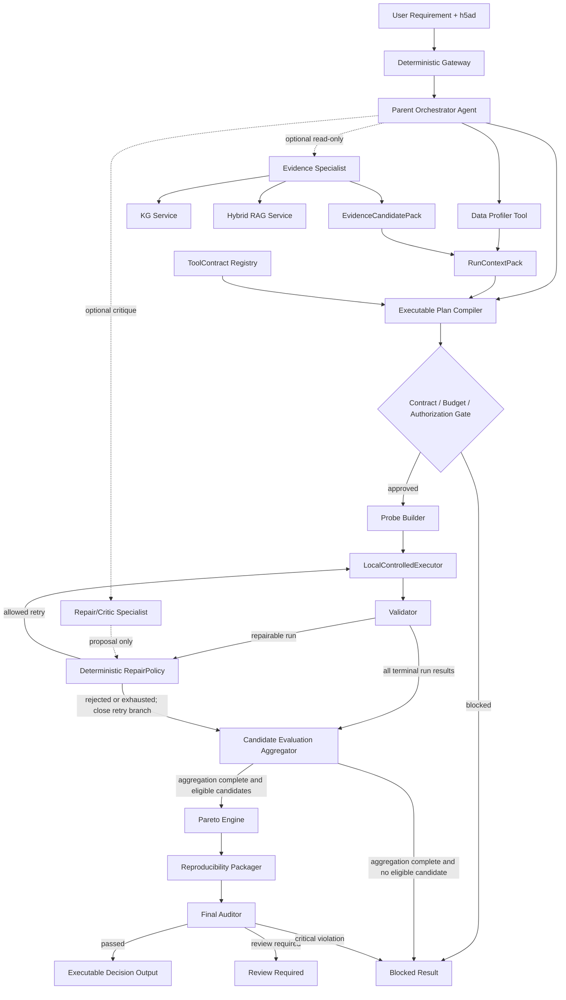
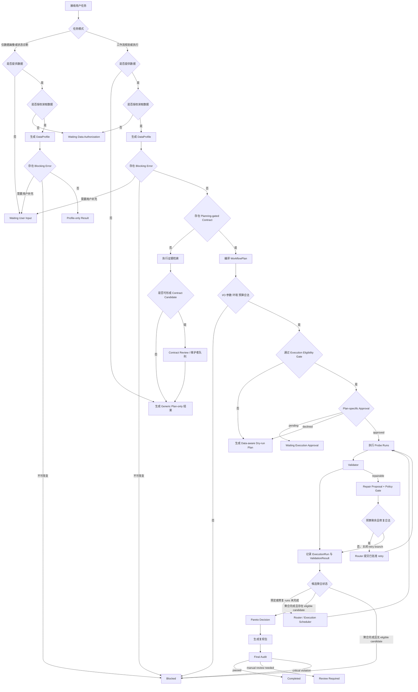
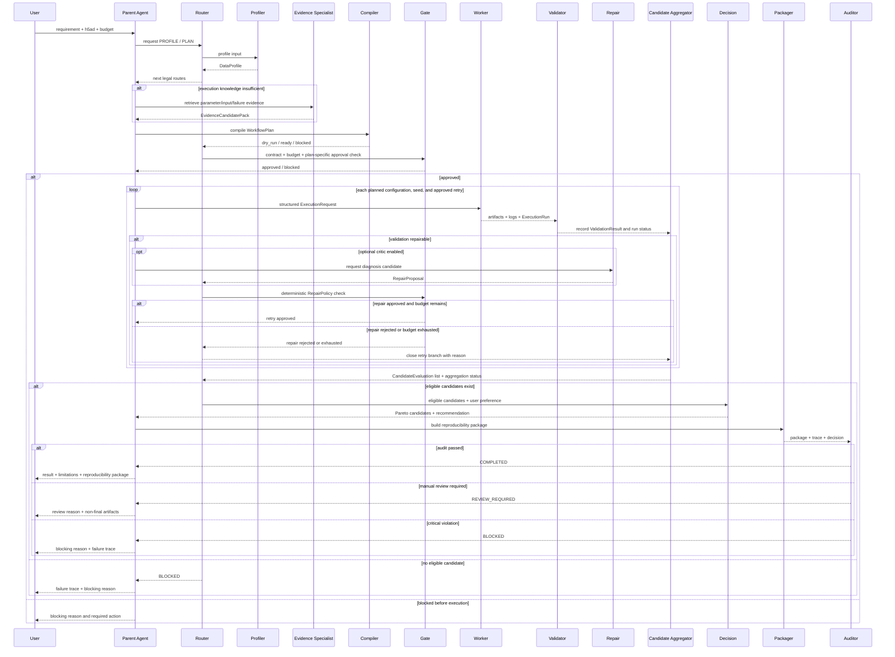
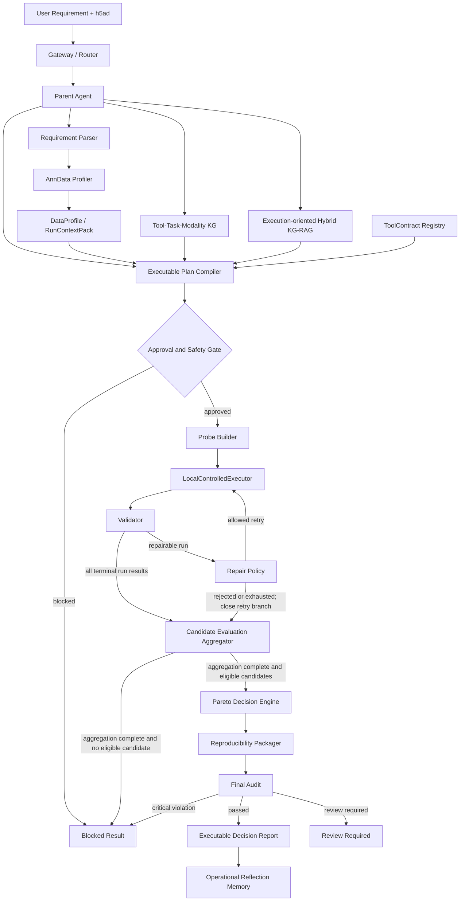
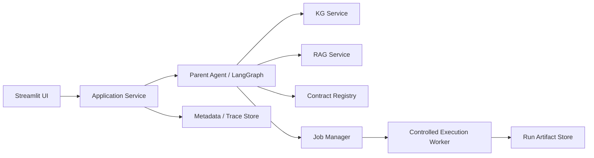

# scKG-Agent 2.0 中文开发规约

版本：2.4.0  
状态：Active，Phase 4 execution orchestration + bounded repair completed；用户执行仍禁用  
生效日期：2026-07-11  
维护语言：中文  
适用仓库：`SCKG-Agent`  
历史规约：`docs/DEV_SPEC_scKG_CN.md`，冻结为 1.x 设计与演进记录  

> 本规约是 scKG-Agent 2.0 的唯一主开发基准。需求、代码、测试、评测、界面和文档发生冲突时，以本规约中当前 Phase 的边界和验收标准为准。完成每个 Phase 后必须反向更新本文档。

---

## 0. 2.0 决策摘要

scKG-Agent 2.0 从“证据治理型推荐与报告原型”转向：

```text
面向单细胞分析的
证据约束、可执行、可验证、可修复、可复现的科研 Agent
```

推荐英文定位：

```text
scKG-Agent 2.0:
An Evidence-Grounded Agent
for Single-Cell Workflow Planning, Execution, Validation, and Repair
```

核心研究问题：

```text
如何将用户的单细胞分析需求和真实数据状态，
转化为经过轻量执行验证、能够解释参数来源、
能够有限修复错误并交付复现包的分析工作流？
```

2.0 的决定不是废弃已有 KG、RAG、证据治理和推荐模块，而是改变它们在系统中的位置：

```text
1.x：证据与图谱 -> 推荐 -> 报告

2.0：需求与数据 -> 图谱/RAG/契约 -> 可执行计划
     -> Probe 实测 -> 验证/修复 -> 多目标决策 -> 复现包
```

### 0.1 已敲定的架构决策

| 决策 | 2.0 结论 |
| --- | --- |
| 项目名称 | 继续使用 `scKG-Agent`，不立即重命名仓库 |
| `scKG-Exec` | 作为执行子系统或内部代号，不作为当前仓库名称 |
| Agent 类型 | 有边界的中心化 Agent（Bounded Centralized Agent），Parent 可委派预定义 Specialist，但 Specialist 不再生成下级 Agent |
| 当前是否多 Agent | 不是运行中的多 Agent；subagent contract 已有但默认关闭 |
| 核心输出 | 可执行计划、运行结果、验证结果、修复记录、复现包，而不只是报告 |
| 首个任务 | Doublet Detection |
| 首个输入 | 本地 `.h5ad` / AnnData，scRNA-seq |
| 首个真实工具 | Scrublet |
| 第二独立工具 | 在 Python 闭环稳定后引入 `scDblFinder` 或 `DoubletFinder`，不得伪装成已完成 |
| Batch Integration | 第二个动态任务，不与首个闭环并行开发 |
| 执行模式 | `LocalControlledExecutor`，应用层受控 worker，`shell=False`，wrapper allowlist，有限预算 |
| 环境 | `sckg_env` 为控制平面；`scRNAseq` 为首选执行环境候选 |
| RAG 范围 | 只优先覆盖执行白名单工具，不要求 1800+ 工具全部下载 PDF 和切 chunk |
| Dense embedding | 不是 Phase 1 阻塞项；稀疏检索和结构化契约先服务执行 |
| 决策方式 | Pareto frontier + 透明偏好，不输出无统计定义的伪精确置信度 |
| Memory | 只保存偏好、资源约束和运行教训，不成为科学证据或参数权威 |
| MCP | 等本地执行 contract 稳定后再抽取，不是当前主线 |
| GNN / RL | 暂停，不进入 2.0 MVP |
| 多 Agent 口径  | 当前不是运行中的多 Agent；MVP 只有 Parent Agent，未来最多增加只读 Evidence Specialist 与受限 Repair/Critic Specialist |
| 任务路由 | Parent Agent 负责语义规划；deterministic Router 负责权限、状态和预算路由；任何 Specialist 都无最终执行权 |
| 动态 Agent 范围| 允许动态选择 route、工具、probe、参数搜索和 repair；不允许动态生成任意 Agent 类型或任意工具权限  |
| RAG 地位 | Execution-oriented Hybrid KG-RAG 是核心知识能力，但不能直接越过 ToolContract 生成执行参数|
| 服务化原则 | MVP 采用 modular monolith + separate execution worker；核心 Python API 稳定后再包装 MCP/FastAPI |
| Skill 原则 | Skill 是版本化、可测试的能力单元，不等于 Agent；所有执行型 Skill 必须绑定 schema、权限、contract 和测试 |

### 0.2 对新转型手册的裁决

直接采纳：

- 从报告型 Agent 转向执行、验证、修复型 Agent；
- AnnData Data Profiler；
- ToolContract；
- workflow DAG 与参数搜索空间；
- Probe Builder；
- LocalControlledExecutor；
- Validation 与有限 Repair Loop；
- Pareto 多目标决策；
- 可复现运行包；
- Planning/Knowledge 与 Execution/Repair 双轨 baseline；
- 首个闭环优先 Doublet Detection；
- 禁止任意 shell、无限重试、自动安装、自动写 formal evidence。

调整后采纳：

- 项目不整体改名为 `scKG-Exec`，避免已有论文、文档、图谱和代码口径断裂；
- Phase 1 不同时支持 6 至 8 个真实执行工具，只为少量工具建立 contract；
- RAG 的参数、输入要求、失败模式增强必须与 ToolContract 同期开始，不能放到所有执行之后；
- 首个闭环先完成 Scrublet 的真实运行和参数比较，再增加第二个独立实现；
- Batch Integration 等 Doublet Detection 闭环稳定后再进入；
- 当前 `ToolExecutor` 是 Agent 函数调用包装器，不等同于生信受控执行器。

暂缓：

- 自动 spawn 多层 subagent；
- 全工具覆盖；
- 复杂 Docker/Kubernetes/remote worker；
- 自动 evidence promotion；
- GNN、RL、learning-to-rank；
- 用户行为 Agent；
- 自动生成最终生物学结论。

---

## 1. 为什么必须转型

当前系统已经能完成约束解析、KG 候选召回、证据检索、工作流模板生成、MCDM、报告审计和可观测展示，但主要回答的仍是：

```text
“应该考虑哪些工具，以及为什么。”
```

通用 LLM、Deep Research 和普通 RAG 也可以生成类似内容。仅增加 PDF、图谱节点、Agent 角色名称或更漂亮的报告，不会形成稳定的科研价值。

2.0 要回答的是：

```text
“基于我的真实数据状态，这个方法能否运行？”
“参数是否合法，来源是什么？”
“在小规模 probe 上实际表现如何？”
“失败在哪里，系统做了什么有限修复？”
“最终交付能否由另一个人复现？”
```

这些能力不能由一个 Prompt 稳定替代，因为它们依赖：

- 真实文件检查；
- 结构化工具契约；
- 输入输出兼容性校验；
- 受控执行与明确的隔离等级；
- 真实 stdout、stderr、版本和资源记录；
- 任务指标计算；
- 有限状态修复；
- artifact hash 和复现清单。

这也是 2.0 与普通“推荐助手”的核心差异。

---

## 1A. 研究假设

2.0 不只验证“系统能否做出来”，还要检验以下可证伪假设。详细数据集、baseline、统计方法和防泄漏协议维护在 `docs/eval/RESEARCH_EVAL_PROTOCOL.md`。

### H1：DataProfiler 与 ToolContract 能减少无效工作流

与 LLM-only 或普通 RAG 相比，matrix-level DataProfiler 和 ToolContract 应提高：

- critical input error recall；
- parameter legality；
- input/output compatibility；
- invalid execution blocking rate。

### H2：Execution-oriented KG-RAG 能提高执行知识检索质量

与普通文档 RAG 相比，KG-RAG 应提高：

- parameter source recall；
- input requirement recall；
- failure mode recall；
- metric definition recall；
- source span hit rate。

### H3：执行反馈闭环能提高任务完成率和复现率

与 one-shot code generation 相比，contract-constrained execution 和有限 repair 应提高：

- executable rate；
- artifact completion；
- rerun success；
- failure detection；

并降低 unsupported repair 和 unsafe action。

### H4：轻量 Probe 可辅助配置选择，但外推能力有限

需要分别检验：

- probe 上的参数排序是否稳定；
- 不同子样本和随机种子下排序是否一致；
- probe 排名能否预测更大数据上的表现；
- synthetic probe 与正交标签数据的结果是否一致。

Synthetic probe 结果不支持真实检测准确率声明。

### H5：受控 Agent 更安全，但可能牺牲灵活性

比较自由 one-shot Agent、固定 deterministic workflow 和受控 Parent Agent 的：

- task completion；
- invalid action；
- tool-call count；
- runtime；
- repair success；
- unsupported scientific claim。

---
## 1B. 科研贡献与工程贡献边界

scKG-Agent 2.0 不声称提出新的基础大模型、通用 RAG 算法或通用多 Agent 理论。项目贡献分为科研方法贡献与工程系统贡献。

### 1B.1 科研方法贡献候选

1. **Data-aware workflow planning**

   工作流规划不仅依据用户自然语言，还显式读取 AnnData 的矩阵状态、metadata、任务前置条件和资源约束。

2. **Contract-constrained executable capability representation**

   使用版本化 ToolContract 描述工具输入、输出、参数、前置条件、失败状态、验证指标和执行环境，使工具知识可以被编译和执行，而不只是被自然语言描述。

3. **Execution-oriented Hybrid KG-RAG**

   KG-RAG 不只检索工具介绍和文献摘要，还检索执行所需的输入要求、参数来源、失败模式、metric 定义、版本信息和 workflow transition。

4. **Probe-based empirical validation**

   在受限预算和受控 probe 上实际运行候选配置，以本次执行结果补充文献先验，但不将 synthetic probe 结果外推为真实科学性能。

5. **Contract-constrained repair**

   错误修复不允许 Agent 自由修改代码或参数，只能在 ToolContract 和 RepairPolicy 声明的合法空间内进行。

6. **Artifact-grounded evaluation**

   Agent 质量主要依据真实 artifact、运行日志、验证指标、错误恢复和复现结果进行评价，而不是仅依赖 LLM judge。

### 1B.2 工程系统贡献

* matrix-level AnnData profiler；
* ToolContract registry；
* LocalControlledExecutor；
* execution trace；
* reproducibility package；
* adaptive retrieval router；
* read-only MCP-ready service APIs；
* evaluation harness 与 robustness suite。

这些工程模块可以形成软件成果、软著、演示系统和求职项目，但不能单独被表述为新的科学理论。

### 1B.3 不得作为核心创新单独声称的内容

以下能力属于采用、集成或工程实现：

* LangGraph；
* 普通 RAG；
* BM25 + dense retrieval + RRF；
* Neo4j；
* MCP；
* Streamlit；
* 多 Agent 角色命名；
* MCDM；
* Docker；
* Dashboard；
* LLM structured output。

项目的创新性必须通过消融实验和真实执行结果证明，而不能通过技术组件数量证明。


## 2. 当前实现边界与状态维护

主规约只保存稳定的能力边界，不保存会频繁变化的测试数、包版本、source coverage 和当前 blocker。

动态状态统一维护在：

```text
docs/status/PROJECT_STATUS_2.0.md
```

科研评测协议维护在：

```text
docs/eval/RESEARCH_EVAL_PROTOCOL.md
```

执行威胁模型维护在：

```text
docs/security/EXECUTION_SECURITY_MODEL.md
```

### 2.1 稳定能力分类

现有 KG、RAG、evidence gate、plan-only workflow、trace、dashboard 和 operational memory 作为 1.x 可复用基础。Phase 1 已实现 canonical execution models、deterministic AnnDataProfiler、planning-only Scrublet ToolContract 和 import-qualified EnvironmentRegistry。受控本地执行、Validator、Repair Loop 和 Reproducibility Packager 在对应 Phase 验收前仍属于目标能力。

文档或 UI 必须使用以下状态：

```text
implemented
partially_implemented
design_only
not_implemented
deprecated
```

禁止用“已规划”“已有 schema 草案”代替 `implemented`。

### 2.2 不得混淆的现有对象

`core.agent_runtime.ToolExecutor` 当前负责：

```text
注册 Python 函数
校验参数模型
记录 tool call trace
阻断重复调用和超预算调用
```

它不负责：

```text
执行生信命令
隔离文件系统
限制运行时间和内存
记录产物 hash
管理 Conda/R/Python 环境
```

因此 2.0 新增的生信执行器必须命名为 `LocalControlledExecutor`，不能复用 `ToolExecutor`，也不能在没有 OS/container isolation 时称为 sandbox。

### 2.3 状态更新规则

每次 Phase 完成后：

1. 更新 `docs/status/PROJECT_STATUS_2.0.md` 的日期、实现状态、环境和测试；
2. 只有 schema、边界、Phase 或 gate 改变时才更新本规约；
3. 实验数据集、baseline 或统计方法改变时更新评测协议；
4. 路径、进程、网络或资源隔离改变时更新安全模型。

---

## 3. 产品边界

### 3.1 2.0 是什么

scKG-Agent 2.0 是一个受控科研 Agent。它负责：

1. 理解用户任务和资源约束；
2. 检查真实单细胞数据对象；
3. 从 KG、RAG 和 ToolContract 召回候选工具、参数和限制；
4. 编译可执行 workflow DAG；
5. 在受控 probe 数据上运行候选配置；
6. 验证产物、任务指标、稳定性和资源消耗；
7. 对允许修复的失败执行有限重试；
8. 用透明多目标决策比较结果；
9. 输出代码、配置、环境、trace、指标和证据链接。

### 3.2 2.0 不是什么

第一版不承诺：

- 自动处理 FASTQ/BAM；
- 自动发现所有单细胞工具；
- 支持任意 Python/R 工具；
- 支持全单细胞多组学原始数据；
- 自动产生可发表生物学结论；
- 自动判断所有 benchmark 是否可信；
- 全自动安装依赖；
- 自动修改用户原始数据；
- 自动写 formal TSV 或 trusted Neo4j；
- 自动无限修复；
- 去中心化多 Agent；
- 训练领域 LLM；
- 用 embedding 相似度代替真实执行。

### 3.3 不需要把所有工具 PDF 都入库

2.0 明确取消以下错误前提：

```text
“只有把 1800+ 工具的所有论文 PDF 下载、切 chunk、embedding，
Agent 才能开始执行。”
```

正确顺序是：

```text
选择执行白名单工具
-> 补齐官方文档、方法论文、参数说明和失败模式
-> 建立 ToolContract
-> 完成真实执行与评测
-> 根据任务扩展工具覆盖
```

PDF 只是 source 类型之一。官方 HTML、API 文档、README、tutorial、protocol 和可定位的方法段落都可以成为 retrieval source。只有需要支持具体 claim 时，才要求相应 source span。

---

## 4. Agent 与 Workflow 的关系

Workflow 是被规划和执行的对象，Agent 是控制这个闭环的决策主体。

```text
Workflow：固定或动态生成的步骤、依赖、输入输出和参数
Agent：观察状态、选择工具、执行、读取结果、决定继续/修复/停止
```

只输出一份 DAG 不是完整 Agent。2.0 至少必须形成：

```text
Observe data
-> Plan
-> Act on probe
-> Observe result
-> Validate
-> Repair or stop
-> Decide
-> Package
```

### 4.1 架构类型

当前与目标口径：

```text
当前：中心化 Parent Agent + 硬编码 LangGraph 工作流原型
目标：有限状态、预算受控的 Bounded Centralized Agent
```

Parent Agent 对以下内容负最终责任：

- 任务路由；
- 是否需要数据画像；
- 是否提出执行请求以及是否进入执行候选路径；
- workflow plan；
- repair budget；
- evidence boundary；
- 最终决策和报告；
- 复现包完整性。

Subagent 不是 2.0 MVP 的必要条件。执行 worker 也不是 subagent，它只是无自主权的受控工具。

执行是否最终获准，由用户授权、ToolContract execution gate、Deterministic Router 和 Safety Gate 共同决定。Parent Agent 无权单独批准执行。

### 4.2 Agentic Decision Boundary

系统不把所有逻辑交给 LLM。确定性模块负责：

- 文件、路径和 hash 校验；
- matrix-level 数据状态检测；
- ToolContract schema 和执行 gate；
- 参数类型与范围；
- 用户执行授权；
- artifact validation；
- repair permission；
- budget、安全边界和停止条件；
- Pareto 计算。

Parent Agent 负责：

- 根据用户目标形成候选任务计划；
- 在合法 ToolContract 中选择候选；
- 根据 DataProfile 决定补充检索、请求信息或阻断；
- 根据运行结果选择继续测试、停止或进入允许的 repair route；
- 根据用户资源偏好选择 Pareto candidate；
- 组织结论、限制和复现说明。

只有形成以下运行时闭环时，场景才称为 Agent 路由：

```text
Observe -> Plan -> Act -> Observe -> Adapt -> Stop
```

若某场景始终执行同一固定 DAG，应表述为 `deterministic workflow`。2.0 评测必须加入：

```text
fixed deterministic workflow
vs
Parent Agent dynamic routing
```

Agent 的价值由动态路径选择、正确阻断、有限修复和停止决策证明，不由 Agent 角色数量证明。

### 4.3 当前与目标 Agent 拓扑

当前系统只有一个真正拥有运行时决策权的 Agent：

```text
Parent Orchestrator Agent
```

DataProfiler、KG Retriever、RAG Retriever、Plan Compiler、Executor、Validator、RepairPolicy 和 Pareto Engine 均属于工具、服务、编译器或确定性决策模块，不应因为被 Parent Agent 调用就称为独立 Agent。

MVP 架构：

```text
Parent Agent
  + deterministic tools/services
  + controlled execution worker
```

目标扩展架构最多包含三个 Agent：

| Agent                    | 状态      | 核心职责                                              | 明确禁止                                    |
| ------------------------ | ------- | ------------------------------------------------- | --------------------------------------- |
| Parent Orchestrator      | MVP 主控  | 目标理解、规划、路由、停止、授权申请、最终决策                           | 任意 shell、绕过 contract、修改 formal evidence |
| Evidence Specialist      | 后续可选，只读 | query decomposition、KG/RAG 检索、source span 与参数来源核对 | 启动执行、修改 contract、决定最终推荐                 |
| Repair/Critic Specialist | 后续可选，受限 | 错误归类候选、修复建议、矛盾检查                                  | 自由改代码、直接重试、扩大预算、修改 repair policy        |

执行 worker 不是 Agent。它不具有目标、规划、记忆和自主路由能力。

### 4.4 权限与责任矩阵

| 决策/动作              |        Parent Agent | Specialist Agent |    Deterministic Module |         User |
| ------------------ | ------------------: | ---------------: | ----------------------: | -----------: |
| 理解用户目标             |                  主责 |              可辅助 |               schema 校验 |         提供需求 |
| 任务路由               |                  主责 |               无权 |          Router 强制 gate |            无 |
| KG/RAG 检索          |                  发起 |          可执行只读检索 |            Retriever 执行 |            无 |
| Workflow DAG 编译    |                  发起 |               无权 |        Plan Compiler 主责 |            无 |
| 参数合法性              |              无权修改规则 |           无权修改规则 |         ToolContract 主责 | 只能在合法范围内显式 override |
| 执行授权               |                  申请 |               无权 |                 Gate 校验 |         最终确认 |
| 真实执行               |              无直接执行权 |               无权 | LocalControlledExecutor |        授权后触发 |
| 结果有效性              |                  读取 |              可批评 |            Validator 主责 |          可查看 |
| Repair 建议          | 决定是否进入 repair route |            可提出候选 |     RepairPolicy 决定是否合法 |        必要时确认 |
| 最终推荐               |                  主责 |             无最终权 |      Pareto Engine 提供候选 |         提供偏好 |
| Formal evidence 修改 |              无权自动修改 |               无权 |      人工 review workflow |        维护者确认 |

### 4.5 Route 类型

系统至少定义以下 route：

```text
PROFILE_ONLY
PLAN_ONLY
EVIDENCE_RECOVERY
CONTRACT_REVIEW
EXECUTION_QUALIFICATION
WAITING_USER_INPUT
WAITING_DATA_AUTHORIZATION
WAITING_EXECUTION_APPROVAL
PROBE_EXECUTION
VALIDATION
REPAIR
DECISION
PACKAGE
AUDIT
REVIEW_REQUIRED
COMPLETED
BLOCKED
```

每个 route 必须声明：

* 输入 schema；
* 输出 schema；
* 允许调用的工具；
* 最大调用次数；
* 是否读取用户数据；
* 是否允许外部模型；
* 是否需要用户授权；
* 失败后的合法下一 route。

### 4.6 Deterministic Router

Parent Agent 可以提出下一步意图，但最终 route 必须由 deterministic Router 根据状态和 gate 决定。

Router 至少读取：

```yaml
request:
  task
  input_path
  data_access_authorized
  execution_authorized
data_profile:
  blocking_errors
  selected_count_source
contract:
  planning_gate_passed
  execution_gate_passed
plan:
  plan_status
execution:
  run_status
validation:
  eligible_for_candidate_aggregation: bool
  repairable: bool
candidate_evaluation:
  aggregation_complete: bool
  eligible_candidate_count: int
  all_candidates_failed: bool
budget:
  runs_remaining
  repairs_remaining
user:
  approval_state
actor:
  role: user | maintainer
qualification:
  mode: bool
  fixture_id: str | null
  fixture_allowlisted: bool
```

核心规则：

```text
用户任务仅请求数据画像、对象解释或数据状态诊断，
且不请求 workflow planning 或 execution
  -> PROFILE_ONLY

未提供数据，但请求生成通用分析方案
  -> PLAN_ONLY

提供数据但 data_access_authorized = false
  -> WAITING_DATA_AUTHORIZATION

存在需要用户处理的 blocking error
  -> WAITING_USER_INPUT

存在不可恢复的 blocking error
  -> BLOCKED

缺少 planning-gated contract
  -> EVIDENCE_RECOVERY、CONTRACT_REVIEW 或 PLAN_ONLY

contract 未通过 execution gate，
且 actor.role = maintainer，
且 qualification.mode = true，
且 fixture_allowlisted = true
  -> EXECUTION_QUALIFICATION

contract 未通过 execution gate，
且不满足 qualification 条件
  -> PLAN_ONLY 或 CONTRACT_REVIEW

数据已画像但 execution_authorized = false
  -> PLAN_ONLY

plan ready，
且 execution_authorized = true，
但 approval_state != approved
  -> WAITING_EXECUTION_APPROVAL

plan approved
  -> PROBE_EXECUTION

单次 run 进入 terminal 状态
  -> VALIDATION

每个 ValidationResult 都必须写入对应 candidate 的运行记录。
eligible_for_candidate_aggregation 只决定该 run 是否参与聚合指标，
不影响 failed_run_id、失败类型和资源记录的保存。

validation.repairable = true 且预算足够
  -> REPAIR

validation.repairable = false，
或 repair 被拒绝、取消、耗尽预算
  -> 不生成新 run，继续等待 candidate 聚合

同一 candidate 的预定 run 或已批准 repair run 尚未全部进入 terminal 状态
  -> PROBE_EXECUTION

PROBE_EXECUTION route 同时负责提交未运行任务和轮询已提交任务，
具体 job 状态由 execution scheduler 管理。

candidate 聚合完成且 eligible_candidate_count > 0
  -> DECISION

candidate 聚合完成且 all_candidates_failed = true
  -> BLOCKED

decision 完成
  -> PACKAGE

package 完成
  -> AUDIT

AUDIT 通过
  -> COMPLETED

AUDIT 未通过，但属于非关键缺失或可人工复核问题
  -> REVIEW_REQUIRED

AUDIT 发现 evidence boundary violation、
unauthorized execution、安全问题、
关键 artifact 缺失或结论无法回溯
  -> BLOCKED
```

LLM 不能直接修改 Router 的状态字段，也不能把 `BLOCKED` 改为 `READY`。

### 4.7 动态 Agent 边界

2.0 是有界动态 Agent，而不是任意动态 Agent。

允许动态决定：

* 是否需要证据检索；
* 是否需要用户补充信息；
* 选择哪些通过 gate 的候选工具；
* 选择 probe 规模；
* 选择 ToolContract 允许的参数配置；
* 是否进入 repair；
* 何时停止；
* 选择哪个 Pareto candidate。

固定不变：

* Agent 类型；
* 工具权限；
* ToolContract；
* RepairPolicy；
* 最大深度；
* 最大工具调用次数；
* 最大 repair 次数；
* 执行白名单；
* evidence boundary；
* 用户授权规则。

未来若启用 Specialist Agent：

```text
max_specialist_depth = 1
max_specialists_per_run = 2
specialist_execution_permission = false
specialist_write_permission = false
```

MVP 不动态创建新的 Agent 类型。

### 4.8 Agent 模式图



### 4.9 任务规划流程图



### 4.10 核心时序图



## 5. 总体架构



### 5.1 四个平面

控制平面：

- Parent Agent；
- LangGraph 状态机；
- routing、budget、approval；
- trace 和 audit。

知识平面：

- Neo4j KG；
- formal evidence；
- source chunks；
- ToolContract registry；
- metric/failure/parameter knowledge。

执行平面：

- Data Profiler worker；
- Probe Builder；
- LocalControlledExecutor；
- tool wrappers；
- Validator；
- Repair Policy；
- run artifacts。

评测与治理平面：

- planning eval；
- execution eval；
- repair eval；
- scientific validity eval；
- governance eval；
- observability dashboard。

---

## 6. MVP 边界

### 6.1 输入

Phase 1 至 Phase 4 只支持：

```text
文件：.h5ad
对象：AnnData
模态：scRNA-seq
数据形态：本地文件
任务：Doublet Detection
```

不支持：

```text
FASTQ, BAM, loom, RDS, spatial image,
scATAC raw fragments, CITE-seq raw inputs,
远程对象存储和任意 URL 输入
```

### 6.2 首个执行工具

第一个真实 wrapper：

```text
Scrublet
```

首个闭环允许比较：

- 不同合法参数配置；
- 不同随机种子；
- 默认参数与 source-bound 参数范围；
- Scrublet 与透明 heuristic baseline。

注意：heuristic baseline 不是第二个科学工具，不能在论文或展示中写成“两种工具比较”。

第二个独立工具只在 Phase 3A-E 完成后选择：

```text
优先评估 scDblFinder
备选 DoubletFinder
```

选择标准：

- 能否从 AnnData counts 做稳定转换；
- 本地 Mac 环境能否复现；
- wrapper 和环境复杂度；
- source 与参数信息是否足够；
- 是否能生成与 Scrublet 可比较的输出。

### 6.3 默认预算

首版默认值采用保守本地配置：

```text
max_cells_for_probe = 10_000
max_genes_for_probe = all input genes, with method-specific HVG cap when needed

parameter_configs_per_tool <= 4
random_seeds_per_config <= 3

max_initial_runs_per_request = 12
reserved_repair_runs_per_request = 4
reserved_validation_reruns = 2
max_total_runs_per_request = 18

repair_attempts_per_failed_run <= 2
max_concurrent_runs = 1
default_timeout_seconds = 900

必须满足：

initial_runs
+ repair_runs
+ validation_reruns
<= max_total_runs_per_request

Planner 不得把全部预算分配给初始参数搜索。
Repair 预算未使用时可以释放给后续验证，但必须记录 budget reallocation。
加入第二工具后，预算必须在工具之间显式分配，不能简单乘以工具数量。
```

预算必须可配置，并写入 trace。资源不足时缩小 probe 或阻断，不自动运行全量数据。

---

## 7. 核心数据模型

执行模型建议新增到 `core/execution_models.py`，避免继续扩大 `core/models.py`。

### 7.1 RequirementSpec

```yaml
request_id: str
query: str
task: doublet_detection
modality: scRNA-seq
species: str | unknown
platform: str | unknown
input_path: str | null
input_object_type: AnnData | unknown
batch_key: str | null
label_key: str | null
resource_budget:
  max_cells: int
  max_runtime_seconds: int
  max_memory_mb: int | null
  memory_enforcement: monitor_only | hard_limit
  gpu_allowed: bool
output_goal: str
strictness: conservative | balanced | exploratory
data_access_authorized: bool
execution_authorized: bool
user:
  approval_state: pending | approved | declined | revoked
  approved_plan_id: str | null
  approved_plan_hash: str | null
  approved_budget_snapshot: object | null
  approved_at: datetime | null
  approval_revoked_at: datetime | null
```

规则：

- LLM 可以辅助解析自然语言；
- 路径、文件类型、预算和授权必须由确定性代码校验；
- 未授权时只能生成 dry-run plan；
- 用户数据内容不发送给外部 LLM，默认只发送去标识化 profile summary。

授权分层：

```text
data_access_authorized 控制系统是否可以读取和画像用户文件。
execution_authorized 表示用户是否允许本次请求进入真实执行候选流程，
不等于用户已经批准任意具体计划。

user.approval_state 表示用户对某个具体 WorkflowPlan 的批准状态：

pending | approved | declined | revoked

批准必须绑定：

approved_plan_id
approved_plan_hash
approved_budget_snapshot
approved_at

当工具、输入矩阵、参数搜索范围、资源预算或输出路径发生实质变化时，
原批准自动失效并重新进入 WAITING_EXECUTION_APPROVAL。

RepairPolicy 范围内、且不改变已批准风险边界的修复，
可以复用原批准；超出原预算或改变工具/输入的修复必须重新授权。

```

用户可以选择：

1. 不提供数据，只获得 generic plan；
2. 提供数据并授权画像，但不授权执行，只获得 data-aware dry-run plan；
3. 同时授权画像与执行，经过 gate 后启动 probe run。

### 7.2 DataStateEvidence

每个数据状态判断都必须保存依据：

```yaml
state_name: integer_count_likelihood
value: 0.98
method: sampled_nonzero_integer_fraction
sample_size: 10000
thresholds:
  raw_like: 0.95
warnings: []
```

启发式数值不能单独决定执行输入。`value` 表示观测结果或启发式信号，不是统计校准后的概率。

### 7.3 MatrixProfile

AnnData 的 `X`、`raw.X` 和 `layers/*` 必须分别画像：

```yaml
matrix_id: X | raw.X | layers/counts
shape: [int, int]
dtype: str
is_sparse: bool
min_value: float | null
max_value: float | null
negative_fraction: float | null
nonzero_integer_fraction: float | null
inferred_state: raw_counts | normalized | log_normalized | scaled | unknown
inference_confidence: high | medium | low
state_evidence: [DataStateEvidence]
eligible_tasks: [str]
blocking_reasons: [str]
```

`inference_confidence` 是规则强弱标签，不得解释为统计置信度。矩阵采样、阈值和推断规则必须写进 `state_evidence`。

### 7.4 DataProfile

```yaml
profile_id: str
file_path_redacted: str
file_hash: str
file_size_bytes: int
object_type: AnnData
n_cells: int
n_genes: int
raw_exists: bool
layers: [str]
obsm_keys: [str]
obsp_keys: [str]
obs_keys: [str]
var_keys: [str]
batch_key: str | null
batch_count: int | null
label_key: str | null
has_pca: bool
has_neighbors: bool
has_clustering: bool
matrix_profiles: [MatrixProfile]
selected_count_source: str | null
count_source_selection:
  method: explicit_user | tool_contract | explicit_layer_name | deterministic_rule | unresolved
  evidence: [str]
warnings: [str]
blocking_errors: [str]
profile_version: str
```

count source 选择优先级：

```text
用户明确指定且通过 MatrixProfile/ToolContract 校验
> ToolContract 明确指定
> 明确命名且通过校验的 counts layer
> 可验证的整数 count matrix
> 数值启发式候选
> unresolved
```

数值启发式只能产生候选，不能让系统自动越过 `unresolved`。例如：

```text
X = log-normalized
layers/counts = raw counts
raw.X = older normalized matrix
```

此时 DataProfile 必须保留三个 MatrixProfile，并将 `layers/counts` 作为有依据的执行候选，而不是给整个 AnnData 一个状态标签。

### 7.5 ToolContract

```yaml
contract_id: str
contract_version: str
tool_name: str
tool_version: str
task: str
language: python | r
environment_id: str
wrapper_id: str
input_object: AnnData
required_fields: [str]
optional_fields: [str]
preconditions: [ContractRule]
not_supported: [str]
output_artifacts: [ArtifactSpec]
parameter_schema: object
default_parameters: object
paper_parameters: [ParameterProvenance]
searchable_parameters: object
failure_checks: [str]
validation_metrics: [str]
resource_requirements: object
source_refs: [str]
schema_status: draft | valid | invalid
source_review_status: missing | partial | reviewed
execution_critical_fields_reviewed: bool
wrapper_status: missing | implemented | smoke_passed
environment_status: missing | available | smoke_passed
execution_status: untested | integration_passed
scientific_validation_status: not_evaluated | synthetic_only | scientific_pilot | externally_evaluated
enabled_for_execution: bool
```

Planning gate 要求：

```text
schema_status = valid
source_review_status in {partial, reviewed}
wrapper_id is declared
parameter_schema is valid
```

通过 planning gate 的 contract 可以进入 dry-run plan，但不能执行。

Execution gate 要求：

```text
schema_status = valid
source_review_status = reviewed
execution_critical_fields_reviewed = true
wrapper_status = smoke_passed
environment_status = smoke_passed
execution_status = integration_passed
enabled_for_execution = true
```

执行关键字段包括：

- input matrix requirements；
- default parameters；
- searchable parameter ranges；
- output artifacts；
- failure checks；
- validation metrics；
- tool version；
- resource requirements。

满足执行 gate 不代表科学性能已经被外部数据验证。`scientific_validation_status` 必须单独展示，不能被其他状态隐式推高。

Contract 第一次 integration test 通过受限 qualification route 完成：

```text
schema_status = valid
wrapper_status = implemented
environment_status = available
qualification_fixture = maintainer-approved
qualification_mode = true
```

Qualification route 只允许测试 fixture 和维护者运行，不接受用户数据，也不进入最终推荐。测试通过后才能更新 `smoke_passed`、`integration_passed` 和 `enabled_for_execution`。

ToolContract 文件使用版本化 JSON，推荐路径：

```text
contracts/tools/scrublet/0.2.3.json
contracts/tools/scdblfinder/<version>.json
contracts/tools/harmony/<version>.json
contracts/tools/scanorama/<version>.json
```

首版使用 JSON，避免额外引入 YAML parser。

### 7.6 ParameterProvenance

```yaml
parameter_name: str
value_or_range: any
origin_type: contract_default | source_bound_prior | user_override | empirical_search | repair_action
source_type: official_default | official_tutorial | primary_paper | benchmark | internal_run | user | policy_rule
source_id: str | null
source_span: str | null
tool_version: str | null
run_id: str | null
policy_rule_id: str | null
applicable_scope: str
limitations: [str]
```

执行使用的每个参数都必须区分“为什么出现这个值”和“证据或规则来自哪里”：

```text
origin_type = 参数进入 plan/run 的原因；
source_type/source_id/source_span = 支撑该参数合法性或推荐范围的来源；
run_id = empirical_search 或 repair_action 产生参数时对应的运行记录；
policy_rule_id = repair 或安全策略修改参数时对应的规则。
```

`user_override` 只能在 ToolContract 合法范围内生效。`empirical_search` 和 `repair_action` 的参数不能伪装为文献参数，必须回链到运行记录或 policy rule。

### 7.7 WorkflowPlan

```yaml
plan_id: str
requirement_id: str
profile_id: str
steps: [WorkflowNode]
edges: [WorkflowEdge]
candidate_tools: [str]
selected_probe_tools: [str]
parameter_search_space: object
execution_budget: object
expected_outputs: [ArtifactSpec]
blocking_conditions: [str]
approval_required: bool
plan_status: dry_run | ready | blocked | approved
```

每个 WorkflowNode 必须包含：

- 输入 artifact；
- 输出 artifact；
- ToolContract；
- 参数与来源；
- 资源预算；
- 前置条件；
- 失败策略；
- 是否可跳过。

### 7.8 ProbeSpec

```yaml
probe_id: str
profile_id: str
sampling_strategy: stratified_by_batch | random
max_cells: int
random_seed: int
selected_obs_indices_hash: str
synthetic_doublet_ratio: float | null
synthetic_generation_method: str | null
synthetic_generation_version: str | null
pairing_strategy: within_cluster | between_cluster | mixed | null
split_role: engineering | development | evaluation
ground_truth_available: bool
ground_truth_type: synthetic | cell_hashing | genotype_demultiplexing | experimental | none
probe_artifact_path: str
probe_hash: str
```

### 7.9 ExecutionRequest 与 ExecutionRun

Parent Agent 不能直接输出任意 shell command。它只能生成：

```yaml
request_id: str
run_id: str
wrapper_id: scrublet_v0_2_3
environment_id: scRNAseq
input_artifact_id: probe_001
parameters: object
timeout_seconds: int
artifact_policy_id: default_run_artifacts
```

ExecutionRequest 不接受用户或 LLM 提供的绝对输出目录。

LocalControlledExecutor 根据 run_id 和 artifact_policy_id
确定规范化工作目录：

.sckg_exec/runs/<run_id>/

所有路径必须由 Executor 解析、规范化并检查父目录。
用户导出结果通过独立 ExportRequest 完成，不能修改原始 run directory。
ExecutionRun：

```yaml
run_id: str
trace_id: str
plan_id: str
step_id: str
wrapper_id: str
tool_name: str
tool_version: str
environment_id: str
command_argv_redacted: [str]
parameters: object
parameter_provenance: object
input_hash: str
start_time: datetime
end_time: datetime
runtime_seconds: float
peak_memory_mb: float | null
memory_enforcement: monitor_only | hard_limit
exit_code: int | null
stdout_path: str
stderr_path: str
artifact_paths: [str]
artifact_hashes: object
status: queued | running | succeeded | failed | timeout | blocked
error_type: str | null
```

### 7.10 ValidationResult

```yaml
validation_id: str
run_id: str
artifact_checks: object
task_metrics: object
sanity_checks: object
stability_metrics: object
resource_metrics: object
warnings: [str]
failures: [str]
eligible_for_candidate_aggregation: bool
repairable: bool
validation_version: str
```

### 7.10A CandidateEvaluation

CandidateEvaluation 将同一工具、同一参数配置在多个随机种子或重复运行下的结果聚合为一个决策候选。

```yaml
candidate_id: str
tool_name: str
tool_version: str
configuration_hash: str
parameters: object
parameter_provenance: object
run_ids: [str]
successful_run_ids: [str]
failed_run_ids: [str]
aggregated_metrics: object
metric_uncertainty: object
stability_metrics: object
runtime_summary: object
memory_summary: object
evidence_profile: object
eligible_for_decision: bool
limitations: [str]
```

聚合规则：

- 同一 `tool_name + tool_version + configuration_hash` 形成一个 candidate；
- 所有 terminal run 都进入 candidate 记录，包括成功、失败、超时和修复后的 run；
- 只有满足 `eligible_for_candidate_aggregation=true` 的 run 参与数值指标聚合；
- 失败 run 仍必须进入 `failed_run_ids`、稳定性、失败率和资源统计；
- 只有聚合完成后的 CandidateEvaluation 可以进入 Decision Engine。

### 7.11 RepairProposal

RepairProposal 是候选诊断和候选修复，不代表系统已经允许重试。

```yaml
proposal_id: str
failed_run_id: str
proposed_error_type: str
diagnosis: str
proposed_repair_type: parameter_change | probe_resize | environment_retry | no_repair
proposed_parameter_changes: object
proposed_environment_changes: object
supporting_evidence: [str]
proposed_by: deterministic_classifier | repair_critic
status: proposed | rejected | approved
```

Repair/Critic Specialist 只能生成 RepairProposal。是否转化为 RepairAction，必须由 deterministic RepairPolicy、预算、用户授权和 ToolContract 共同决定。

### 7.12 RepairAction

```yaml
repair_id: str
failed_run_id: str
error_type: str
diagnosis: str
repair_type: parameter_change | probe_resize | environment_retry | no_repair
parameter_changes: object
environment_changes: object
retry_index: int
policy_rule_id: str
result_run_id: str | null
status: approved | applying | applied | failed | exhausted | cancelled
proposal_id: str
approval_scope:
  plan_id: str
  plan_hash: str
  budget_snapshot: object
```

### 7.13 DecisionResult

```yaml
decision_id: str
candidate_ids: [str]
eligible_candidate_ids: [str]
pareto_candidate_ids: [str]
recommended_candidate_id: str | null
alternative_candidate_ids: [str]
representative_run_ids: object
preference_profile: object
decision_flip_conditions: [str]
limitations: [str]
```

聚合关系：
ExecutionRun
-> ValidationResult
-> 按 tool + parameter configuration 聚合
-> CandidateEvaluation
-> Pareto Decision

### 7.14 RunContextPack

`EvidenceContextPack` 保留给 1.x 推荐链。2.0 新增：

```yaml
requirement_context: object
data_context: object
tool_context: object
evidence_context: object
plan_context: object
execution_context: object
validation_context: object
decision_context: object
blocked_context: object
authority_matrix: object
```

必须明确区分：

```text
文献说了什么
ToolContract 要求什么
数据画像观察到什么
本次运行实际得到什么
系统推断了什么
```

### 7.15 ReproducibilityManifest

```yaml
package_version: str
request_id: str
trace_id: str
input_hash: str
probe_hash: str
plan_path: str
contract_versions: object
environment_lock_paths: [str]
commands: [object]
parameters: object
source_refs: [str]
run_ids: [str]
validation_paths: [str]
decision_path: str
artifact_hashes: object
rerun_instructions: [str]
known_limitations: [str]
```

### 7.16 Reproducibility Levels

Level 1，Configuration reproducibility：

- 同一代码、参数和输入 hash；
- 环境和平台信息齐全；
- 命令可以重新执行。

Level 2，Metric reproducibility：

- 关键 metric 在预设 tolerance 内；
- 输出 schema 和必需 artifact 完整；
- 随机种子、线程数和非确定性来源有记录。

Level 3，Artifact reproducibility：

- 核心 artifact hash 完全一致；
- 只对 contract 明确声明 deterministic 的 wrapper 强制要求。

随机算法默认验收 Level 2，不要求跨平台 artifact hash 完全一致。

### 7.17 Supporting Schemas

以下对象必须在进入 Phase 2 前完成 Pydantic schema：

```text
ContractRule
ArtifactSpec
WorkflowNode
WorkflowEdge
ExecutionBudget
EvidenceCandidatePack
RetrievalRoute
AuditResult
ExportRequest
ApprovalState
CandidateEvaluation
```

未定义对象不得使用自由 dict 代替，除非明确标记为 Phase 1 临时实现。

---

## 8. Data Profiler

推荐位置：

```text
engine/data_profiler.py
```

第一版实现 `AnnDataProfiler`，使用执行 worker 读取 `.h5ad`。

### 8.1 必须检查

- 文件存在、可读、后缀合法；
- 文件 hash 和大小；
- AnnData 能否读取；
- 分别枚举 `X`、`raw.X` 和每个 `layers/*`；
- 为每个候选矩阵生成 MatrixProfile；
- 分别记录 shape、dtype、sparse/dense；
- 分别记录近似整数比例、数值范围、分位数和负值比例；
- 分别记录 log1p-like、scaled-like 信号；
- `obs`、`var`、`obsm`、`obsp` keys；
- batch key 是否存在；
- batch 数量；
- PCA、neighbors、clustering、label 是否已有；
- 数据规模是否超过预算；
- NaN/Inf 和空矩阵；
- 重复 obs/var name。

### 8.2 Warning 与 Blocking Error

例子：

| 情况 | Doublet Detection | Batch Integration |
| --- | --- | --- |
| 缺 batch key | warning，可按 sample-independent 模式处理 | blocking error |
| 单 batch | warning | blocking error |
| 已有 PCA | informational | 可复用或重算，取决于 contract |
| `X` 可能 scaled，但 counts layer 合法 | 选择 counts layer，并保留选择依据 | 根据 contract 决定 |
| 所有候选矩阵状态 unresolved | blocking | blocking |
| 数据过大 | 生成 probe 建议 | 生成 probe 建议 |
| unknown count state | blocking，要求用户指定 counts layer | blocking |

### 8.3 画像不得依赖 LLM

基础状态检查必须由确定性代码完成。LLM 只能：

- 将 warning 翻译为用户可读说明；
- 根据 profile 提出澄清问题；
- 不能改变 `blocking_errors`；
- 不能猜测不存在的 layer 或 metadata key。

---

## 9. ToolContract Registry

### 9.1 Contract 是执行前置条件

没有通过完整 execution gate 的 ToolContract 只能：

```text
进入 retrieval candidate
出现在 plan-only 建议
```

不能：

```text
进入 LocalControlledExecutor
自动生成运行参数
进入 empirical comparison
```

执行 gate 与科学验证状态分离。`scientific_validation_status=synthetic_only` 的工具可以参与工程运行，但最终界面必须明确显示其科学验证仍不足。

### 9.2 首批 contract

Phase 1 必做：

1. Scrublet 0.2.3；
2. synthetic doublet generator，内部受控组件；
3. doublet validation metric set，内部受控组件。

Phase 2/3 预留：

1. scDblFinder 或 DoubletFinder；
2. Harmony；
3. Scanorama。

合同数量不等于已支持工具数量。只有 wrapper、environment smoke 和 end-to-end test 都通过，才能设置 `enabled_for_execution=true`。

### 9.3 Contract 校验

新增 registry loader 后必须验证：

- JSON schema/Pydantic 合法；
- wrapper_id 存在；
- environment_id 在环境注册表；
- 参数类型和范围合法；
- source_refs 可解析；
- output artifact 有 validator；
- contract version 与工具实际版本一致。
- 多状态字段不能被压成一个笼统的 `validated`。

---

## 10. Execution-oriented Hybrid KG-RAG

KG-RAG 仍然是 2.0 的核心，但职责从“支持报告推荐”变为“支持执行决策”。

### 10.1 检索目标

必须能检索：

- 工具任务与模态；
- 输入对象和 required field；
- 输出 artifact；
- 官方默认参数；
- 参数建议范围；
- benchmark 参数；
- 版本信息；
- 资源需求；
- 已知失败模式；
- metric 定义；
- workflow transition；
- 兼容与不兼容条件。

### 10.2 EvidenceChunk 扩展

在兼容旧 schema 的前提下新增：

```yaml
claim_type: str
tool_version: str | null
parameter_name: str | null
parameter_value: any | null
parameter_range: any | null
input_requirement: str | null
output_artifact: str | null
failure_mode: str | null
metric_name: str | null
workflow_transition: str | null
applicable_scope: str | null
```

`claim_type` 至少支持：

```text
tool_capability
input_requirement
output_contract
parameter_default
parameter_recommendation
benchmark_result
failure_mode
workflow_transition
metric_definition
resource_requirement
```

### 10.3 RAG 与 Contract 的关系

```text
RAG = 发现候选知识和 source span
ToolContract = 经过维护者确认的执行约束
Execution = 在当前数据上的实测
```

RAG snippet 不能直接变成可执行参数。参数要进入执行必须：

1. 进入 ToolContract；或
2. 被限制在 ToolContract 已声明的 searchable range；或
3. 作为用户显式 override 并通过 schema 校验。

### 10.4 Dense retrieval 的位置

当前 dense vectors 为 0。2.0 不把 dense embedding 作为 Phase 1 阻塞项。

优先顺序：

```text
结构化 contract lookup
-> KG hard filter
-> sparse source retrieval
-> governance rerank
-> 小规模 dense retrieval
```

当执行白名单 source coverage 稳定后，再用 `BAAI/bge-m3` 为相关 chunks 建立 dense index。必须记录模型、provider、维度、费用、失败率和重建版本。

### 10.5 RAG 评测

针对执行白名单建立 gold queries：

- tool recall；
- input requirement recall；
- parameter source recall；
- failure mode recall；
- metric definition recall；
- source span hit rate；
- context precision；
- context recall。

RAGAS 只能作为辅助评测，不得绕过 contract 和 evidence gate。

### 10.6 Adaptive Hybrid RAG Router

2.0 不要求所有请求都固定执行：

```text
KG + sparse + dense + rerank + LLM
```

Retriever Router 必须根据 query type 选择最低成本、最低风险且足够完成任务的检索路线。

| Query 类型    | 首选路线                            | 备选路线                    |
| ----------- | ------------------------------- | ----------------------- |
| 参数是否合法      | ToolContract exact lookup       | 无                       |
| 参数默认值       | ToolContract + official source  | sparse source retrieval |
| 参数为什么这样设置   | sparse + source span            | dense + rerank          |
| 哪些工具支持某任务   | KG hard filter                  | sparse tool catalog     |
| 输入输出是否兼容    | KG typed edge + ToolContract    | 不使用自由 LLM 判断            |
| 已知失败模式      | failure-mode index              | source RAG              |
| metric 如何定义 | metric registry                 | source RAG              |
| 某次运行为什么失败   | run-log retrieval               | Repair/Critic           |
| 类似历史运行      | episodic run retrieval          | 不作为科学证据                 |
| 最新工具版本      | official package/release source | 人工确认                    |

### 10.7 Retrieval Route 输出

每次检索必须输出：

```yaml
retrieval_route:
  route_id: contract_lookup | kg_lookup | sparse | dense | hybrid | run_memory
  reason: str
  query_type: str
  providers: [str]
  filters: object
  top_k: int
  latency_ms: float
  result_ids: [str]
  source_bound_count: int
  warnings: [str]
```

Router 必须把 retrieval route 写入 trace，便于比较不同检索路线的贡献、延迟和成本。

### 10.8 RAG 服务接口边界

业务 workflow 不直接依赖具体向量库或 embedding provider。RAG 层应先形成稳定 Python service API：

```text
search_tools_for_task()
search_parameter_evidence()
search_input_requirements()
search_failure_modes()
search_metric_definitions()
get_source_span()
get_retrieval_coverage()
```

每个接口必须返回结构化对象，而不是只返回自然语言文本。

当这些 API 稳定并通过 integration test 后，才允许包装成 MCP 或 HTTP 服务。

### 10.9 RAG 消融实验

至少比较：

```text
BM25 only
Dense only
BM25 + Dense
KG + BM25
KG + Hybrid RAG
KG + Hybrid RAG + ToolContract
```

指标包括：

* Recall@K；
* MRR/NDCG；
* parameter source recall；
* input requirement recall；
* failure mode recall；
* source span hit rate；
* latency；
* token cost；
* downstream parameter legality；
* downstream plan blocking correctness。

高 RAG 分数不能绕过 ToolContract 和 execution gate。

---

## 11. Executable Plan Compiler

建议新增：

```text
engine/execution_planner.py
```

旧 `engine/workflow_recommender.py` 保留为 plan-only 兼容层，不直接改造成执行器。

### 11.1 编译输入

```text
RequirementSpec
+ DataProfile
+ ToolContract candidates
+ KG/RAG execution context
+ ExecutionBudget
```

### 11.2 编译输出

输出 `WorkflowPlan` DAG。每个 step 必须通过：

- 输入 artifact 存在；
- 上游输出与下游输入兼容；
- ToolContract precondition；
- 参数类型和范围；
- 环境存在；
- 预算不超限；
- output validator 存在。

### 11.3 Plan 状态

```text
dry_run：可以展示，不能执行
ready：contract 和数据条件已满足，等待授权
approved：用户授权执行
blocked：存在不可绕过条件
```

LLM 不能把 `blocked` 改成 `ready`。

---

## 12. Probe Builder

建议新增：

```text
execution/probe_builder.py
```

### 12.1 通用抽样

- 按 batch 分层抽样；
- 没有 batch 时使用固定种子随机抽样；
- 保存选中 obs index 的 hash；
- 保持原始数据只读；
- 输出新的 probe `.h5ad`；
- 保存 probe manifest。

### 12.2 Doublet Probe

第一版支持：

```text
真实 singlet-like 子集
-> 随机配对细胞
-> 合成 doublet counts
-> 按比例混入
-> 保存 ground truth labels
```

至少记录：

- doublet_ratio；
- pairing strategy；
- batch-aware pairing 与否；
- random_seed；
- original/synthetic index mapping；
- probe hash。

Synthetic doublet 评测不等于真实 doublet ground truth。最终报告必须标明这一限制。

### 12.3 评估隔离与防循环验证

Scrublet 自身使用模拟 doublets。若 Probe Builder 使用相近的“两个细胞 counts 相加”机制，再用这些标签证明 Scrublet 科学性能，会形成生成假设与被测方法之间的循环验证。

因此 synthetic probe 主要用于：

- 验证 wrapper、contract 和 environment 是否可运行；
- 检查参数合法性和输出 artifact；
- 比较 seed stability；
- 做受控参数敏感性测试；
- 测试 trace、validator 和复现包。

强制规则：

1. Probe Builder 必须独立于 Scrublet wrapper 实现；
2. synthetic generation method 和版本必须记录；
3. 至少支持 within-cluster/homotypic 和 between-cluster/heterotypic pairing；
4. synthetic 数据不能单独支持真实检测性能声明；
5. 工程闭环和科学验证必须分别验收；
6. 科学验证至少需要一个带正交标签的公开数据集，例如 cell hashing、genotype demultiplexing 或其他实验标签；
7. 若没有正交标签，结论只能写“在受控 synthetic probe 上的表现”。

### 12.4 参数搜索与评价隔离

每次参数实验至少区分：

```text
development probe：选择配置和 threshold
evaluation probe：冻结配置后报告最终指标
```

两者必须：

- 使用不同 synthetic pairing；
- 使用不同随机种子；
- 具有独立 ground-truth labels；
- 不在 evaluation probe 上继续调参；
- 记录 threshold 来源。

threshold provenance 必须是以下之一：

```text
tool_default
expected_doublet_rate
development_probe_tuned
user_override
```

最终指标不得来自参与参数选择的数据。数据不足时使用 nested resampling，并明确标记为 internal validation，不得称为独立测试。

---

## 13. LocalControlledExecutor

建议目录：

```text
execution/
  local_controlled_executor.py
  environment_registry.py
  wrappers/
    scrublet.py
  validators/
    doublet.py
```

### 13.1 执行规则

必须：

- 只接受结构化 ExecutionRequest；
- 只运行 registry 中的 wrapper_id；
- 使用 argv list 和 `shell=False`；
- 固定运行目录；
- 输出只能写入 run directory；
- 设置 timeout；
- 记录 stdout、stderr、exit code；
- 记录环境与工具版本；
- 记录输入输出 hash；
- 记录 runtime；
- 用 psutil 记录 peak memory；Phase 3 只做 monitoring，不声称 hard limit；
- timeout 时终止完整 process tree，并检查残留进程；
- cleanup policy 必须保留失败日志和必要临时文件；
- 单条失败不破坏其他 run；
- 失败必须有明确状态。

禁止：

- 拼接用户 shell 文本；
- 任意系统命令；
- 维护者审核的 wrapper 声明或主动发起网络访问；
- 自动 `pip install` / `conda install`；
- 写用户原始文件；
- 路径穿越；
- 自动清理用户数据；
- 无限重试；
- 自动写 Neo4j/formal TSV。

### 13.2 执行安全边界

Phase 3 的 `LocalControlledExecutor` 提供应用层控制，不提供操作系统级安全隔离。

Phase 3 仅提供 policy-level network prohibition，不声明系统级网络隔离。只有迁移到容器、独立 worker 或明确配置 network policy 后，才能在文档和论文中声称 enforceable network isolation。

可以防御：

- 用户直接注入任意 shell command；
- 未注册 wrapper 调用；
- 显式路径穿越；
- 超时后父子进程继续运行；
- 输出路径的显式越界请求。

不能完全防御：

- 第三方库内部的任意文件访问；
- 恶意 Python/R package；
- worker 进程绕过应用层目录约束；
- macOS 上的 OS 级资源争抢；
- 未隔离的第三方网络访问；
- kernel 或系统调用级攻击。

因此 Phase 3 只允许运行项目维护者审核过的 wrapper 和固定依赖。真正的多用户服务必须迁移到容器或独立 worker。完整规则见 `docs/security/EXECUTION_SECURITY_MODEL.md`。

### 13.3 运行目录

默认：

```text
.sckg_exec/
  runs/<run_id>/
    request.json
    plan.json
    contract_snapshot.json
    input_manifest.json
    work/
    artifacts/
    stdout.log
    stderr.log
    execution_run.json
    validation.json
    repair_history.jsonl
    reproducibility_manifest.json
```

`.sckg_exec/` 必须加入 `.gitignore`。运行包可以由用户显式导出，默认不进入 Git。

### 13.4 环境调用

控制平面通过环境注册表调用 worker，例如：

```text
conda run -n scRNAseq python -m execution.wrappers.scrublet ...
```

但 command argv 由 registry 构造，不接受 LLM 或用户直接提供命令字符串。

worker 环境固定设置可写缓存目录：

```text
NUMBA_CACHE_DIR=<run cache>
MPLCONFIGDIR=<run cache>
XDG_CACHE_HOME=<run cache>
```

### 13.5 资源边界

Phase 3：

```text
timeout = enforceable，必须终止 process tree
memory = monitoring only
network = wrapper policy only，不是系统隔离
filesystem = application-level path policy
```

Container/Linux worker 阶段才允许声明：

```text
hard memory enforcement
container filesystem isolation
network policy
CPU quota
```

---

## 14. Validator

### 14.1 通用验证

- exit code；
- 必需 artifact 是否存在；
- artifact 能否读取；
- shape、obs 数量是否符合预期；
- NaN/Inf；
- 输出字段是否满足 contract；
- hash 是否生成；
- runtime 是否在预算内；
- peak memory 是否超过软预算；只有 hard-limit worker 才能声称内存被强制限制。

### 14.2 Engineering 指标

Synthetic engineering probe 必须报告：

- wrapper/run success；
- artifact completeness；
- output schema validity；
- seed stability；
- configuration sensitivity；
- runtime；
- peak memory monitoring；
- reproducibility level。

可以计算 AUROC/AUPRC/F1 来检查 metric pipeline，但必须标记：

```text
synthetic_engineering_metric
```

不得据此声明真实科学性能。

### 14.3 Scientific Pilot 指标

有独立正交 ground truth 时：

- AUROC；
- AUPRC；
- precision；
- recall；
- F1；
- top-k recall；
- 不同拆分和随机种子稳定性；
- development/evaluation split；
- uncertainty interval；
- 与 synthetic 结果的差异。

没有 ground truth 时：

- 只输出 score distribution、call rate、batch/sample consistency 和 sanity checks；
- 不得声称真实准确率；
- 不得把 synthetic probe 表现直接外推为全数据表现。

### 14.4 统计区间

只有真实重复运行或 bootstrap 支持时才输出区间，例如：

```text
AUPRC median across 3 seeds
bootstrap 95% CI
```

禁止输出无定义的：

```text
推荐可信度 91%
证据分数 0.83
```

---

## 15. Repair Loop

Repair 是有限策略，不是自由 LLM debug。

### 15.1 首版错误类型

```text
missing_dependency
invalid_parameter
missing_input_field
wrong_data_state
memory_limit
timeout
tool_runtime_error
output_missing
```

### 15.2 允许与禁止

| 错误 | 允许动作 | 禁止动作 |
| --- | --- | --- |
| invalid_parameter | 收缩到 contract 合法范围，最多一次 | 自造新参数 |
| missing_input_field | 阻断并请求用户指定 | 自动猜 batch_key/layer |
| wrong_data_state | 切换到明确 counts layer，需 profile 支持 | 对 scaled X 强行运行 |
| memory_limit | 缩小 probe | 自动扩大资源或跑全量 |
| timeout | 缩小 probe 或降低合法迭代参数 | 无限延长时间 |
| missing_dependency | 标记环境失败 | 自动联网安装 |
| output_missing | 检查 wrapper/路径后有限重试 | 忽略产物继续决策 |

### 15.3 Repair 预算

- 每个 run 最多 2 次；
- 同一 fingerprint 不重复执行；
- 每次 repair 必须绑定 policy rule；
- repair 后重新完整 validation；
- 用尽预算后返回 blocked result；
- LLM 只能提供 diagnosis candidate，确定性 policy 决定是否允许。

---

## 16. Decision Engine

旧 MCDM 保留，但不再以 publication、benchmark、GitHub 元数据为主要输入。

### 16.1 决策输入

Decision Engine 以 `CandidateEvaluation` 为直接输入，不直接比较单次 `ExecutionRun`。

- aggregated task performance；
- stability；
- execution success；
- runtime；
- peak memory；
- tool/data compatibility；
- literature evidence profile；
- parameter provenance coverage；
- user resource preference；
- known caveats。

### 16.2 默认输出

先输出 Pareto frontier，再根据用户偏好选择推荐项：

```text
性能优先
稳定性优先
资源优先
快速本地运行
```

命名边界：

```text
Phase 3A-E / 3A-S：configuration-level Pareto analysis
Phase 3B 及以后：tool-level Pareto comparison
```

只有一个工具时，不得把参数配置比较包装成多工具决策。

### 16.3 透明性

必须显示：

- 哪些 candidate 被淘汰；
- 必要时展示其对应的 failed/successful run；
- 淘汰原因；
- 哪些指标来自本次执行；
- 哪些信息来自文献；
- 权重或偏好配置；
- 决策翻转条件；
- 缺失指标。

若所有 CandidateEvaluation 均不满足 decision eligibility，
recommended_candidate_id 必须为 null。

---

## 17. Evidence Governance 在 2.0 的位置

原有 evidence gate 继续有效。

### 17.1 六类 authority

| 类型 | 权限 |
| --- | --- |
| formal reviewed evidence | 支持受限文献声明 |
| retrieval source chunk | 发现与解释，不自动 promotion |
| ToolContract | 约束允许执行的输入、参数和输出 |
| DataProfile observation | 描述当前数据事实 |
| Execution/Validation result | 描述本次 run 的实测事实 |
| Memory/Subagent output | 仅 operational/candidate context |

### 17.2 不得跨层

- 文献 benchmark 不能伪装成本次运行结果；
- synthetic probe 结果不能伪装成真实数据 ground truth；
- 本次小样本结果不能自动晋升 formal benchmark；
- Memory 不能修改参数范围；
- RAG snippet 不能直接执行；
- ToolContract 不能替代工具论文中的科学结论；
- LLM 解释不能改变 artifact 或 metric。

### 17.3 Evidence profile

文献证据使用结构化 profile，而不是单一总分：

```yaml
source_type: primary_method_paper
primary_source_available: true
source_span_available: true
tool_version_match: true
task_alignment: matched
modality_alignment: matched
parameter_source_coverage: partial
code_available: true
independent_benchmark_available: false
limitations:
  - synthetic probe only
```

可以映射为 A/B/C/insufficient，但必须同时展示缺陷。

---

## 18. Memory、Subagent 与 MCP

### 18.1 Memory

保留现有 operational memory，可记录：

- 常用物种、平台和输出格式；
- 默认资源预算；
- 最近数据字段选择；
- 已确认的用户偏好；
- 常见失败原因；
- 上次执行环境状态；
- 待补 source/contract gap。

不能记录为科学权威：

- “某工具一定最好”；
- 未验证参数；
- AI 自己生成的 benchmark 结论；
- 自动 evidence promotion 决策。

### 18.2 Reflection

每次执行后可反思：

1. 哪个 stage 失败；
2. 是否存在可复用的 operational lesson；
3. ToolContract 是否缺字段；
4. 是否需要新增测试或 source；
5. 是否生成 review-only skill candidate。

Reflection 不自动修改 contract、wrapper 或 repair policy。

### 18.3 Subagent

当前 2.0 MVP 不是多 Agent 系统。只有 Parent Agent 具有全局目标、运行时状态、路由权和最终输出权。

未来启用 Subagent 时，只允许从预定义 Specialist 模板中实例化：

```text
Evidence Specialist
Repair/Critic Specialist
Report Critic Specialist
```

不得在运行时创建新的 Agent 类型、权限或系统提示词。

Subagent 默认：

```text
read_only = true
execution_permission = false
write_contract_permission = false
write_evidence_permission = false
max_depth = 1
max_instances_per_run = 2
```

Subagent 不得：

- 启动 LocalControlledExecutor run；
- 修改参数范围；
- 修改最终决策；
- 修改 formal evidence；
- 写 trusted KG。

### 18.4 MCP

本地 contract 稳定后，可抽取只读 MCP：

```text
profile_anndata
query_tool_contract
search_execution_evidence
compile_workflow_plan
get_execution_status
read_validation_result
```

`run_workflow` 之类写操作必须晚于权限、审批、LocalControlledExecutor 和隔离路线稳定化。当前不因为“方便调用”而提前拆微服务。

### 18.5 Memory 分层

Memory 必须分为四层，不能统一写入一个长期记忆库。

#### Thread State

作用：维护当前任务的短期状态。

包括：

* RequirementSpec；
* DataProfile；
* WorkflowPlan；
* current route；
* active run IDs；
* repair budget；
* user approval state；
* pending clarification。

生命周期：当前 thread。

#### User Preference Memory

作用：保存跨任务的非科学偏好。

允许保存：

* 语言；
* 输出格式；
* CPU/GPU 偏好；
* 默认预算；
* 常用物种和平台；
* 是否允许调用云端模型。

禁止保存：

* 工具优劣结论；
* benchmark 结论；
* 未审核参数；
* 科学事实。

#### Episodic Run Memory

作用：保存历史运行经验。

允许保存：

* wrapper 在特定环境中的失败；
* 某类输入常见 blocking error；
* repair 是否成功；
* runtime/memory 概况；
* contract 或 source 缺口。

Episodic memory 只能影响：

* warning；
* route priority；
* evidence retrieval；
* review queue。

不能直接修改参数或最终推荐。

#### Scientific Knowledge Store

包括：

* formal evidence；
* source chunks；
* ToolContract；
* metric registry；
* KG。

它独立于用户记忆和运行记忆，更新必须经过各自治理流程。

### 18.6 ReflectionEvent Schema

每次 run 结束后可生成：

```yaml
reflection_id: str
trace_id: str
run_id: str | null
stage: str
outcome: succeeded | failed | blocked | repaired
observed_issue: str | null
operational_lesson: str | null
evidence_gap: str | null
contract_gap: str | null
test_gap: str | null
candidate_action:
  type: warning_rule | test_case | source_review | contract_review | skill_candidate
  description: str
write_target:
  episodic_memory: bool
  review_queue: bool
  user_preference: bool
requires_user_confirmation: bool
auto_apply: false
created_at: datetime
```

Reflection 推断出的用户偏好默认只能进入 review candidate。只有用户明确表达或确认后，才能写入 User Preference Memory。单次运行、单次点击或单次参数选择不得自动升级为长期偏好。

所有 reflection 默认：

```text
auto_apply = false
```

Reflection 不允许自动修改：

* ToolContract；
* RepairPolicy；
* wrapper；
* formal evidence；
* trusted KG；
* production prompt。

### 18.7 MCP 服务划分

未来 MCP 建议拆成三个逻辑服务，但 MVP 阶段可以由同一进程实现。

#### Evidence MCP，read-only

```text
search_source_chunks
search_parameter_evidence
search_failure_modes
get_metric_definition
get_source_span
get_evidence_coverage
```

#### Graph/Contract MCP，read-only

```text
query_tools_for_task
get_tool_contract
find_workflow_paths
check_io_compatibility
get_tool_neighbors
```

#### Execution MCP，future write-capable

```text
create_probe
submit_execution
get_execution_status
cancel_execution
read_validation_result
export_reproducibility_package
```

Execution MCP 不得在以下条件完成前开放：

* authentication；
* explicit user approval；
* wrapper allowlist；
* job ownership；
* path policy；
* timeout/cancellation；
* audit log；
* resource quota；
* isolated worker。

禁止暴露：

```text
run_shell(command)
execute_python(code)
install_package(name)
write_formal_evidence(...)
```

### 18.8 MCP 与核心业务关系

MCP 是接口层，不是业务层。

必须遵守：

```text
核心 Python API
-> unit/integration tests
-> MCP adapter
```

禁止：

```text
在 MCP handler 中复制业务逻辑
在 Streamlit 中复制业务逻辑
MCP 返回绕过 gate 的原始数据库内容
```

MCP、CLI、Streamlit 和未来 FastAPI 必须调用相同 application service。

---

## 19. 可审计执行

每个成功或失败 run 至少保存：

- 用户需求；
- 输入 hash；
- DataProfile 与判断依据；
- workflow DAG；
- ToolContract snapshot；
- 工具和版本；
- 环境清单；
- command argv；
- 全部参数；
- 参数来源；
- source IDs 和 source spans；
- stdout、stderr；
- 中间和最终 artifact；
- artifact hash；
- runtime、peak memory；
- validation metric 和计算版本；
- 失败、重试和 repair action；
- Pareto 与最终决策依据；
- limitations；
- rerun instructions。

系统必须能回答：

```text
为什么允许这个工具运行？
为什么用这些参数？
工具是否真的执行成功？
最终指标来自哪次 run？
失败后修改了什么？
换偏好后决策是否变化？
哪些结论来自文献，哪些来自本次实测？
别人能否复现？
```

回答不了时，不得标记为 auditable execution。

### 19.1 最终复现包

用户导出的固定结构：

```text
reproducibility_package/
  README_RUN.md
  workflow_plan.json
  config.json
  run_workflow.py
  environment.yml
  requirements-lock.txt
  platform.json
  contracts/
  sources/
  metrics/
  logs/
  artifacts/
  reproducibility_manifest.json
```

`README_RUN.md` 必须回答：

- 如何安装；
- 如何运行；
- 输入文件放在哪里；
- 哪些参数允许修改；
- 预计资源和运行时间；
- 如何检查输出；
- 哪些结果只来自 probe；
- 如何生成全量数据脚本；
- 当前达到哪个 reproducibility level。

`run_workflow.py` 只能调用已注册 wrapper，不能将历史 command string 原样拼接后执行。

---

## 20. UI 目标

统一应用继续使用 `app.py`，但必须等后端 contract 稳定后再增加执行控件。

### 20.1 用户侧

`Home / Chat` 目标交互：

```text
输入需求 + 选择/上传 h5ad
-> Data Profile card
-> blocking warnings
-> executable plan DAG
-> 参数和预算预览
-> 用户授权执行
-> live run status
-> metrics/Pareto
-> repair history
-> reproducibility package
```

### 20.2 管理员侧

目标导航：

```text
Home / Chat
Run Trace
Evidence & RAG
Neo4j / KG
Execution Runs
Reflection Memory
Evaluation
Settings
```

现有独立 dashboard 保留作为管理端和调试端。不要在 backend 未完成时用静态 JSON 假装真实执行。

### 20.3 人工确认点

首版至少需要：

- 确认输入文件；
- 确认 counts layer 或阻断项；
- 确认执行预算；
- 点击授权真实执行；
- 对可能覆盖/导出的操作二次确认。

人工确认不要求用户审核所有生物学论文，但系统必须把证据缺口和运行限制说清楚。


## 20A. 后端联动、打包与部署

### 20A.1 MVP 部署形态

2.0 MVP 使用：

```text
Modular Monolith
+ Separate Controlled Execution Worker
```

控制平面和执行平面进程分离，但不立即拆成大量微服务。



### 20A.2 分层结构

推荐代码分层：

```text
ui/
api/
application/
agent/
core/
contracts/
retrieval/
graph/
execution/
evaluation/
storage/
observability/
```

职责：

* `ui/`：展示与用户交互；
* `api/`：可选 FastAPI/MCP adapter；
* `application/`：用例编排；
* `agent/`：Parent Agent 与 routing；
* `core/`：schema、policy、不变量；
* `execution/`：worker、wrapper、validator；
* `storage/`：artifact、trace、job metadata；
* `evaluation/`：offline harness 和 regression。

业务逻辑不得直接写在 Streamlit callback 或 MCP handler 中。

### 20A.3 MVP 存储

首版本地存储可以使用：

```text
SQLite：run metadata、approval、job state
JSONL：trace、reflection、evaluation artifact
filesystem：run artifacts 和 reproducibility package
Neo4j/offline graph：KG
local BM25/vector index：RAG
```

后续组内服务化再考虑：

```text
PostgreSQL
Qdrant/Chroma
object storage
job queue
Docker worker
```

### 20A.4 部署阶段

#### Stage 1：本地开发

```text
Streamlit
LangGraph
SQLite
local/Neo4j graph
local retrieval index
Conda controlled worker
```

#### Stage 2：组内试用

```text
FastAPI control service
PostgreSQL
shared Neo4j
job queue
Docker execution worker
shared artifact storage
basic authentication
```

#### Stage 3：服务化

```text
Web frontend
API gateway
Agent service
Evidence MCP
Graph MCP
isolated execution workers
object storage
central observability
authentication and quotas
```

Phase 1 至 Phase 4 不实施 Stage 3。

### 20A.5 打包与发布

项目至少维护：

```text
pyproject.toml or requirements-control.txt
environment-worker.yml
.env.example
Dockerfile.control future
Dockerfile.worker future
scripts/run_control_plane.*
scripts/run_worker.*
scripts/run_smoke.*
```

控制平面依赖和执行 worker 依赖必须分开锁定。

发布验收至少包括：

* fresh clone smoke；
* missing config fail-fast；
* worker version report；
* secret 不进入 trace；
* reproducibility package 可导出；
* upgrade/migration notes；
* rollback instructions。

---

## 21. 评估体系

### 21.1 双轨 Baseline

Planning 与 Execution 必须分开比较。不能用不具备执行模块的 RAG baseline 计算执行成功率。

Track A，Planning / Knowledge：

| Baseline | Knowledge | Matrix Profile | Contract |
| --- | --- | --- | --- |
| LLM-only | model knowledge | summary only | no |
| ordinary RAG | document chunks | summary only | no |
| KG-RAG | KG + governed chunks | matrix profile | no |
| KG-RAG + ToolContract | KG + governed chunks | matrix profile | yes |

比较 tool/workflow recall、parameter legality、source coverage、I/O compatibility 和 unsupported claim。

Track B，Execution / Repair：

| Baseline | Execution path | Repair |
| --- | --- | --- |
| Expert static script | fixed reviewed script | no |
| One-shot LLM-generated code | generated once | no |
| Contract-constrained execution | allowlisted wrapper | no |
| Contract-constrained execution + repair | allowlisted wrapper | bounded policy |

比较 executable rate、artifact completion、failure detection、repair success、runtime、reproducibility 和 unsafe action。

`One-shot LLM-generated code` 不得由本地 `LocalControlledExecutor` 直接运行。没有容器/独立隔离 worker 时，只做静态代码与计划评估，或将 LLM 输出约束为同一 wrapper registry 的参数选择 baseline；任意生成代码的真实执行必须等待隔离 worker。

Agentic ablation：

```text
fixed deterministic workflow
vs
Parent Agent dynamic routing
```

详细 protocol 统一维护在 `docs/eval/RESEARCH_EVAL_PROTOCOL.md`。

### 21.2 Planning 评估

- requirement parse accuracy；
- tool recall；
- workflow step recall；
- input/output compatibility rate；
- parameter legality rate；
- parameter source coverage；
- blocked-invalid-plan rate。

### 21.3 Data Profiler 评估

- object read success；
- matrix-level raw/log/scaled/unknown classification；
- batch key detection；
- blocking error recall；
- false blocking rate；
- large-file profile runtime；
- deterministic repeatability。

### 21.4 Execution 评估

- executable plan rate；
- successful run rate；
- artifact completion rate；
- timeout rate；
- runtime；
- peak memory monitoring；
- reproducibility rerun success。

### 21.5 Repair 评估

- error classification accuracy；
- repair success rate；
- invalid repair rate；
- average attempts；
- exhausted-budget correctness；
- repeated-call violation count。

### 21.6 Scientific validity

- AUROC/AUPRC/F1 等任务指标；
- seed stability；
- parameter sensitivity；
- synthetic-to-real limitation reporting；
- development/evaluation leakage count；
- false migration/unsupported conclusion rate。

### 21.7 Governance

- evidence boundary violation = 0；
- parameter without provenance rate；
- execution-gate contract violation count = 0；
- unauthorized execution count = 0；
- path escape count = 0；
- trace completeness；
- unverifiable decision rate；
- frozen evidence leakage = 0。

### 21.8 鲁棒性场景

内部场景至少包含：

- 损坏 h5ad；
- 空矩阵；
- 缺 counts layer；
- scaled X；
- 缺 batch key；
- 单 batch；
- 重复 obs/var names；
- 错误参数；
- 环境缺包；
- wrapper 返回非零；
- output missing；
- timeout；
- memory budget；
- path traversal；
- prompt 要求绕过执行 gate。

### 21.9 阶段成功指标

以下数值只用于有明确定义的工程验收，不作为科学“可信度分数”。

| 阶段 | 指标 | MVP 门槛 | 定义 |
| --- | --- | ---: | --- |
| Phase 1 | critical blocking recall | 1.00 | gold 中会导致错误执行的状态全部被阻断 |
| Phase 1 | DataProfile deterministic rate | 1.00 | 同一输入重复运行的结构化 profile 一致，时间字段除外 |
| Phase 1 | planning-gated contract load rate | 1.00 | 白名单 contract 全部通过 schema、参数、source 和 planning gate 校验，但 `enabled_for_execution` 保持 false |
| Phase 2 | parameter legality rate | 1.00 | plan 中参数全部落在 contract 范围内 |
| Phase 2 | I/O compatibility violation | 0 | gold plan 中没有不兼容 step edge |
| Phase 2 | unprovenanced non-default parameter | 0 | 非默认参数都有来源类型 |
| Phase 3A-E | execution-gated contract load rate | 1.00 | Scrublet contract 在 qualification fixture、wrapper smoke、environment smoke 和 integration test 通过后进入 execution gate |
| Phase 3A-E | reference fixture run success | >= 0.90 | 固定环境下支持的 Scrublet run 成功比例 |
| Phase 3A-E | required artifact completion | 1.00 | 成功 run 的必需 artifact 全部存在且可读 |
| Phase 3A-E | metric reproducibility | 1.00 | reference demo 的关键指标在预设 tolerance 内 |
| Phase 3A-E | unauthorized/path-escape execution | 0 | 安全测试中无越权执行或目录逃逸 |
| Phase 3A-S | evaluation leakage count | 0 | 最终评价数据未参与参数或 threshold 选择 |
| Phase 4 | invalid repair rate | 0 | gold repair cases 中无 policy 禁止动作被执行 |
| Phase 4 | repair budget violation | 0 | 没有超过 contract 中定义的 retry budget |
| 全阶段 | evidence boundary violation | 0 | retrieval/memory/legacy embedding 不越权 |
| 全阶段 | trace completeness | 1.00 | 必需 stage 和 artifact reference 全部存在 |

`reference fixture run success` 的分母必须是环境、输入和 contract 都声明支持的 run。不能把被正确阻断的 unsupported case 计为执行失败，也不能从分母中删掉真实 runtime failure。


### 21.10 Agent Routing 与 Trajectory 评估

Agent 评估不能只看最终任务是否完成，还要评估路径是否合理。

指标：

```text
route selection accuracy
trajectory exact match
trajectory partial match
unnecessary retrieval rate
unnecessary tool-call rate
invalid transition rate
premature stop rate
failure-to-stop rate
human clarification correctness
specialist spawn precision
```

Gold trajectory 不要求每一步完全唯一，但必须标记：

* required states；
* allowed alternative states；
* forbidden states；
* expected stop condition；
* expected human-confirmation point。

### 21.11 Agent 效率与成本

每次运行记录：

```text
LLM input/output tokens
LLM cost
retrieval calls
KG calls
tool calls
specialist calls
execution runs
repair attempts
retrieval latency
planning latency
execution wall time
total wall time
peak memory observation
artifact storage size
```

核心派生指标：

```text
cost per successful task
tool calls per successful task
repair cost per recovered run
latency increase vs deterministic workflow
accuracy gain per additional tool call
```

需要判断动态 Agent 带来的质量提升是否值得额外成本。

### 21.12 Memory 与个性化评估

只有启用长期偏好后才评估：

* preference retrieval accuracy；
* inappropriate personalization rate；
* scientific decision contamination rate；
* user correction count；
* response format satisfaction；
* memory deletion correctness。

个性化只能改善交互和默认预算，不能以降低科学正确性为代价。

### 21.13 在线试用评估

组内试用至少收集：

```text
task completion
user intervention count
blocking reason
execution success
repair result
reproducibility package opened
user-rated usefulness
user-reported incorrect claim
```

用户评分不能替代离线科学评测。

所有在线运行必须匿名化保存必要 telemetry，并提供不记录用户原始数据内容的默认选项。

---

## 22. 实施阶段

实施阶段采用“主链 + 可选研究分支”，不是所有 Phase 强制线性串行。

主工程链：

Phase 0
-> Phase 1
-> Phase 2
-> Phase 3A-E
-> Phase 4
-> Phase 6

可选科学与扩展分支：

Phase 3A-E
-> Phase 3A-S

Phase 3A-E
-> Phase 3B

Phase 4
-> Phase 5

Phase 6
-> Phase 7

主链中的 Phase 未通过验收，不进入下一主链 Phase。
可选分支未完成，不阻断 Engineering MVP、Repair Loop 和 UI 集成。
Phase 7 属于服务化扩展，不阻断 Engineering MVP、答辩演示版本和本地可复现版本的验收。

Phase 3B 默认只能输出 engineering-level multi-tool comparison。只有两个工具均完成同等级正交标签验证后，才能输出 scientific tool comparison。

### Phase 0：规约冻结与执行环境资格审查

目标：建立真实基线，不改业务主逻辑。

产物：

- 本规约；
- `docs/review/PROJECT_REVIEW_scKG_EXEC.md`；
- `docs/design/MIGRATION_MAP_scKG_TO_EXEC.md`；
- `docs/review/PLAN_REVIEW_scKG_EXEC.md`；
- `docs/status/PROJECT_STATUS_2.0.md`；
- `docs/eval/RESEARCH_EVAL_PROTOCOL.md`；
- `docs/security/EXECUTION_SECURITY_MODEL.md`；
- execution environment smoke report；
- 当前测试基线。

必须确认：

- 哪些模块复用；
- 哪些模块只是 plan-only；
- 哪些旧 artifact 不再代表 2.0 成功；
- `scRNAseq` 环境在可写 cache 配置下可用；
- 仓库没有可直接用于真实闭环的 `.h5ad`。

验收：

- `python -m pytest` 通过；
- 环境 import smoke 可复现；
- 不新增业务执行代码；
- 2.0 规约成为中文主入口。

### Phase 1：Execution Models + AnnData Profiler + Scrublet Contract

目标：系统能理解数据状态，并明确 Scrublet 的 planning/execution eligibility 及缺失条件。

实现状态（2026-07-11）：`completed`。Scrublet 仅通过 planning gate；execution gate 明确失败。未实现或运行 Scrublet wrapper。

新增建议：

```text
core/execution_models.py
engine/data_profiler.py
contracts/tools/scrublet/0.2.3.json
execution/environment_registry.py
tests/test_execution_models.py
tests/test_data_profiler.py
tests/test_tool_contracts.py
```

测试 fixture：

- synthetic raw counts AnnData；
- log1p AnnData；
- scaled-like AnnData；
- counts in layer；
- missing/invalid file；
- corrupted h5ad；
- duplicate names；
- oversized metadata-only case。

验收：

- 不调用 LLM 完成 profile；
- `X/raw.X/layers/*` 分别生成 MatrixProfile；
- count source 选择有优先级和依据；
- unresolved 不被强行继续；
- Scrublet precondition 自动检查；
- ToolContract 多状态字段独立校验；
- contract version 与 runtime version 一致；
- Phase 1 默认 `enabled_for_execution=false`，不得提前标记可执行；
- profile 不修改输入文件；
- 新旧测试全部通过。

### Phase 2：Executable Plan Compiler + Execution RAG v1

目标：从 plan-only recommendation 生成可编译 dry-run plan。

实现状态（2026-07-11）：`completed`。已实现独立 `ExecutionPlanCompiler` 与 `DeterministicRouter`；只生成 `dry_run/blocked` WorkflowPlan，不创建 ExecutionRequest，不运行工具。

新增建议：

```text
engine/execution_planner.py
engine/execution_knowledge.py
contracts/metrics/doublet_detection.json
eval/gold_execution_plans_v2.jsonl
tests/test_execution_planner.py
```

验收：

- DAG 每一步有 input/output；
- 所有候选 step 绑定通过 planning gate 的 contract；
- 未通过 execution gate 时 plan 保持 dry_run，不得变为 ready/approved；
- 参数合法且有 provenance；
- missing counts/invalid state 被阻断；
- plan 默认是 dry_run；
- RAG snippet 不能直接变参数；
- workflow evidence boundary violation = 0。

### Phase 3A-E：Scrublet 工程闭环

目标：证明系统能真实执行、记录、校验、阻断和重跑，不证明 Scrublet 在真实数据上的科学准确率。

新增建议：

```text
execution/probe_builder.py
execution/local_controlled_executor.py
execution/wrappers/scrublet.py
execution/validators/doublet.py
engine/reproducibility_packager.py
eval/run_execution_eval.py
```

流程：

```text
AnnData
-> profile
-> synthetic doublet probe
-> qualification mode integration test
-> execution gate update
-> Scrublet parameter configs
-> run
-> validate
-> aggregate runs into CandidateEvaluation
-> configuration-level Pareto decision
-> reproducibility package
```

验收：

- 至少一个 synthetic `.h5ad` fixture 可重复运行；
- Scrublet 真实执行；
- 至少 3 个随机种子；
- 至少 2 个合法参数配置；
- synthetic AUROC/AUPRC 等只能标记为 engineering metric；
- stdout/stderr/version/hash/runtime 被保存；
- 运行包达到 Level 2 metric reproducibility；
- 任意 shell 和路径逃逸测试被阻断；
- timeout 终止完整 process tree；
- memory 只声明 monitoring；
- configuration-level Pareto 不包装成工具比较；
- development/evaluation probe 分离；
- 不声称已经比较两个独立工具。

### Phase 3A-S：Scrublet 科学验证试验

进入条件：Phase 3A-E 全部通过。

目标：在独立正交标签上检验参数选择和 probe 外推，而不是复用 Scrublet 相似的 synthetic 生成机制自证性能。

验收：

- 至少一个带正交 doublet 标签的公开数据集；
- 标签来源、license、预处理和排除标准可追踪；
- development/evaluation 数据严格隔离；
- 参数选择和 threshold 不使用最终评价集；
- 报告 AUROC、AUPRC、F1 和不确定性；
- 比较默认参数、source-bound 参数和 bounded search；
- 比较 synthetic 与正交标签结果；
- 结果不足时允许结论为“无法稳定推荐”；
- 单个公开数据集的受限试验只能更新为 `scientific_pilot`；只有满足预先定义的多数据集外部验证标准后，才允许更新为 `externally_evaluated`。

### Phase 3B：第二独立 Doublet 工具

目标：完成多工具 empirical comparison。

进入条件：Phase 3A-E 全部通过。若目标包含科学工具比较，还必须完成 Phase 3A-S 或为第二工具建立同等级正交验证。

任务：

- 比较 scDblFinder 与 DoubletFinder 的环境和转换成本；
- 只选择一个加入；
- 建立独立 environment、contract、wrapper、validator；
- 将输出统一为标准 doublet score/call artifact；
- 同一 probe、同一 seed policy 下比较。

验收：

- 两个独立实现真实运行；
- 失败不影响另一候选；
- 输出 Pareto comparison；
- R/Python 转换信息可复现；
- 不以 wrapper 名称冒充独立算法。

### Phase 4：有限 Repair Loop + Decision Engine

目标：Agent 能根据执行观察有限修复，而不是失败后只写报告。

固定状态机：

```text
CREATED -> PROFILED -> PLANNED -> WAITING_APPROVAL
-> RUNNING -> VALIDATING
-> REPAIR_PENDING（仅可修复失败）-> RUNNING -> VALIDATING
-> AGGREGATING -> DECIDING -> PACKAGING
-> COMPLETED | BLOCKED | FAILED
```

Repair 只允许 `reduce_probe_size`、`reduce_n_prin_comps`、`switch_approx_neighbors`、contract 范围内 expected-doublet-rate 调整和同请求一次重试。安全违规、hash mismatch、无 count source、invalid contract、scientific label error 与 execution gate failure 不允许 repair。

固定预算：initial runs <= 12、repair runs <= 4、validation reruns <= 2、total runs <= 18。所有 repair 必须生成 `RepairProposal` 和 `RepairAction`，保存 parent/new run lineage、前后值、policy provenance 与 approval 状态。

验收：

- 至少 4 类错误有确定性 policy；
- 不超过 12/4/2/18 分层预算；
- invalid repair rate = 0 on gold cases；
- 每次 repair 有前后参数和 rule_id；
- 所有候选失败时不生成推荐；
- 单个候选失败不阻断其他候选；
- package 保留原始失败 run、stderr、artifact hash 和完整 repair history；
- Pareto 和决策翻转条件可解释。

### Phase 5：Batch Integration 闭环

目标：验证框架能从分类型任务扩展到多目标 integration。

候选优先：

```text
Harmony
Scanorama
scVI optional, not required for CPU MVP
```

验收：

- multi-batch profile gate；
- 至少两个 CPU 候选真实运行；
- 至少一个 batch mixing metric；
- 有 label 时至少一个 biology conservation metric；
- 无 label 时明确降级；
- runtime、memory、stability 被比较；
- CPU-only fallback 成立。

### Phase 6：统一评估与 UI 集成

目标：形成可答辩、可演示、可复盘的 2.0 版本。

任务：

- Planning/Knowledge 与 Execution/Repair 双轨 baseline；
- execution trace 页面；
- live run status；
- workflow DAG；
- validation/Pareto；
- repair history；
- reproducibility package export；
- failure queue；
- group trial telemetry。

验收：

- 一条完整 demo；
- 至少一个失败并修复案例；
- 至少一个正确阻断案例；
- baseline 对比；
- trace completeness 达标；
- 3 至 5 位组内用户可在明确说明下试用。

### Phase 7：服务化与 MCP

进入条件：本地 contract、权限和评测稳定。

可以做：

- FastAPI control service；
- read-only MCP；
- local worker API；
- job queue；
- Docker execution worker；
- 组内局域网部署。

暂不默认开放远程任意执行。

---

## 23. 代码迁移策略

### 23.1 直接复用

| 现有模块 | 复用方式 |
| --- | --- |
| `core/constraints.py` | 作为 RequirementSpec parser 的 deterministic 基础 |
| `core/evidence_policy.py` | 继续守 formal/retrieval boundary |
| `core/trace_context.py` | 扩展 trace_type 与 execution stages |
| `core/reflection_memory.py` | 保存 execution lesson，权限不变 |
| `engine/evidence_rag_pipeline.py` | 增加 execution claim types |
| `engine/evidence_discovery_index.py` | 继续 source retrieval |
| `connectors/graph_client.py` | 工具、任务、模态和关系查询 |
| `engine/semantic_hallucination_auditor.py` | 扩展执行 claim audit |
| `observability/` | 接入真实 run artifacts |
| `eval/` 现有治理评测 | 作为回归测试，不能删除 |

### 23.2 保留但降级

| 现有模块 | 2.0 定位 |
| --- | --- |
| `engine/workflow_recommender.py` | plan-only fallback/template baseline |
| `engine/mcdm_calculator.py` | 旧推荐 baseline，后续适配 empirical inputs |
| `engine/isomorphism_analyzer.py` | exploratory recall only |
| `engine/migration_hypothesis_engine.py` | 非 MVP，保留研究分支 |
| `core/subagent_runtime.py` | contract only，默认 disabled |
| `data/scKG_embeddings_backup.jsonl` | legacy baseline only |

### 23.3 暂不删除

2.0 初期不删除旧 eval artifact、evidence pipeline 或旧 spec。原因：

- 需要回归；
- 需要对比 1.x 与 2.0；
- 部分模块仍服务 execution knowledge；
- 删除会掩盖真实迁移成本。

只有在新测试、迁移说明和替代入口齐全后，才允许标记 deprecated。


## 23A. Skill 与 Harness 规范

### 23A.1 Skill 定义

Skill 是具有明确输入、输出、权限、失败状态、版本和测试的可复用能力单元。

Skill 不等于 Agent。一个 Skill 不拥有长期目标，也不能自行扩张权限。

首批 Skill：

| Skill                          | 输入                                | 输出                        | 权限                 |
| ------------------------------ | --------------------------------- | ------------------------- | ------------------ |
| `profile-anndata`              | h5ad + task                       | DataProfile               | 只读文件               |
| `resolve-count-source`         | DataProfile + ToolContract        | selected matrix / blocked | 无执行                |
| `retrieve-execution-knowledge` | task/tool/query                   | EvidenceCandidatePack     | 只读 KG/RAG          |
| `resolve-tool-contract`        | tool + version                    | ToolContract              | 只读 registry        |
| `compile-executable-plan`      | requirement + profile + contracts | WorkflowPlan              | 无执行                |
| `build-doublet-probe`          | AnnData + ProbeSpec               | probe artifact            | 写 run directory    |
| `run-scrublet`                 | ExecutionRequest                  | ExecutionRun              | controlled worker  |
| `validate-doublet-run`         | run artifacts                     | ValidationResult          | 只读 artifact        |
| `propose-bounded-repair`       | failed run + policy               | RepairProposal            | 无直接执行              |
| `compare-pareto-candidates`     | CandidateEvaluation 列表            | DecisionResult            | 无执行               |
| `package-reproducibility`      | RunContextPack                    | package                   | 写 export directory |
| `audit-run-trace`              | trace + context                   | AuditResult               | 只读                 |

### 23A.2 Skill Contract

每个 Skill 至少声明：

```yaml
skill_id: str
version: str
input_schema: str
output_schema: str
allowed_reads: [str]
allowed_writes: [str]
external_network: bool
execution_permission: bool
timeout_seconds: int | null
failure_types: [str]
unit_tests: [str]
integration_tests: [str]
status: draft | tested | enabled | disabled
```

Skill 只有在测试通过且状态为 `enabled` 时才能被 Parent Agent 调用。

### 23A.3 Evaluation Harness

Evaluation Harness 负责批量运行：

```text
task
baseline
model
retrieval configuration
random seed
probe configuration
error perturbation
```

统一收集：

```text
planning result
route trace
execution result
artifact
validation
repair
cost
latency
governance violation
```

Harness 必须支持：

* resume；
* fixed seed；
* configuration snapshot；
* failure queue；
* per-case artifact；
* summary report；
* baseline comparison；
* regression threshold。

### 23A.4 Wrapper Runtime Harness

Wrapper Runtime Harness 不是第二个执行器。它是 `LocalControlledExecutor` 内部复用的 wrapper lifecycle 与测试框架。

生产运行唯一入口仍是 `LocalControlledExecutor`。Wrapper Runtime Harness 提供 `prepare`、`validate_request`、`execute`、`collect_artifacts`、`validate_artifacts`、`cleanup` 生命周期；`LocalControlledExecutor` 负责权限、进程、目录、预算和运行状态。

所有工具 wrapper 使用统一生命周期：

```text
prepare
validate_request
execute
collect_artifacts
validate_artifacts
cleanup
```

Wrapper Runtime Harness 负责公共能力：

* run directory；
* cache directory；
* environment report；
* timeout；
* process-tree termination；
* stdout/stderr；
* hash；
* runtime/memory observation；
* artifact manifest。

具体 wrapper 只实现工具相关逻辑。

### 23A.5 Figure/Report Harness

评测产物可以通过 figure/report harness 自动生成：

* benchmark table；
* failure matrix；
* route Sankey/flow；
* Pareto plot；
* latency/cost plot；
* robustness heatmap；
* 答辩图和论文图。

Figure harness 只读取结构化 evaluation artifact，不得修改实验结果。

### 23A.6 Skill Candidate 治理

Reflection 可以生成 `SkillCandidate`，但不能自动启用。

Skill Candidate 流程：

```text
reflection
-> candidate file
-> maintainer review
-> implementation
-> unit/integration test
-> permission review
-> enabled registry
```

禁止 Agent 在运行时自行生成 Python 代码并注册为永久 Skill。

---

## 24. 开发规范

每个开发循环固定为：

```text
读取 DEV_SPEC_2.0
-> 确认当前 Phase
-> 检查工作树和现有实现
-> 写明输入/输出/权限/风险
-> 小步实现
-> 单元测试
-> integration smoke
-> governance regression
-> 更新本文档状态
-> 记录下一阻塞项
```

### 24.1 开始前必须回答

1. 本改动属于哪个 Phase？
2. 修改哪些 contract？
3. 是否读取用户数据？
4. 是否执行外部进程？
5. 是否写 `.sckg_exec` 以外的路径？
6. 是否调用外部 API？
7. 是否可能修改 formal TSV/Neo4j？
8. 需要哪些 unit/integration/eval？
9. 回退方式是什么？

### 24.2 完成后必须记录

- 修改摘要；
- 新增/修改文件；
- schema 变化；
- 测试命令和结果；
- 实际环境；
- 未解决问题；
- spec 更新；
- 下一 Phase gate。

### 24.3 测试纪律

至少运行：

```bash
python -m pytest
```

执行代码还必须运行：

```text
environment smoke
synthetic fixture smoke
controlled-executor security tests
execution integration test
governance regression
```

测试失败不能通过删除断言或放宽 gate 来掩盖。若设计改变，先更新 spec 和 schema，再更新测试。

---

## 25. 2.0 成功标准

2.0 的成功不看页面数量、Agent 数量、PDF 数量或工具目录规模。工程闭环与科学验证分别验收。

Engineering MVP 必须同时满足：

1. 能读取一个真实或公开可复现的 AnnData；
2. 能分别画像 `X/raw.X/layers/*` 并选择或阻断 count source；
3. 能阻断不合法 counts/batch/input 状态；
4. 能生成绑定 execution-gated ToolContract 的 DAG；
5. 能通过 LocalControlledExecutor 真实运行 Scrublet；
6. 能记录版本、参数、来源、命令、runtime 和 peak-memory observation；
7. 能生成彼此隔离的 development/evaluation synthetic probe；
8. 能比较参数和随机种子稳定性；
9. 能正确修复至少一种允许的失败；
10. 能正确阻断至少一种不可修复失败；
11. 能输出达到 Level 2 的可复现运行包；
12. 能明确区分文献、数据观察和本次实测；
13. evidence boundary violation = 0；
14. unauthorized execution = 0；
15. 能完成 Track A/Track B 对应 baseline；
16. 不把 synthetic engineering metric 声称为真实检测准确率。

Scientific Pilot 必须满足：

1. 至少一个带正交标签的公开 doublet 数据集；
2. 参数选择与最终评价数据隔离；
3. 报告 AUROC/AUPRC/F1、不确定性与限制；
4. 比较 synthetic 与正交标签结果；
5. 允许得出“无法稳定推荐”的负结果。

后续扩展成功标准：

1. 加入第二个独立 doublet 工具；
2. 输出 tool-level Pareto frontier；
3. 完成 Batch Integration 双工具闭环；
4. 组内用户可复现 demo；
5. 从 trace 完整复盘执行与修复。

---

## 26. 风险与砍项顺序

### 26.1 主要风险

| 风险 | 应对 |
| --- | --- |
| 环境版本冲突 | 控制平面与 worker 分离，版本锁定 |
| R/Python 转换复杂 | Phase 3A-E 先 Python-only，第二工具单独 gate |
| 没有真实 h5ad | 先 synthetic fixture，再选择公开小数据 |
| synthetic doublet 不代表真实 ground truth | 限制 claim，增加真实/半真实评测 |
| synthetic 机制与 Scrublet 假设相似 | 工程/科学验收拆分，增加正交标签和独立 pairing |
| RAG source coverage 低 | 只补执行白名单 claim，不做全量 PDF 工程 |
| 用户数据隐私 | 本地执行，外部 LLM 只看 summary |
| Repair 失控 | 确定性 policy、预算、无自动安装 |
| UI 先于 backend | UI 只展示真实 artifacts，禁止假执行 |
| 指标过多 | 每个任务先选少量可解释指标 |
| Agent 只是包装 | 以执行、观察、修复和复现作为验收 |
| 本地内存无法硬限制 | Phase 3 只声明 monitoring，容器阶段才声明 enforcement |

### 26.2 时间减半时的砍项顺序

依次砍掉：

1. MCP；
2. subagent；
3. dense embedding；
4. Batch Integration；
5. 第二独立 doublet 工具；
6. 复杂 dashboard；
7. cloud deployment。

绝不砍掉：

- Data Profiler；
- ToolContract；
- 一个真实执行闭环；
- Validation；
- Trace；
- Reproducibility package；
- governance boundary。

### 26.3 最低回退版本

```text
AnnData Profiler
+ Scrublet ToolContract
+ dry-run DAG
+ 一个真实 Scrublet probe
+ 指标与 trace
+ 可复现包
```

即使没有第二工具和 Repair Loop，这个版本也比继续扩展报告模块更有研究和演示价值。

---

## 27. 当前下一步

Phase 4 execution orchestration 与 bounded repair 已完成：`ExecutionOrchestrator` 统一串联 profiler、contract/environment registry、plan compiler、Router、ProbeBuilder、ExperimentRunner、LocalControlledExecutor、Validator、CandidateAggregator、Pareto 和 ReproducibilityPackager。RepairPolicy 只执行确定性白名单动作，不生成代码或 shell command。

当前固定状态：

```text
source_review_status=reviewed
execution_critical_fields_reviewed=true
wrapper_status=smoke_passed
environment_status=smoke_passed
execution_status=integration_passed
scientific_validation_status=scientific_pilot
enabled_for_execution=false
```

因此 planning gate 通过，统一 execution gate 仍因 contract/environment 两个 execution enable 开关关闭而失败。Phase 4 仅允许 maintainer + allowlisted synthetic fixture 或已登记的 GSE108313 scientific pilot artifact，不得接入 Agent 主链、Streamlit 或用户数据。

Phase 4 已实现范围：

```text
新增：
  execution/execution_orchestrator.py
  execution/repair_policy.py
  scripts/run_phase4_repair_smoke.py

可能修改：
  core/deterministic_router.py
  execution/reproducibility_packager.py
  core/execution_models.py（仅将组合 batch 上限扩展到总预算 18）
  docs/DEV_SPEC_2.0.md

本阶段不修改：
  data/tool_publications.tsv
  data/tool_benchmarks.tsv
  Neo4j trusted graph
  MCDM 主推荐逻辑
  subagent runtime
  formal evidence TSV
  Neo4j trusted graph
  subagent runtime
```

---

## 28. 版本维护规则

本文档采用小版本维护：

```text
2.0：转型基线与 MVP 边界
2.1：Phase 1 models/profiler/contracts 落地
2.2：executable plan compiler
2.3：Scrublet execution closure
2.4：repair + multi-tool decision
2.5：batch integration
```

每次设计更新必须在本节记录；动态测试值只写入状态文档：

| 日期 | 规约修订 | 变更 | 状态入口 |
| --- | --- | --- | --- |
| 2026-07-10 | 2.0 | 建立从报告型原型向 evidence-grounded execution Agent 转型的主规约 | `docs/status/PROJECT_STATUS_2.0.md` |
| 2026-07-10 | 2.0.1 | 拆分工程与科学验证；引入 MatrixProfile、Contract 多状态、LocalControlledExecutor、双轨 baseline、防泄漏和复现等级 | `docs/status/PROJECT_STATUS_2.0.md` |
| 2026-07-10 | 2.0.2 | 修正 Phase 依赖图、授权模型、Router 状态、Specialist 可选性、ParameterProvenance、RepairProposal/RepairAction、Execution Gate 与 Executor/Harness 边界 | `docs/status/PROJECT_STATUS_2.0.md` |
| 2026-07-10 | 2.0.3 | 补充 CandidateEvaluation、计划绑定授权、qualification 权限、执行预算预留、审计终态，并统一 ValidationResult -> CandidateEvaluation -> Decision 数据流 | `docs/status/PROJECT_STATUS_2.0.md` |
| 2026-07-11 | 2.1.0 | 完成 Phase 1 execution models、AnnDataProfiler、Scrublet planning contract、environment registry、fixtures 与 gate tests；execution 保持 disabled | `docs/status/PROJECT_STATUS_2.0.md` |
| 2026-07-11 | 2.2.0 | 完成 Phase 2 dry-run WorkflowPlan compiler、deterministic Router、七节点审计计划与 planning smoke；不创建 ExecutionRequest | `docs/status/PROJECT_STATUS_2.0.md` |
| 2026-07-11 | 2.3.0 | 完成 Scrublet 维护者 synthetic qualification 闭环、受控执行与安全测试；execution enable 继续关闭 | `docs/status/PROJECT_STATUS_2.0.md` |
| 2026-07-11 | 2.3.1 | 完成 development/evaluation probe、多配置多 seed、CandidateEvaluation、配置级 Pareto 与 Level 2 复现包；科学验证和用户执行仍未开始 | `docs/status/PROJECT_STATUS_2.0.md` |
| 2026-07-11 | 2.3.2 | 完成 GSE108313 Cell Hashing PBMC scientific pilot；引入 scientific_pilot 独立状态、正交 HTO 标签、冻结 evaluation 和 bootstrap CI；用户执行仍禁用 | `docs/status/PROJECT_STATUS_2.0.md` |
| 2026-07-11 | 2.4.0 | 完成统一 ExecutionOrchestrator、确定性 bounded RepairPolicy、repair Router、结构化 trace、lineage 与 Level 2 repair package；第二工具和用户执行仍未开始 | `docs/status/PROJECT_STATUS_2.0.md` |

---

## 29. 最终北极星

```text
真实科研需求与真实数据
-> 可解释的数据状态判断
-> KG/RAG/ToolContract 共同约束
-> 可执行 workflow DAG
-> 轻量实测
-> 验证与有限修复
-> Pareto 决策
-> 可复现交付
-> trace/eval/operational memory 反哺下一次运行
```

scKG-Agent 2.0 的价值不在于“知道很多工具”，而在于它能证明：

```text
计划为什么可执行，
工具在当前数据上是否真正运行，
结果如何验证，
失败如何处理，
结论如何复现。
```
