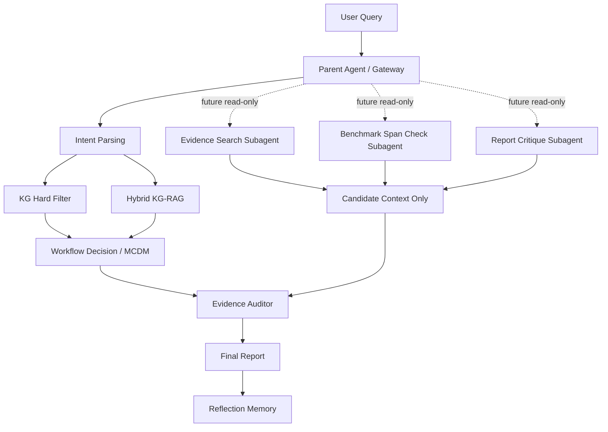

# scKG-Agent 项目介绍

更新时间：2026-07-09  
定位：组内介绍 / 合作者 onboarding / 项目答辩速览

> 版本说明：本文记录 1.x 当前可运行原型。自 2026-07-10 起，项目向可执行科研 Agent 转型，新的目标架构、MVP 边界和实施顺序以 `docs/DEV_SPEC_2.0.md` 为准；在对应 Phase 验收前，不把目标能力写成已实现能力。

---

## 1. 一句话介绍

**scKG-Agent 是一个面向单细胞与多组学分析的 evidence-governed research agent。**

它不是普通聊天机器人，也不只是“推荐一个工具”。它的目标是围绕单细胞分析任务完成：

```text
用户问题理解
  -> 知识图谱约束召回
  -> RAG / 原文证据检索
  -> workflow planning
  -> 工具候选比较
  -> 证据边界审计
  -> 可追溯分析报告
  -> 运行反思与记忆沉淀
```

更准确的英文定位：

```text
An evidence-governed research agent for single-cell multi-omics decision making.
```

---

## 2. 为什么要做这个项目

单细胞分析工具生态非常复杂。用户真正的问题往往不是“哪个工具最火”，而是：

- 我的数据类型和任务应该怎么规划分析流程？
- 每一步该用哪些工具？为什么？
- 工具推荐背后的论文、benchmark、协议证据在哪里？
- 哪些推荐只是候选，哪些是真正有证据支撑？
- 如果证据不足，下一步该补什么文献、实验或 benchmark？
- 不同工具之间是否有算法机制、输入输出、适用任务上的可迁移关系？

现有通用 LLM/RAG 很容易把这些问题变成“看起来合理的回答”，但缺少科学证据边界。scKG-Agent 的核心目标是把 **推荐、证据、图谱、审计、评测** 串成一个可复核闭环。

---

## 3. 项目不是什么

scKG-Agent 不应该被理解为：

- 普通 ChatGPT wrapper；
- 只查 PDF 的 RAG demo；
- 只根据 GitHub stars 排名的推荐器；
- 自动爬文献后直接写入知识库的系统；
- 去中心化多 Agent 自由讨论系统；
- 无证据约束的 AutoGPT 式科研助手。

它必须始终区分：

| 类型 | 能否支持主推荐 | 说明 |
| --- | --- | --- |
| formal reviewed evidence | 可以 | 人工确认、source-bound、结构化证据 |
| source chunks / RAG snippets | 不可以 | 只做 evidence discovery / explanation |
| AI reviewed candidate | 不可以 | 只能进入 review queue |
| reflection memory | 不可以 | 只能影响偏好和上下文 |
| migration hypothesis | 不可以 | 只是假设，不能当推荐结论 |

---

## 4. 当前系统架构

当前 scKG-Agent 不是成熟去中心化多 Agent，而是：

```text
中心化 Parent Agent / LangGraph workflow prototype
```

目标演进方向是：

```text
中心化递归 Agent（Recursive Centralized Agent）
```

也就是说，Parent Agent 负责最终回答、证据边界、排序和审计；未来 subagent 只能做只读辅助任务。



---

## 5. 核心模块

### 5.1 用户应用

当前主入口是统一 Streamlit 应用 `app.py`：

- `Chat`：原始对话窗口；
- `Knowledge Graph`：知识图谱探索；
- `Evidence & RAG`：证据与 RAG 管线状态；
- `Evaluation`：评测结果与失败队列；
- `Memory`：反思记忆与 skill candidate；
- `Architecture`：当前架构状态与路线图。

Chat 回答后会附加 `Workflow Decision` card，用于展示：

- workflow steps；
- candidate tools；
- retrieval snippets；
- source-bound chunks；
- evidence boundary；
- markdown decision report。

### 5.2 Hybrid KG-RAG / GraphRAG

scKG 的 RAG 不是普通问答 RAG，而是证据治理型 KG-RAG：

```text
KG hard filter
  + formal TSV evidence
  + source chunk retrieval
  + sparse / future dense retrieval
  + governance rerank
  + evidence boundary
```

当前已经打通：

- `data/indexes/evidence_chunks.jsonl`；
- sparse / lexical retrieval；
- source-bound snippet 展示；
- governance-aware rerank；
- RAG snippet 不进入 MCDM 主排序。

当前尚未完成：

- dense embedding 批量入库；
- 更大规模 PDF / paper / protocol source coverage；
- RAG ID-based precision / recall；
- RAGAS 接入。

### 5.3 知识图谱

当前图谱围绕以下实体：

- Tool；
- Task；
- Modality；
- Algorithm；
- Language；
- Hardware；
- Resolution；
- Evidence。

图谱承担：

- task / modality hard filter；
- 工具候选召回；
- 工具-任务-算法关系组织；
- 后续算法迁移与工具相似性分析基础。

### 5.4 Evidence Governance

项目当前最重要的原则：

```text
原文 chunk 负责找证据
formal TSV 只保存人工确认后的结构化事实
主推荐只信 source-bound / canonical / numeric evidence
```

因此：

- qualitative-only benchmark 被冻结；
- title-only publication 被降级；
- `benchmark_result` 不能支持主推荐；
- `paper_citations` 不能成为主推荐证据；
- RAG chunk 不能自动晋升 formal TSV。

### 5.5 Memory / Reflection

当前已有轻量反思记忆：

- 记录用户偏好；
- 记录最近任务；
- 记录 evidence gaps；
- 生成 review-only skill candidates。

Memory 的边界：

```text
Memory 可以影响交互体验
Memory 不能影响科学证据权威
Memory 不能改推荐排名
Memory 不能写 formal TSV
```

### 5.6 Subagent / 多 Agent

当前不是运行中的多 Agent 系统。已有的是 subagent contract：

- `evidence_search`；
- `benchmark_span_check`；
- `workflow_compatibility_check`；
- `report_critique`。

默认关闭。未来只允许 read-only subagent，结果只能进入 candidate context，由 Parent Agent 最终裁决。

---

## 6. 当前进度

### 6.1 已完成

- 原始聊天界面与管理员界面已融合到 `app.py`；
- 知识图谱可视化已接入；
- Workflow Decision card 已接入 Chat；
- Evidence/RAG 管理面板已接入；
- Memory 管理面板已接入；
- Architecture 管理面板已接入；
- Workflow Eval v0.1 已建立；
- formal publication / benchmark evidence 已做保守冻结；
- source-level registry 与 PDF/source pipeline v2.3 已落地；
- Algorithm Representation v2 已建立；
- subagent read-only contract 已建立；
- full pytest 当前通过。

### 6.2 当前关键指标

| 指标 | 当前状态 |
| --- | --- |
| `scrna_tools.tsv` | 1843 行工具目录 |
| legacy embedding records | 1698 |
| evidence chunks | 819 |
| dense vectors | 0 |
| core literature source rows | 23 |
| source text available | 19 |
| unresolved literature source rows | 4 |
| tools with source chunks | 16 |
| tools without source chunks | 1818 |
| workflow eval scenarios | 8 |
| workflow eval pass rate | 1.0 |
| evidence boundary violation | 0 |

---

## 7. 当前难点、痛点与阻力

### 7.1 证据质量是最大痛点

早期 formal TSV 中一部分 publication / benchmark 证据来自人工或 AI 辅助审核，但审核不够严格。

主要问题：

- title-only claim span；
- qualitative-only benchmark；
- reviewer identity 不清；
- DOI/source mismatch；
- 缺少 figure/table/section/paragraph source span；
- 缺 metric / rank / score / rank scope。

因此当前采用保守冻结策略，宁愿推荐变弱，也不让不可靠证据进入主推荐。

### 7.2 PDF/source 获取无法全自动

自动化可以做：

- open PDF discovery；
- publisher HTML；
- official docs / README；
- title/DOI validation；
- text extraction；
- chunking。

但仍然需要人工或半人工处理：

- paywall；
- browser login；
- DOI 指向错误文章；
- PDF 标题和 expected title 不一致；
- PDF 抽取失败；
- source span 是否真的支持 claim。

### 7.3 RAG 还不是完整 dense RAG

当前已经有 source chunks 和 sparse retrieval，但 dense vector index 仍是 0。

阻力：

- embedding API 成本；
- 批量任务稳定性；
- chunk 质量；
- source validation 不完整；
- 需要避免“embedding 相似就当证据”的错误闭环。

### 7.4 单细胞领域知识门槛高

用户不一定能独立判断：

- benchmark 是否合理；
- method scope 是否匹配；
- tool 是否适合特定 task / modality；
- migration hypothesis 是否科学；
- workflow 是否缺关键步骤。

这也是项目必须引入 evidence governance、audit 和 eval 的原因。

### 7.5 Agent 与 workflow 的边界需要继续升级

当前系统已有 agent 壳和部分 agent 能力，但底层仍偏 workflow 化。

缺口：

- multi-step Think / Act / Observe / Revise；
- 动态工具调用；
- read-only subagent；
- report critique；
- 失败恢复；
- 更强的 trace-based self-improvement。

---

## 8. 计划安排

### Phase 0：当前系统稳定化

目标：让统一应用稳定可用。

- 固定 `sckg_env` 为主运行环境；
- 给 Workflow Decision card 接 trace；
- 在 `app.py` 增加 Run Trace 页面；
- 保持 `observability/dashboard/app.py` 作为备用管理面板；
- 整理启动说明和演示流程。

验收：

- app 可启动；
- Chat / KG / Evidence / Evaluation / Memory / Architecture 均可进入；
- 正常 query 能生成回答 + workflow decision card；
- 全量测试通过。

### Phase 1：Evidence/RAG 基座扩展

目标：提升 source-bound coverage。

- 把核心工具 source coverage 从 16 个扩到 50 个；
- 继续修复 4 条 unresolved literature source；
- 建立 dense embedding index；
- 加入 RAG ID-based precision / recall；
- source registry 继续作为唯一 acquisition 状态源。

验收：

- dense vectors > 0；
- mismatch candidate 不进入 ingest；
- RAG chunk 不改变 MCDM rank；
- source-bound coverage 可视化。

### Phase 2：评测体系扩展

目标：把性能评估变成项目亮点。

- Workflow Eval 从 8 条扩到 20-30 条；
- 加入 negative-control query；
- 加入 context precision / recall；
- 加入 recommendation coverage；
- 后续接 RAGAS，但 RAGAS 不能绕过 evidence gate。

验收：

- workflow eval pass rate >= 0.9；
- evidence boundary violation = 0；
- candidate leakage = 0；
- 每条失败进入 failure queue。

### Phase 3：中心化递归 Agent

目标：从静态 workflow prototype 升级为受控 Agent。

- Parent Agent 负责最终裁决；
- 增加 read-only subagent：
  - evidence search；
  - benchmark span check；
  - workflow compatibility check；
  - report critique；
- subagent 输出只能进入 candidate context；
- Parent Agent 统一 audit。

验收：

- subagent 不写 formal TSV；
- subagent 不改推荐排名；
- subagent 能提高 evidence recall 或 report critique quality；
- 引入 subagent 后 eval 不下降。

### Phase 4：MCP / 部署 / 组内试用

目标：让系统可复用、可试用、可演示。

- 抽取 read-only MCP tools：
  - `query_tool_kg`；
  - `search_evidence_chunks`；
  - `build_workflow_decision`；
  - `audit_evidence_boundary`；
  - `run_workflow_eval`；
- 本地部署优先；
- 再做组内局域网；
- 最后考虑 remote MCP / FastAPI / 云端部署。

验收：

- 3-5 位组内用户能跑通；
- 每次 query 有 trace；
- 报告可导出；
- 管理员能看到失败原因；
- RAG/KG/Eval 可被外部工具调用。

---

## 9. 近期最建议做的 5 件事

1. **把 Run Trace 合进 `app.py`**  
   让用户和管理员在一个应用里看到每次 query 的完整执行路径。

2. **给 Workflow Decision card 写 trace**  
   记录每步耗时、candidate tools、snippet count、source-bound count、boundary status。

3. **扩展 Workflow Eval 到 20-30 条**  
   从 demo 级别升级到可讨论的评测集。

4. **启动 dense embedding index**  
   小批量先做核心工具，记录模型、成本、chunk count、失败率。

5. **设计第一个 read-only subagent**  
   建议从 `EvidenceSearchSubagent` 开始，只做 source chunk 搜索和候选证据解释。

---

## 10. 对外介绍口径

推荐口径：

```text
scKG-Agent is an evidence-governed research agent for single-cell multi-omics decision making.
It combines a tool knowledge graph, source-grounded RAG, evidence governance, workflow planning,
and evaluation loops to produce auditable analysis recommendations rather than unsupported tool rankings.
```

中文口径：

```text
scKG-Agent 是一个面向单细胞多组学分析决策的证据治理型科研 Agent。
它结合知识图谱、原文证据检索、工具推荐、工作流规划和证据审计，
帮助用户生成可追溯、可解释、可评估的分析决策报告。
```

---

## 11. 当前演示建议

演示顺序建议：

1. 打开主应用 `app.py`；
2. 在 Chat 输入一个单细胞分析需求；
3. 展示主回答；
4. 展示 Workflow Decision card；
5. 展示 source-bound snippets；
6. 打开 Knowledge Graph；
7. 打开 Evidence & RAG 看 source coverage；
8. 打开 Evaluation 看 Workflow Eval；
9. 打开 Memory 看 reflection；
10. 最后展示 Architecture 页面说明长期路线。

推荐示例 query：

```text
我有一批 multi-sample 10x PBMC scRNA-seq 数据，需要做 QC、doublet detection、
batch integration、cell type annotation，并希望知道哪些步骤证据比较充分，哪些地方需要谨慎。
```

---

## 12. 当前结论

scKG-Agent 已经不是单纯的“玩具推荐助手”，但也还没有完成成熟 research agent 的全部能力。

当前最准确的状态是：

```text
evidence-governed single-cell research agent prototype
with unified UI, KG-RAG discovery, workflow decision, audit, memory, and early eval.
```

它现在的主要价值不在于“马上推荐得多强”，而在于建立了一个可以持续扩展和审计的科研 Agent 工程骨架。下一阶段最重要的是补强 source coverage、dense retrieval、trace、eval 和 read-only subagent。
