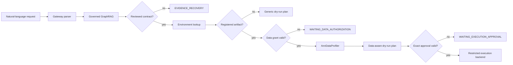

# Bounded Parent Agent Loop

日期：2026-07-15  
状态：plan-first runtime implemented；真实执行仍由 restricted execution backend 独立授权

## 1. 定位

这条 loop 用一条可审计轨迹回答“scKG-Agent 为什么是 Agent”：它接收自然语言目标，动态选择并调用知识、契约、画像、规划和路由能力，根据观察结果决定继续、等待或阻断，而不是只生成一篇推荐报告。



## 2. 权限边界

- Parent Agent 可以提出 task、modality、tool preference 和下一动作；
- `EvidenceGraphQuery` 决定是否存在 governed path；
- `ToolContractRegistry` 与 `EnvironmentRegistry` 决定计划输入、参数和环境；
- `ApprovalService` 决定能否读取已登记 artifact；
- `DeterministicRouter` 决定最终 route，Parent 无 override 参数；
- plan-only Agent 永远返回 `execution_request_count=0`；
- 真实执行继续复用 `LocalUserService -> ExecutionOrchestrator -> LocalControlledExecutor`，不能由聊天模型直接调用。

## 3. 当前四个固定场景

| 场景 | Route | 结果 |
| --- | --- | --- |
| generic doublet plan | `PLAN_ONLY` | GraphRAG + contract 生成 7-step generic dry-run plan |
| registered artifact without grant | `WAITING_DATA_AUTHORIZATION` | 不读取文件，不生成 DataProfile |
| valid data grant without approval | `WAITING_EXECUTION_APPROVAL` | 生成 DataProfile 与 data-aware plan，不执行 |
| cell annotation without reviewed contract | `EVIDENCE_RECOVERY` | 显示 graph hypotheses，不生成 executable plan |

## 4. 使用入口

生成固定 demo：

```bash
python scripts/run_bounded_parent_agent_demo.py
```

输出：

```text
.sckg_exec/demos/agent-loop-*/
  agent_loop_summary.json
  generic_plan.json
  authorization_blocked.json
  data_aware_waiting_approval.json
  evidence_limited.json
```

前端一级导航 `Agent Loop` 提供：

- 最新四场景只读卡片；
- Graph candidate basis 与 tool-call trace；
- plan-only 自然语言试跑；
- 明确的 route、blocker 和 ExecutionRequest 计数。

## 5. 当前限制

- 离线 parser 是确定性的，尚未评测 LLM requirement extraction；
- 自然语言试跑不接受文件路径，不创建 grant/approval；
- 只有 doublet detection 的两个工具具有 reviewed contract；
- execution backend 已存在，但本轮没有把 plan-only chat 变成隐式执行入口；
- subagent runtime 仍默认关闭。
