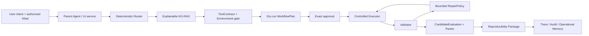

# 大模型开发岗位作品集差距与收敛路线

更新时间：2026-07-17
状态：Phase 6 interview-grade closure implemented；项目仍不能表述为“已达到目标岗位要求”

## 1. 对照基准

对照百度 2027 AIDU 计划“智能体算法工程师”公开岗位描述：

<https://talent.baidu.com/jobs/detail/GRADUATE/4f1cbc80-8332-4a92-b8fa-c0132b17d47e>

公开要求重点包括感知-决策-执行闭环、planning/tool use/reflection、RAG-Agent 融合、长期记忆、多 Agent、代码生成，以及成功率、时延、成本和体验评测。scKG-Agent 当前覆盖其中一部分，但在统一 Agent loop、数据反馈闭环、服务化和规模评测上仍有明显差距。

## 2. 当前可证明能力

| 岗位能力 | 当前仓库证据 | 状态 |
| --- | --- | --- |
| 结构化规划 | Bounded Parent Agent、RequirementSpec、DataProfile、WorkflowPlan Compiler、DeterministicRouter | 已实现 plan-first loop |
| 工具执行 | Scrublet/scDblFinder/Harmony/Scanorama contract、wrapper、LocalControlledExecutor | 已实现，固定四工具/两任务族 |
| 失败修复 | 白名单 RepairPolicy、预算和 lineage | 已实现，范围受限 |
| 决策 | CandidateEvaluation、跨工具 Pareto、limitations | 已实现 |
| RAG-Agent 融合 | KG v2 候选召回、Decision Graph ActionBundle、ToolContract 与 Audited Parent Agent | 已实现 plan-first 统一 trace |
| 图谱治理 | formal/frozen/quarantined/execution/hypothesis 五层边界 | 已实现 |
| 可观测性 | trace、dashboard、failure queue、复现包 | 已实现本地闭环 |
| 用户授权 | data grant、plan-specific approval、ownership、防重放 | 已实现本地闭环 |
| 科学评测 | GSE108313 doublet pilot + scIB pancreas batch-integration pilot | 两个 dataset-scoped pilot |
| 多 Agent | subagent contract 默认关闭，无运行中 specialist 协作 | 未实现 |
| 长期学习 | operational memory/telemetry 不自动改变策略 | 仅安全骨架 |
| 微调/RL | 无训练数据闭环、SFT/DPO/RL 实验 | 未开始 |
| 服务工程 | FastAPI/MCP/remote worker/容器隔离 | 未开始 |
| 规模评测 | 48-case deterministic gold bank + 16-case A2/A3/A4 同 case 对照；A4 保存 raw/admitted 双结果与字段级 intervention | 作品集级已实现；统计重复、并发和长稳态未完成 |

## 3. KG v2 与 Decision Graph 的真实含义

```text
1847 catalog Tool records
-> normalized Task / Modality / Language / AlgorithmFamily ontology
-> source chunks / formal audits / contracts / environments / pilot results
-> governed GraphRAG paths
-> candidate_context
-> evidence and execution gates
```

Catalog KG 当前对齐 1847 个工具；Decision Graph 将严格 execution capability 收敛为 2 个 qualified Action 与 4 个 ActionBundle。目录覆盖、图连通性和可执行资格是三种不同指标，不能相互替代。

旧 LLM profile 规范化后的 `graph_hypothesis` 只解决召回孤岛，不是可信证据；只有 Scrublet、scDblFinder、Harmony、Scanorama 四个固定实现具有 contract/environment/pilot 路径，formal evidence promotion 仍受独立 gate 控制。

## 4. 当前 Agent 拓扑



它已经形成可评测的 plan-first tool-calling loop：自然语言目标驱动 GraphRAG、ActionBundle、contract、profile、plan 和 policy route；执行、验证、修复、决策与复现包由确定性 safety plane 完成。显式审批分离是安全设计，不是缺失；真正缺口是任务/工具广度、真实用户反馈、规模统计评测和生产级服务隔离，因此不能声称是成熟通用 Agent。

## 5. 后续优先级

### P1：面试可证明闭环（本轮已完成）

1. 已实现 Audited Parent Agent，生成覆盖 proposal/knowledge/safety/execution/validation/package authority 的统一 trace。
2. 已冻结 48 条 gold case，并在其中 16 条代表场景运行 A2 ordinary RAG / A3 KG-RAG / A4 KG-RAG+Contract 同 case 对照。
3. 已生成 Doublet success、Batch Integration success、bounded repair、correctly blocked 四类一键 interview bundle。
4. 已补 README、三分钟演示口径、failure analysis 和 Biomni Adopt/Adapt/Reject 对照；不使用 node count 冒充效果。
5. Portfolio v2 已证明 raw LLM proposal 与 governed admission 的差异：安全平面通过硬 gate，但 raw blocker/I-O 仍有明显缺口，因此面试中不把 admitted 满分表述为模型满分。

### P2：工程落地

1. 完成真实 3 至 5 人组内试用和错误声明复核。
2. 再进入 Phase 7：稳定 API、worker isolation、Docker/部署、metrics 和并发压测。
3. 建立离线 feedback dataset；优先训练/评估 router、reranker 或 parameter selector，不为了“有微调”而本地部署弱模型。

### P3：研究增强

1. 多数据集 scientific validation；Batch Integration 执行闭环已完成，但当前仍是单一 scIB pancreas pilot。
2. source-bound 核心工具子图晋升；加入 hard negatives 和 temporal/version edges。
3. 只有在单 Agent baseline 已稳定且 specialist 有明确净收益时，才启用 Evidence/Critic subagent。

## 6. 面试口径

可以说：

> 我把一个单细胞工具推荐原型重构成了 evidence-governed、contract-constrained 的执行型 Agent。它覆盖 Doublet Detection 与 Batch Integration 两类任务、四个 Python/R 工具，能从自然语言与 AnnData 画像生成计划，经过逐请求授权执行、验证和有限修复，并交付可复现包；GraphRAG 的每条路径区分目录召回、低置信假设与可执行 ActionBundle。

不能说：

- 已覆盖全部单细胞多组学工具；
- 1.57 万条边均为可信知识；
- 已完成通用多 Agent、自进化或生产级远程部署；
- 单数据集 pilot 能证明工具普遍最优；
- 48-case 作品集 benchmark 等同于生产级规模评测或科学外部验证。
